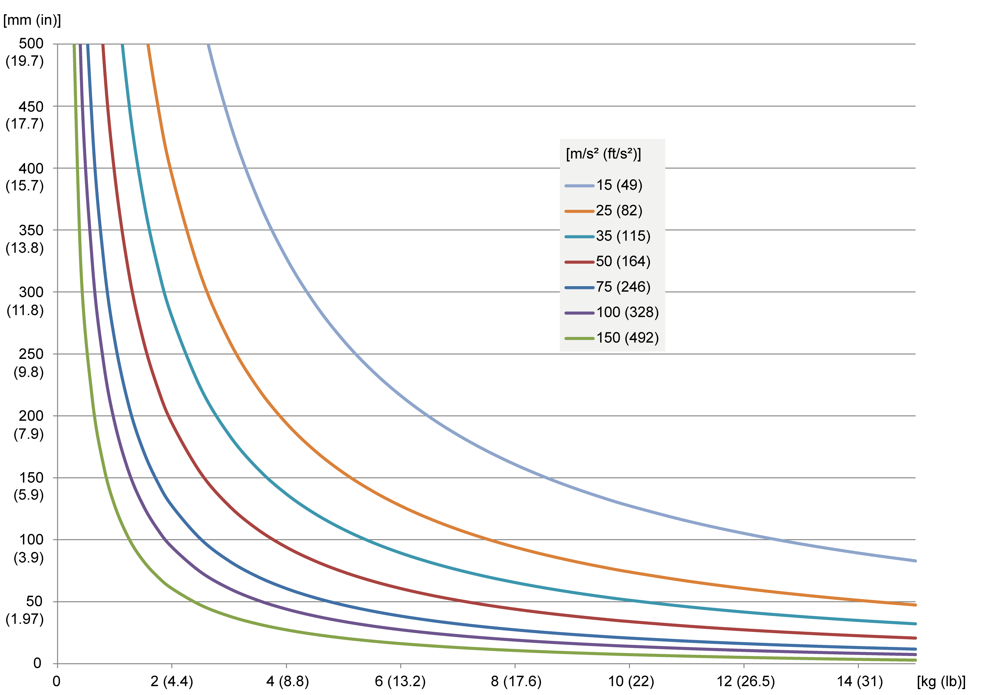

# Load Capacity Diagram

## Overview

The two load diagrams show the maximum permissible distance of the mass center of gravity from the Flange Center Point (FCP) for a given acceleration relative to the mass. For detailed information, refer to the respective dimensional drawing in [*Mechanical and Electrical Data*](D-SE-0056649.html#D-SE-0056649).

The limit values for the maximum tilting torque must always be complied with.

## Maximum Tilting Torque (Vertical Distance From the FCP)

The loading capacity of the Lexium P robots is limited by the maximum tilting torque at the FCP. The following diagram shows the possible vertical distance of the mass center of gravity of the payload relative to the mass and the required maximum acceleration.

A maximum tilting torque of 20 Nm (177 lbf-in) is to be observed at the FCP.

Calculate the tilting torque with the following formula:

Tilting torque [Nm (lbf-in)] = payload [kg (lb)] x maximum acceleration [m/s2 (ft/s2)] x (vertical distance from the FCP [m (in)] + 0.006 m (0.236 in))

EIO0000002173.14