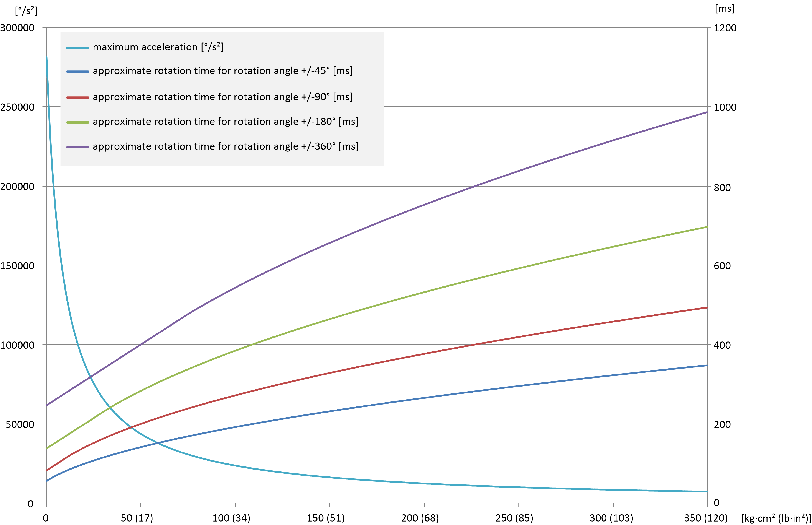

# Positioning Performance

## Overview

The following diagrams specify the performance of the telescopic axis and show that, in addition to the movement time, the rotation of the axis also requires time. In many applications the rotation of the rotational axis is the limiting element. An observation of its performance is inevitable for the layout of an application.

The diagrams show the movement time (Y2-axis), that is, the time required by the telescopic axis in order to rotate forward and backward by the specified angle.

The specified moment of inertia (X-axis) refers to the sum of the moments of inertia of the gripper and the customer end product. The inertia of the axis is already comprised in the diagram.

NOTE: When using the `SchneiderElectricRobotics` library the performance of the rotational axis is adapted automatically; specifying or determining the moments of inertia is not required.

## Positioning Performance of the Telescopic Axes

The following graph presents the positioning performance of the telescopic axes of the Lexium P robots when the center of gravity of the gripper and the customer end product is located centrally under the telescopic axis (lateral displacement = 0).

EIO0000002173.14