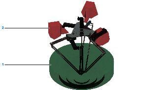
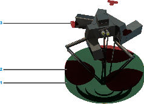
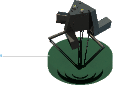

# Design of the Robot Frame

## System Requirements

Use the Lexium P robot for ceiling mounting. For special applications with an angularly suspended robot system, contact your local Schneider Electric service representative.

* Delta-3 robot of the Lexium P reach their highest level of performance and accuracy in the center of the working space.
* Position the robot to locate the movements to be executed as closely as possible to the center of the working space.
* When determining the suspension height of the robot, observe the overall height of the gripper (suction cup or other product pickups).
* For the design of the robot frame, account for possible varying gripper heights. Design the robot suspension in a height-adjustable manner.

The precision of the robot in the application is also determined by the frame. Deformations of the frame cause imprecisions on the Tool Center Point (TCP).

## General Requirements Regarding the Frame

The frame must not only withstand the constant forces and torques stated below, but also have sufficient stiffness so that the deformations and vibrations which occur do not lead to any major deviations on the TCP. Ensure a sufficient transverse bracing in the frame.

Note the forces and torques to be taken up by the frame during normal operation:

| Parameter | Value |
| --- | --- |
| Static load | approximately 1.2 kN (270 lbf) |
| Dynamic load | approximately 1.4 kN (315 lbf) in any direction |
| Dynamic torque | approximately 2000 Nm (17701 lbf-in) |

Fasten the robot with three screws of property class 8.8 or greater, or A2-70 or greater.

For further information, refer to the respective dimensional drawing in [*Mechanical and Electrical Data*](D-SE-0056649.html#D-SE-0056649).

NOTE: The configuration of the robot mechanics, the TCP velocity, as well as the additional payload have an effect on the total energy, which can potentially cause damage.

| WARNING | |
| --- | --- |
|  | CRUSHING, SHEARING, CUTTING AND IMPACT INJURY  * The robot must be operated only within an enclosure. * Open or enter the enclosure for cleaning and maintenance purposes only. * Design the enclosure to withstand an impact from the robot and to resist ejected parts from escaping the zone of operation. * Design the enclosure to safely deactivate the robot as soon as a person enters the zone of operation of the robot. * All barriers, protective doors, contact mats, light barriers, and other protective equipment, must be configured correctly and enabled whenever the robot mechanics are under power. * Define the clearance distance to the zone of operation of the robot so the operational staff do not have access to, nor can be enclosed in, the robot mechanics zone of operation. * Design the enclosure to account for the maximum possible travel paths of the robot; that is, the maximum path until the hardware safety system limits as well as the additional run-on paths, in case of a power interruption.  Failure to follow these instructions can result in death, serious injury, or equipment damage. |

For further information about travel path and power loss, refer to [*Run-on Motions of the Robot for Risk Analysis*](D-SE-0065319.html#D-SE-0065319).

## Interference Contours in the Enclosure

When designing the enclosure, ensure that the upper and lower arms of the robot will have sufficient freedom of movement. Take into account the required space for the movement of the respective robot type and associated equipment.

The following table presents the type of the mounting surface and space in which the robot must be operated.

| Robot type | Type of mounting surface and space |
| --- | --- |
| VRKP0•••WF | On a closed mounting surface (except for the mounting holes and the cable gland). |
| VRKP0•••NC | On a mounting surface with open spaces. |
| VRKP0•••WF••E00 | On a closed mounting surface (except for the mounting holes and the cable gland). |
| VRKP0•••NC••E00 | On a mounting surface with open spaces. |
| VRKP1•••WF | On a closed mounting surface (except for the mounting holes and the cable gland). |
| VRKP1•••NC | On a mounting surface with open spaces. |
| VRKP1•••WF••E00 | On a closed mounting surface (except for the mounting holes and the cable gland). |
| VRKP1•••NC••E00 | On a mounting surface with open spaces. |
| VRKP2•••NC | On a mounting surface with open spaces. |
| VRKP2•••WD VRKP2•••WF | On a closed mounting surface (except for the mounting holes and the cable gland). |
| VRKP4•••WD / VRKP4•••NO | On a closed mounting surface (except for the mounting holes and the cable gland). |
| VRKP4•••WF | On a closed mounting surface with limited working space or with entire working space on a mounting surface with open spaces. |
| VRKP4•••NC | On a mounting surface with open spaces. |
| VRKP5•••WF | On a closed mounting surface with limited working space or with entire working space on a mounting surface with open spaces. |
| VRKP5•••NC | On a mounting surface with open spaces. |
| VRKP6•••WF | On a closed mounting surface with limited working space or with entire working space on a mounting surface with open spaces. |
| VRKP6•••NC | On a mounting surface with open spaces. |
| VRKP6•••WF••E00 | On a closed mounting surface with limited working space or with entire working space on a mounting surface with open spaces. |
| VRKP6•••NC••E00 | On a mounting surface with open spaces. |

For further information, refer to the respective dimensional drawing in [*Mechanical and Electrical Data*](D-SE-0056649.html#D-SE-0056649).

The following figures illustrate the interference areas of the mounting surface for the different robot types.

VRKP••••NC:

**1** Working space

**2** Interference area

VRKP••••WF:

**1** Working space

**2** Unavailable working space on a closed mounting surface (not for VRKP0, VRKP1 and VRKP2)

**3** Interference area (not for VRKP0, VRKP1 and VRKP2)

VRKP••••WD / VRKP••••NO:

**1** Working space

For detailed information about the interference areas caused by upper and lower arm movements, refer to the 3D-CAD data on the Schneider Electric homepage (www.se.com) or contact your local Schneider Electric service representative.

EIO0000002173.14