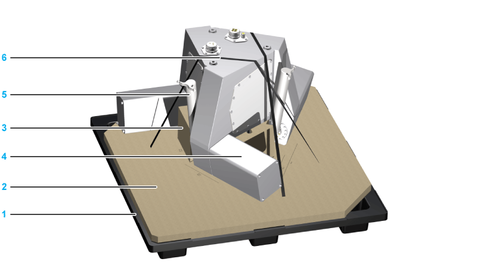
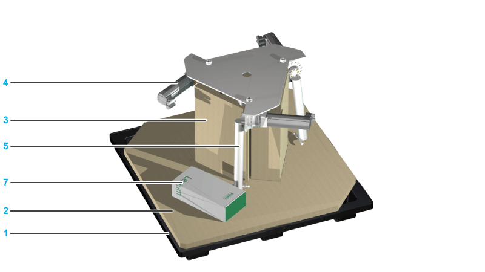

# Unpacking

## Overview

The following figures show the procedure to unpack and prepare the robot as an example.

## Removing the Outer Carton

| Step | Action |
| --- | --- |
| 1 | Remove the lashing straps from the outer carton. |
| 2 | Open the outer carton on the top side and remove the accessories box (1). |
| 3 | Remove both triangular supports (2). |
| 4 | Lift up and remove the outer carton (3). |

## Presentation of the Robot Packaging

The following figure shows the packaging of robots VRKP0, VRKP1, VRKP2, VRKP4, VRKP5, and VRKP6•••WF.

The following figure shows the packaging of robot VRKP6•••NC.

|  |  |  |  |  |  |  |  |  |  |  |  |  |  |  |  |
| --- | --- | --- | --- | --- | --- | --- | --- | --- | --- | --- | --- | --- | --- | --- | --- |
| | 1 | Plastic pallet (120 x 120 cm (47 in x 47 in)) | | 2 | Base carton | | 3 | Carton block (where the housing sits) | | 4 | Motor covers (suspended above the base carton) | | | 5 | Upper arms in transportation position | | 6 | Lashing straps | | 7 | Package containing the rotational axis motor and gearbox | |

NOTE: In case of VRKP•••MNC the motorized module is packed inside the robot packaging in a carton.

## Preparing the Robot for Installation

Refer to the previous figures under [*Presentation of the Robot Packaging*](#D-SE-0059428__D-SE-0059428.7) for the following steps:

| Step | Action |
| --- | --- |
| 1 | Remove the robot lashing straps (6). |
| 2 | Only for VRKP6 robots with a rotational axis (VRKP6••R):  Remove the additional carton containing the rotational motor and gearbox (7). |
| 3 | Verify the robot for transport damage. |
| 4 | Open the accessories box and verify all included parts for transport damage and completeness.  It must contain:   * 1x telescopic axis (only for robots with a rotational axis: VRKP•••R) * 3x lower arm pairs * 1x parallel plate * 1x instruction sheet for Lexium P robot (PKR43194) * 33x screws with sealing washers for maintenance covers (only for robots with a standard housing: VRKP••••WD / VRKP••••NO) * 3x cable glands (only for robots VRKP2S0•WD / VRKP4S0•WD / VRKP4S0•NO) |
| 5 | Only for robots with a standard housing (VRKP••••WD / VRKP••••NO):  Remove the three bolts of each maintenance cover and remove the maintenance covers. |

NOTE: The variants VRKP4L0•WD / VRKP4L0•NO only have one media cover on the upper side. The second aperture is not covered at this variant and must remain open for ventilation.

NOTE: In case of transport damages, contact your local Schneider Electric service representative.

For information on the disposal of the packaging, refer to [*Disposal*](D-SE-0059497.html#D-SE-0059497).

EIO0000002173.14