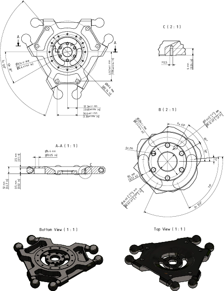
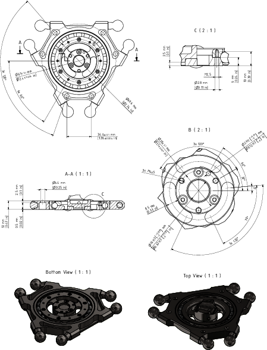

# Mounting the Gripper

| Step | Action |
| --- | --- |
| 1 | Fasten the gripper to the mounting points provided for this purpose on the parallel plate (1) for robots with a rotational axis:   * Pitch circle diameter 61 mm (2.4 in): 6 x M2.5 (2), tightening torque: 0.5 Nm (4.4 lbf-in), strength class of the screw: at least A2-70 * Pitch circle diameter 28 mm (1.1 in): 3 x M4 (3), tightening torque: 1.8 Nm (16 lbf-in), strength class of the screw: at least A4-80   Use the medium strength threadlocking adhesive Loctite 243 for this purpose.  For further information, refer to [*Flange Dimensions for Robots with Three Axes*](#D-SE-0059448__D-SE-0059448.5) or [*Flange Dimensions for Robots with a Rotational Axis*](#D-SE-0059448__D-SE-0059448.6).    NOTE: The mounting points on the parallel plate for robots without a rotational axis (4) are identical, but doubled. |
| 2 | Calibrate the rotational axis if this has not yet been done before the mounting of the gripper.  NOTE:  * Observe the permissible weights and distances that result in the maximum tilting torque. * Maximum tilting torque on the bearing of the parallel plate for robots with a rotational axis: 20 Nm (177 lbf-in). |

NOTE: A mounted gripper may cover the ball pin path of the open hybrid ball bearing. Cleaning could be constrained, this may lead to hygienic problems, or raised rotational torques of the bearing by collecting dirt inside the ball bearing. Keep the ball pin path free in order to allow the bearing to be flushed through from the top.

## Flange Dimensions for Robots without a Rotational Axis

## Flange Dimensions for Robots with a Rotational Axis

EIO0000002173.14