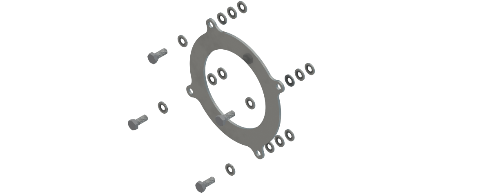

# Product Overview of the Impact Plate

Some applications require protection of the gearbox sealings of the main axes so that certain cleaning methods can be applied (for example, cleaning with water jet cleaning equipment). For such applications, you can apply the Lexium P Impact Plate to the main axes of the robots VRKP2, VRKP4, VRKP5, and VRKP6. For applying the Lexium P Impact Plate to the main axes of the robots VRKP0 and VRKP1, contact your local Schneider Electric service representative.

The following figure shows the Lexium P Impact Plate – VRKPXYYYYY00035.

EIO0000002173.14