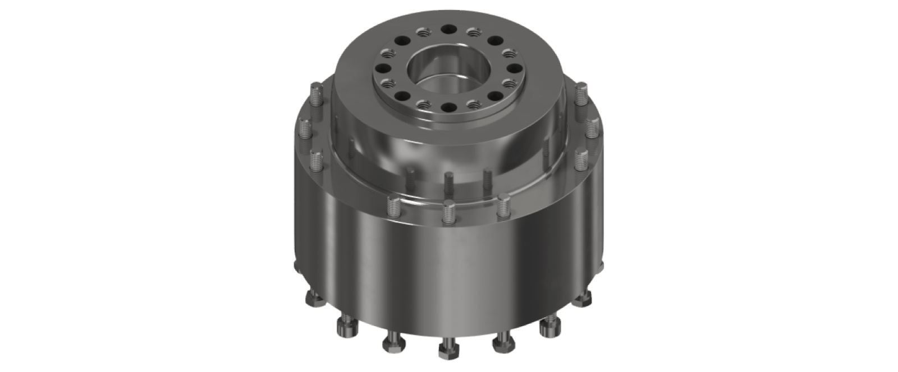

# Product Overview of the Gearbox Leakage Protection

In some applications, the customer end products that are handled by robots must not get contaminated or polluted by the lubricating oil. For such applications, you can additionally apply the Lexium P Gearbox Leakage Protection to the main axes motors of robots VRKP2, VRKP4, VRKP5, and VRKP6. For applying the Lexium P Gearbox Leakage Protection to the main axes of the robots VRKP0 and VRKP1, contact your local Schneider Electric service representative.

The following figure shows the Lexium P Gearbox Leakage Protection – VRKPXYYYYY00031.

NOTE: When mounting the Gearbox Leakage Protection to the main axes motors of robots in the flat variant (VRKP••••WF) or in the standard housing variant (VRKP••••WD / VRKP••••NO), an extended motor cover (VRKPXYYYYY00036) must be used. For further information about the motor cover, refer to [*Optional Equipment and Accessories*](D-SE-0100145.html#D-SE-0100145).

EIO0000002173.14