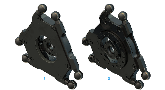

# Product Overview of the Parallel Plate Ball Bearing Protection

For some applications in dry and dusty environments, the ball bearing of the parallel plate for robots with a rotational axis should be protected from dirt and dust. For such applications, you can additionally apply the Lexium P Parallel Plate Ball Bearing Protection to the parallel plate of Lexium P robots with a rotational axis.

The following figure shows the Lexium P Parallel Plate Ball Bearing Protection – VRKPXYYYYY00042.

**1** Top view

**2** Bottom view

NOTE: When the Parallel Plate Ball Bearing Protection is mounted, the weight of the parallel plate increases. This may affect the performance of the robot.

EIO0000002173.14