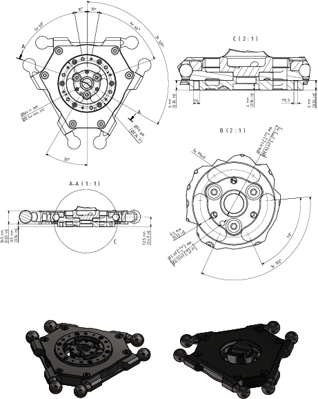

# Mounting the Gripper to the Parallel Plate Ball Bearing Protection

| Step | Action |
| --- | --- |
| 1 | Fasten the gripper to the mounting points provided for this purpose on the Parallel Plate Ball Bearing Protection:   * Pitch circle diameter 61 mm (2.4 in): 6 x M2.5 (1), tightening torque: 0.5 Nm (4.4 lbf-in), strength class of the screw: at least A2-70 * Pitch circle diameter 61 mm (2.4 in): 6 x M4 (2), tightening torque: 1.8 Nm (16 lbf-in), strength class of the screw: at least A2-70 * Pitch circle diameter 28 mm (1.1 in): 3 x M4 (3), tightening torque: 1.8 Nm (16 lbf-in), strength class of the screw: at least A4-80     For further information, refer to [*Flange Dimensions for Robots with a Rotational Axis and Parallel Plate Ball Bearing Protection*](#MountingTheGripper-F57D196B__FlangeDimensionsForRobotsWithFourAx-05633EEF). |
| 2 | Calibrate the rotational axis if this has not yet been done before the mounting of the gripper.  NOTE:  * Observe the permissible weights and distances that result in the maximum tilting torque. * Maximum tilting torque on the bearing of the parallel plate for robots with a rotational axis: 20 Nm (177 lbf-in). |

## Flange Dimensions for Robots with a Rotational Axis and Parallel Plate Ball Bearing Protection

EIO0000002173.14