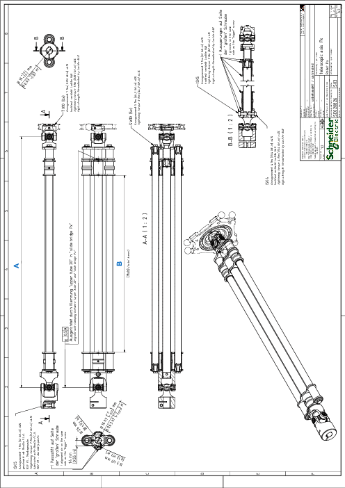

# Technical Data of the Telescopic Axis Double

## Mechanical Data of the Telescopic Axis Double

| Category | Parameter | Unit | VRKP• YYYYY00007 |
| --- | --- | --- | --- |
| General data | Maximum torque of the rotational axis with the Telescopic Axis Double | Nm (lbf-in) | 3 (26.6) |

## Detail Drawing of the Telescopic Axis Double

| Dimension | Description | Unit | Robot type | | | | |
| --- | --- | --- | --- | --- | --- | --- | --- |
| VRKP2 | VRKP4 | VRKP5 | VRKP6 | VRKP6 •••••••E00 |
| A | Minimum length | mm  (in) | 458.4  (18) | 610.4  (24) | 686.4  (27) | 766.4  (30) | 842.4  (33) |
| B | Stroke | mm  (in) | 278.6  (11) | 430.6  (17) | 506.6  (20) | 586.6  (23) | 662.6  (26) |

EIO0000002173.14