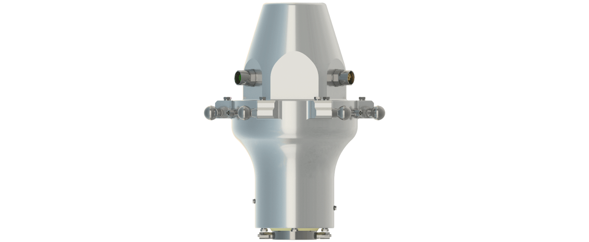
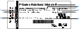

# Product Overview of the Rotational Modules

## Overview

Some applications require the use of a rotational axis with an increased torque and/or a better position repeatability. For such applications, you can apply the Lexium P Rotational Module to the Lexium P Robot.

The following figure represents the Lexium P Rotational Module B – VRKPXYYYYY00045 and the Lexium P Rotational Module HT-B – VRKPXYYYYY00046.

## Type Plate of the Rotational Modules

The type plate of the Rotational Modules is provided in the packaging. You can attach the type plate next to the [type plate of the robot](D-SE-0059413.html#D-SE-0059413__D-SE-0059413.2).

|  |  |  |  |  |  |  |  |  |  |  |  |  |  |  |  |  |  |  |  |
| --- | --- | --- | --- | --- | --- | --- | --- | --- | --- | --- | --- | --- | --- | --- | --- | --- | --- | --- | --- |
| | 1 | Device name | | 2 | Type code | | 3 | Serial number | | 4 | Hardware code | | 5 | Weight of the module | | | 6 | Date of manufacture | | 7 | Voltage and current of the fourth and fifth axis | | 8 | Maximum operating pressure | | 9 | Maximum Load | |

EIO0000002173.14