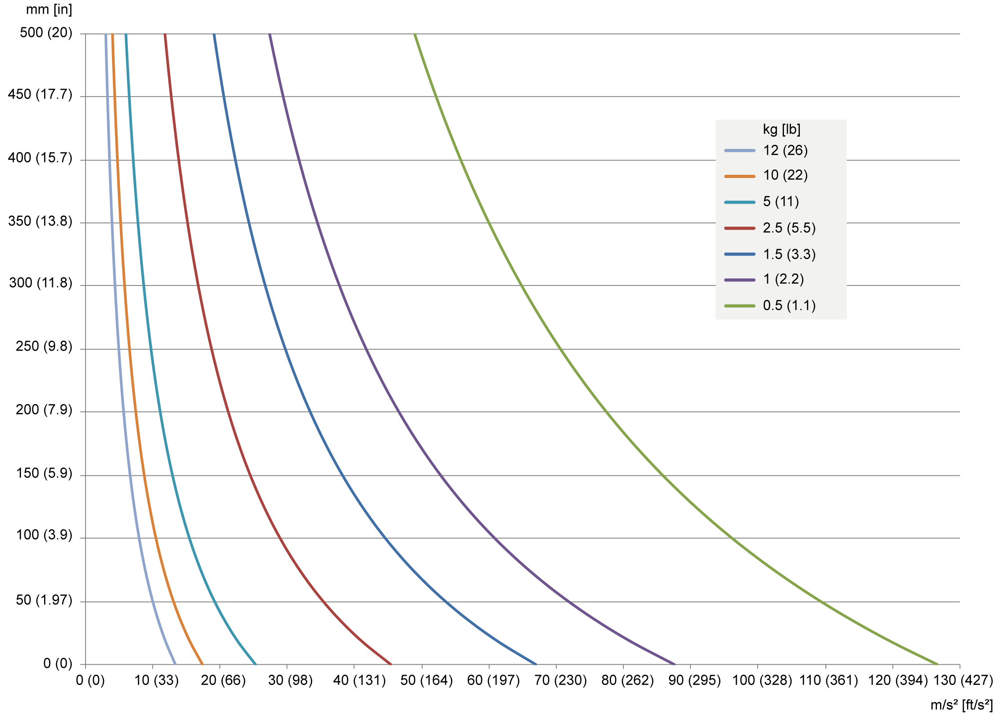
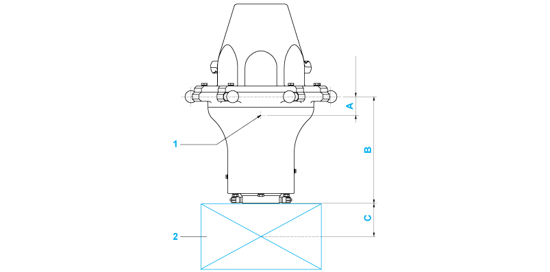

# Technical Data of the Rotational Modules

## Mechanical and Electrical Data of the Rotational Modules

| Category | Parameter | Unit | VRKPXYY YYY00045 | VRKPXYY YYY00046 |
| --- | --- | --- | --- | --- |
| General data | Rated load | kg (lb) | 1.5 (3.3) | 5 (11) |
| Maximum load(1) | kg (lb) | 12 (33) | 12 (33) |
| Allocation of auxiliary axes | – | 4th | |
| Maximum torque of the 4th axis(2) | Nm (lbf-in) | 16 (142)(3) | |
| Nominal torque of the 4th axis(2) | Nm (lbf-in) | 4.5 (40) | 12 (106) |
| Position repeatability (ISO 9283) | – | Angle: +/-0.1° | |
| Electrical data | Mains voltage - 3-phase | Vac | 480(4) | |
| Control voltage (with brake) | Vdc | +24 (-10…+6%) | |
| Motor 4th axis | – | SH30402P07F2000 | |
| Maximum current of 4th axis motor(5) | A | 4.10 | 1.54 |
| Mechanical data | Protection class | – | IP65 | |
| Gear ratio i | – | 15/1 | 40/1 |
| Drive parameter GearOut | – | 15 | 40 |
| Drive parameter GearIn | – | 1 | |
| Maximum speed | 1/min | 600 | 225 |
| Software parameter TcpPlateSize | mm (in) | 75 (2.95)(6) | |
| Pneumatic data | Number of pneumatic connections | – | 2 | |
| Operating pressure | bar  (psi) | -0.95…+6  (-13.8…+87) | |
| Working space | Rotation 4th axis | – | Unlimited | |
| Weight | – | kg (lb) | 3.5 (7.7) | |
| Material | External casing | – | Aluminum, stainless steel 1.4301, steel nickel-plated, zinc nickel-plated, FPM, EPDM | |
| (1) Loads above the maximum load are possible with restrictions. If required, contact your local Schneider Electric service representative.  (2) When designing the gripper, be aware of any appearance of mass moments of inertia as well as friction, which could lead to exceeding the maximum torque and consequential damage.  (3) For further information, refer to *Lexium 52 Hardware Guide* or *Lexium 62 Hardware Guide*.  (4) Motor without brake.  (5) Use the drive parameter UserDrivePeakCurrent to adjust the maximum current.  (6) This value is the distance between the suspension points of the lower arms and the center of the flange plate. | | | | |

## Maximum Tilting Torque

The loading capacity of the Rotational Modules is limited by the maximum tilting torque at the ball pins level. The following diagram shows the possible vertical distance of the mass at its center of gravity of the payload to the FCP relative to the mass and the required maximum acceleration.

A maximum tilting torque of 20 Nm (177 lbf-in) is to be observed at the ball pins level.

Calculate the tilting torque with the following formula:

Tilting torque [Nm (lbf-in)] = total payload [kg (lb)] x maximum acceleration [m/s² (ft/s²)] x vertical distance [m (in)]

NOTE:

* Total payload [Nm (lbf-in)] = weight of the module + weight of the gripper + weight of the customer end product
* Vertical distance [m (in)] = distance from the ball pins level to the total mass center point = (weight of the module [kg (lb)] x vertical distance from the ball pins to the mass center point of the module (A) [m (in)] + weight of the gripper and the customer end product [kg (lb)] x (vertical distance from the FCP (flange center point) to the mass center point of the gripper and the customer end product (C) [m (in)] + vertical distance from the ball pins to the FCP (B) [m (in)])) / total payload [kg (lb)]

**1** Mass center point of the module

**2** Gripper and customer end product

| Dimension | Description | Unit | VRKPXYYYYY00045 | VRKPXYYYYY00046 |
| --- | --- | --- | --- | --- |
| A | Vertical distance from the ball pins to the mass center point of the module | mm  (in) | 25  (0.98) | 25  (0.98) |
| B | Vertical distance from the ball pins to the FCP | mm  (in) | 141  (5.6) | 141  (5.6) |
| C | Vertical distance from FCP to the mass center point of the gripper and the customer end product | mm  (in) | Depends on the gripper and the customer end product | |

EIO0000002173.14