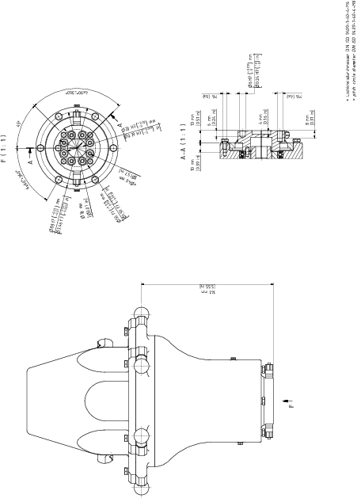

# Mounting the Payload to the Rotational Modules

## Overview

Here you will find the following information:

* [Mounting the gripper to the Rotational Modules](#D-SE-0097566__D-SE-0097566.5)
* [Flange dimensions for the Rotational Modules](#D-SE-0097566__D-SE-0097566.6)
* [Supply of the gripper on the Rotational Modules](#D-SE-0097566__D-SE-0097566.7)

## Mounting the Gripper to the Rotational Modules

| Step | Action |
| --- | --- |
| 1 | Fasten the gripper to the mounting points at the rotating flange (1) or on the fixed flange (3):   * Pitch circle diameter DIN ISO 9409-1, 40 mm (1.57 in): 4 x M6 (2), tightening torque: 4.2 Nm (37 lbf-in), strength class of the screw: at least A2-70 * Pitch circle diameter 78 mm (3.07 in): 6 x M4 (4), tightening torque: 2 Nm (17.7 lbf-in), strength class of the screw: at least A2-70   For further information, refer to [*Flange Dimensions for the Rotational Modules*](#D-SE-0097566__D-SE-0097566.6). |
| 2 | Calibrate the Rotational Module if this has not been done before mounting the gripper.  For further information, refer to [*Calibrating the Double Rotational Module and the Rotational Tilting Module*](D-SE-0079226.html#D-SE-0079226).  NOTE:  * Observe the permissible weights and distances that result in [maximum tilting torque](D-SE-0097563.html#D-SE-0097563__D-SE-0097563.5). * The maximum torque must not be exceeded. For the respective values, refer to [*Mechanical and Electrical Data of the Rotational Modules*](D-SE-0097563.html#D-SE-0097563__D-SE-0097563.4). |

## Flange Dimensions for the Rotational Modules

## Supply of the Gripper on the Rotational Modules

| Step | Action |
| --- | --- |
| 1 | Connect the media line to one of the pneumatic plug-in connections (1.1 or 2.1) of the Rotational Module. The plug-in connection has a diameter of 4 mm (0.0157 in).    For further information, refer to [*Supply of the Gripper*](D-SE-0059432.html#D-SE-0059432). |
| 2 | Connect the media line of the gripper to one of the associated connections (1.2 or 2.2) on the rotational flange of the Rotational Module.  Straight fitting diameter: 4 mm (0.157 in)  NOTE:  * Connection 1.1 is linked to connection 1.2 * Connection 2.1 is linked to connection 2.2 |

EIO0000002173.14