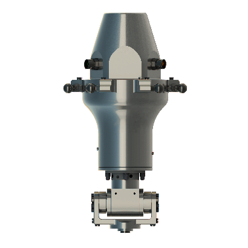
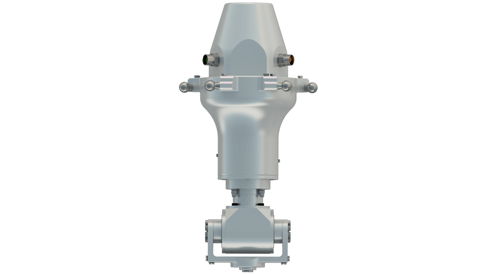

# Product Overview of the Tilting Modules

## Overview

Some applications require the use of a tilting axis. For such applications, you can apply the Lexium P Tilting Module B or the Lexium P Tilting Module HT-B-HD to the Lexium P Robot.

The following figure shows the Lexium P Tilting Module B – VRKPXYYYYY00053.

The following figure shows the Lexium P Tilting Module HT-B-HD – VRKPXYYYYY00052.

## Type Plate of the Tilting Modules

The type plate of the Tilting Modules is provided in the packaging. You can attach the type plate next to the type plate of the robot.

The type plate design is the same as for the [Rotational Module](D-SE-0097562.html#D-SE-0097562__D-SE-0097562.3).

EIO0000002173.14