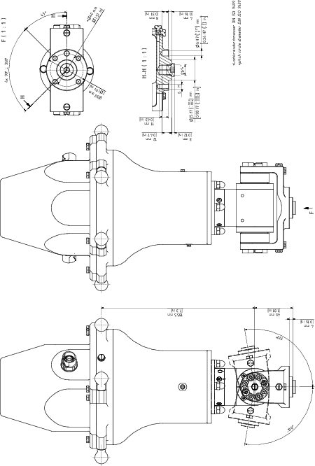
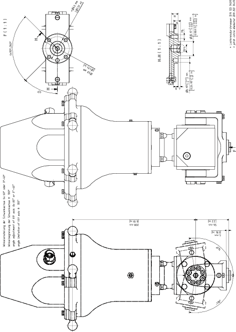

# Mounting the Payload to the Tilting Modules

## Overview

Here you will find the following information:

* [Mounting the gripper to the Tilting Module B](#D-SE-0104243__D-SE-0104243.14)
* [Flange dimensions for the Tilting Module B](#D-SE-0104243__D-SE-0104243.15)
* [Mounting the gripper to the Tilting Module HT-B-HD](#D-SE-0104243__D-SE-0104243.10)
* [Flange dimensions for the Tilting Module HT-B-HD](#D-SE-0104243__D-SE-0104243.11)

## Mounting the Gripper to the Tilting Module B

| Step | Action |
| --- | --- |
| 1 | Fasten the gripper to the mounting points at the flange (1):   * Pitch circle diameter DIN ISO 9409-1, 40 mm (1.57 in): 4 x M6 (2), tightening torque: 4.5 Nm (40 lbf-in), strength class of the screw: at least A2-70 * Thread for suction pads G1/4”: G1/4” x 12 mm (G1/4” x 0.47 in) (3), tightening torque: depends on your gripper. Closed with a screw plug as standard.   For further information, refer to [*Flange Dimensions for the Tilting Module B*](#D-SE-0104243__D-SE-0104243.15). |
| 2 | Calibrate the Tilting Module B if this has not been done before mounting the gripper. For further information, refer to [*Calibrating the Tilting Module*](D-SE-0104246.html#D-SE-0104246).  NOTE:  * Observe the permissible weights and distances that result in the [*maximum tilting torque*](D-SE-0104245.html#D-SE-0104245__D-SE-0104245.5). * The maximum torque must not be exceeded. For the respective values, refer to [*Mechanical and Electrical Data of the Tilting Modules*](D-SE-0104245.html#D-SE-0104245). |

## Flange Dimensions for the Tilting Module B

## Mounting the Gripper to the Tilting Module HT-B-HD

| Step | Action |
| --- | --- |
| 1 | Fasten the gripper to the mounting points at the flange (1):   * Pitch circle diameter DIN ISO 9409-1, 40 mm (1.57 in): 4 x M6 (2), tightening torque: 4.5 Nm (40 lbf-in), strength class of the screw: at least A2-70 * Thread for suction pads G1/4”: G1/4” x 12 mm (G1/4” x 0.47 in) (3), tightening torque: depends on your gripper. Closed with a screw plug as standard.   For further information, refer to [*Flange Dimensions for the Tilting Module HT-B-HD*](#D-SE-0104243__D-SE-0104243.11). |
| 2 | Calibrate the Tilting Module HT-B-HD if this has not been done before mounting the gripper. For further information, refer to [*Calibrating the Tilting Module*](D-SE-0104246.html#D-SE-0104246).  NOTE:  * Observe the permissible weights and distances that result in the [*maximum tilting torque*](D-SE-0104245.html#D-SE-0104245__D-SE-0104245.5). * The maximum torque must not be exceeded. For the respective values, refer to [*Mechanical and Electrical Data of the Tilting Modules*](D-SE-0104245.html#D-SE-0104245__D-SE-0104245.3). |

## Flange Dimensions for the Tilting Module HT-B-HD

EIO0000002173.14