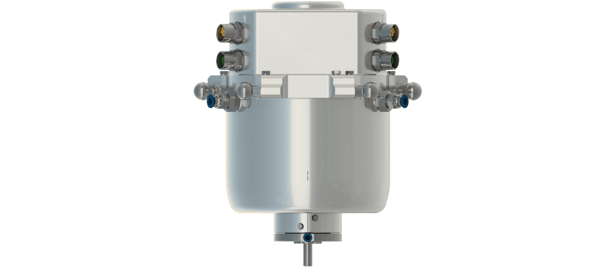
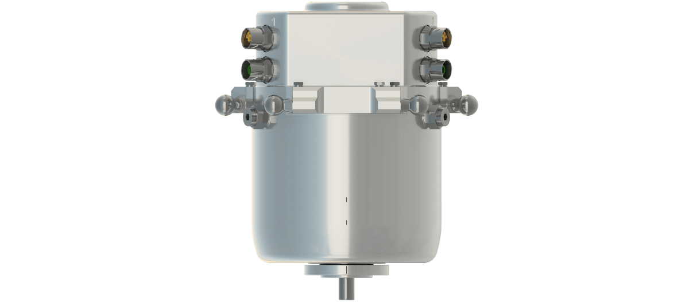

# Product Overview of the Double Rotational Modules

## Overview

Some applications require the use of a further drive axis for the gripper. For such applications, you can apply the Lexium P Double Rotational Module to the Lexium P Robot.

The following figure shows the Lexium P Double Rotational Module – VRKPXYYYYY00038.

The following figure shows the Lexium P Double Rotational Module HD – VRKPXYYYYY00049.

## Motion of the Tilting Axis

NOTE: The motors of the Double Rotational Modules are not equipped with a brake.

| CAUTION | |
| --- | --- |
|  | UNINTENDED MOTION OF THE AXES  Ensure that powering down the motor poses no subsequent risk in the zone of operation.  Failure to follow these instructions can result in injury or equipment damage. |

## Type Plate of the Double Rotational Modules

The type plate of the Double Rotational Module is provided in the packaging. You can attach the type plate next to the [type plate of the robot](D-SE-0059413.html#D-SE-0059413__D-SE-0059413.2).

The type plate design is the same as for the [Rotational Module](D-SE-0097562.html#D-SE-0097562__D-SE-0097562.3).

EIO0000002173.14