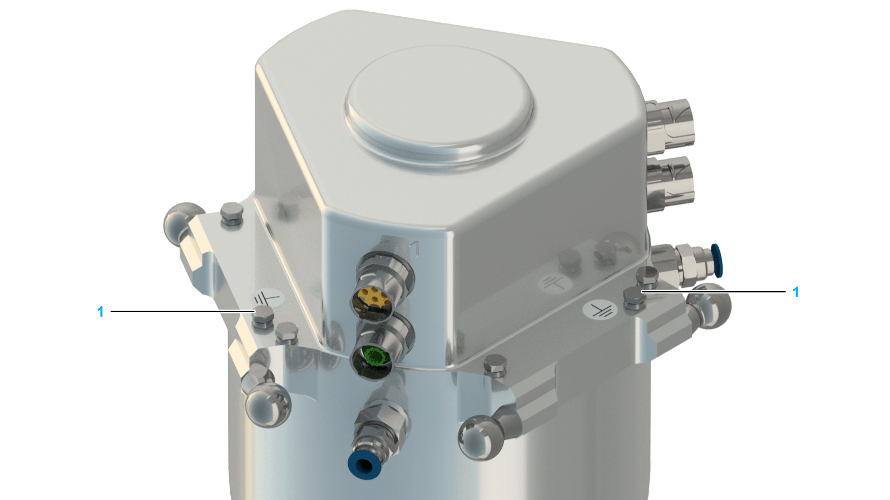

# Cabling the Double Rotational Modules

## Overview

For cabling the Rotational Module, use only Schneider Electric extension cables that are specifically designed for the robot application.

The following table presents the appropriate cable for each robot type.

| Robot type | Cable length | Cable type | Order number |
| --- | --- | --- | --- |
| VRKP0  VRKP1  VRKP2  VRKP4 | 3 m (9.8 ft) | Encoder extension cable | VW3E2100R030 |
| Power extension cable | VW3E1168R030 |
| VRKP5  VRKP6 | 4.3 m (14 ft) | Encoder extension cable | VW3E2100R043 |
| Power extension cable | VW3E1168R043 |

If other cable lengths are required, contact your local Schneider Electric service representative.

## Cabling the Double Rotational Module

| Step | Action |
| --- | --- |
| 1 | Feed two encoder cables for SH3040 motors to the middle of the robot housing. |
| 2 | Feed two power cables for SH3040 motors to the middle of the robot housing.  NOTE: For equipment that you are supplying that is not described in the present document, consult the documentation for those products. |
| 3 | Connect the two encoder extension cables (VW3E2100R•••) (1) and the two power extension cables (VW3E1168R•••) (2) to the Double Rotational Module (3) as described for the SH3040 motor in the *SH3 Servo motor Motor Manual*.    NOTE: For cabling the Double Rotational Module use only Schneider Electric extension cables that are specifically designed for the robot application. |
| 4 | Feed the two encoder extension cables and the two power extension cables from the Double Rotational Module via the lower and upper arms of the robot into the robot housing.  NOTE:  * Attach the cables to the lower and upper arms so that the cables have sufficient freedom of movement to reach with the TCP all positions in the working space. * Consider the bending radius for the respective cables:    + VW3E1168R••• – minimum bending radius: 69 mm (2.7 in)   + VW3E2100R••• – minimum bending radius: 63 mm (2.5 in) |
| 5 | Connect the cables in the robot housing with the cables from the Double Rotational Module.    NOTE: For the washdown robot references, contact your local Schneider Electric representative. |
| 6 | Verify the correct routing and fastening of the cables. |

| NOTICE | |
| --- | --- |
|  | INCORRECT PAIRING OF POWER AND ENCODER CABLES  Label the power and associated encoder cables according to their pairing.  Failure to follow these instructions can result in equipment damage. |

## Grounding Robots with the Double Rotational Module

Ground those parts of the robot which are located where either contact with current carrying parts (cables) or an insulation error is probable.

Alternatively, protect the cables with insulation which withstands the mechanical, chemical, electrical, and thermal stresses that it can be subjected to during normal operating conditions.

Ground the Double Rotational Module via one of the screws (1) for protective ground (earth) if grounding via the protective ground conductor of the motor cable is insufficient. To ensure an ideal electrical connection, use a serrated lock washer between the housing and cable lug. The tightening torque of the screws is 2 Nm (17.7 lbf-in).

| DANGER | |
| --- | --- |
|  | ELECTRIC SHOCK DUE TO IMPROPER GROUNDING  * Ground robot components in accordance with local, regional and/or national standards and regulations at a single, central point. * Verify that the motors are connected to the central ground.  Failure to follow these instructions will result in death or serious injury. |

EIO0000002173.14