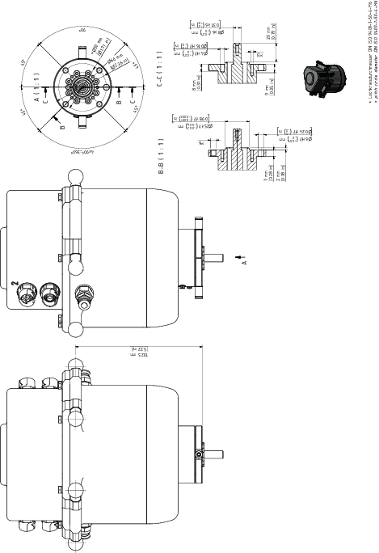
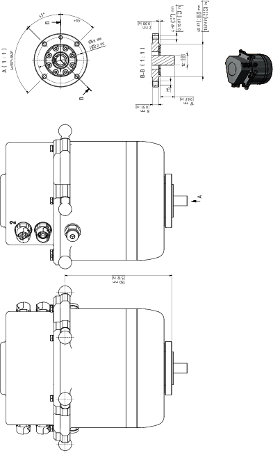

# Mounting the Payload to the Double Rotational Modules

## Overview

Here you will find the following information:

* [Mounting the gripper to the Double Rotational Module](#D-SE-0090323__D-SE-0090323.4)
* [Flange dimensions for the Double Rotational Module](#D-SE-0090323__D-SE-0090323.5)
* [Supply of the gripper on the Double Rotational Module](#D-SE-0090323__D-SE-0090323.8)
* [Mounting the gripper to the Double Rotational Module HD](#D-SE-0090323__D-SE-0090323.12)
* [Flange dimensions for the Double Rotational Module HD](#D-SE-0090323__D-SE-0090323.13)

## Mounting the Gripper to the Double Rotational Module

| Step | Action |
| --- | --- |
| 1 | Fasten the gripper to the mounting points at the rotating flange (1):   * Pitch circle diameter DIN ISO 9409-1, 50 mm (1.97 in): 4 x M6 (2), tightening torque: 4.5 Nm (40 lbf-in), strength class of the screw: at least A2-70 * Pitch circle diameter 31 mm (1.22 in): 5 x M4 (3), tightening torque: 1.4 Nm (12.4 lbf-in), strength class of the screw: at least A2-70 * Shaft diameter fifth axis 8 mm (0.315 in): 8 x 20 mm (0.315 x 0.79 in) (4)   For further information, refer to [*Flange Dimensions for the Double Rotational Module*](#D-SE-0090323__D-SE-0090323.5). |
| 2 | Calibrate the Double Rotational Module if this has not been done before mounting the gripper. For further information, refer to [*Calibrating the Double Rotational Module and the Rotational Tilting Module*](D-SE-0079226.html#D-SE-0079226).  NOTE:  * Observe the permissible weights and distances that result in the [*maximum tilting torque*](D-SE-0097563.html#D-SE-0097563__D-SE-0097563.5). * The maximum torque must not be exceeded. For the respective values, refer to [*Mechanical and Electrical Data of the Double Rotational Modules*](D-SE-0090319.html#D-SE-0090319__D-SE-0090319.3). |

## Flange Dimensions for the Double Rotational Module

## Supply of the Gripper on the Double Rotational Module

| Step | Action |
| --- | --- |
| 1 | Connect the media line to one of the pneumatic plug-in connections (1.1 or 2.1) of the Double Rotational Module. The plug-in connection has a diameter of 6 mm (0.236 in).    For further information, refer to [*Supply of the Gripper*](D-SE-0059432.html#D-SE-0059432). |
| 2 | Connect the media line of the gripper to the associated pneumatic plug-in connection (1.2 or 2.2) on the pneumatics rotary union (A). The plug-in connection has a diameter of 4 mm (0.157 in).  NOTE:  * Connection 1.1 is linked to connection 1.2 * Connection 2.1 is linked to connection 2.2 |

## Mounting the Gripper to the Double Rotational Module HD

| Step | Action |
| --- | --- |
| 1 | Fasten the gripper to the mounting points at the rotating flange (1):   * Pitch circle diameter DIN ISO 9409-1, 56 mm (2.2 in): 4 x M5 (2), tightening torque: 3.5 Nm (31 lbf-in), strength class of the screw: at least A2-70 * Shaft diameter fifth axis 12 mm (0.47 in): 12 x 17 mm (0.47 x 0.67 in) (3)   For further information, refer to [*Flange Dimensions for the Double Rotational Module HD*](#D-SE-0090323__D-SE-0090323.13). |
| 2 | Calibrate the Double Rotational Module HD if this has not been done before mounting the gripper. For further information, refer to [*Calibrating the Double Rotational Module and the Rotational Tilting Module*](D-SE-0079226.html#D-SE-0079226).  NOTE:  * Observe the permissible weights and distances that result in the [*maximum tilting torque*](D-SE-0097563.html#D-SE-0097563__D-SE-0097563.5). * The maximum torque must not be exceeded. For the respective values, refer to [*Mechanical and Electrical Data of the Double Rotational Modules*](D-SE-0090319.html#D-SE-0090319__D-SE-0090319.3). |

## Flange Dimensions for the Double Rotational Module HD

EIO0000002173.14