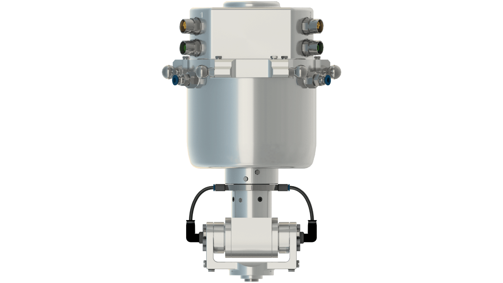
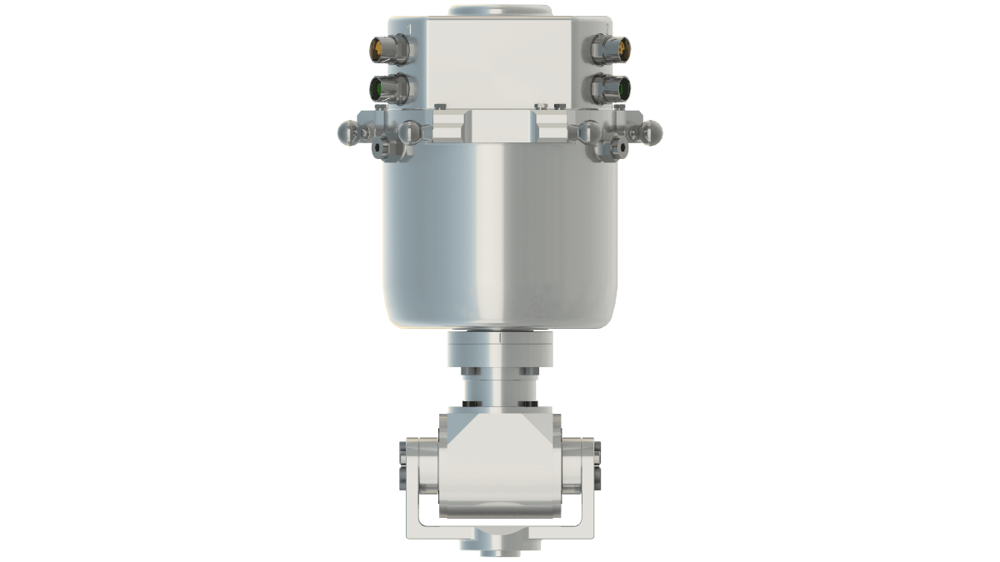

# Product Overview of the Rotational Tilting Modules

## Overview

Some applications require the use of an additional tilting axis. For such applications, you can apply the Lexium P Rotational Tilting Module to the Lexium P Robot.

The following figure shows the Lexium P Rotational Tilting Module – VRKPXYYYYY00039.

The following figure shows the Lexium P Rotational Tilting Module HD – VRKPXYYYYY00041 and the Rotational Tilting Module HD-B – VRKPXYYYYY00050.

## Motion of the Tilting Axis

NOTE: The motor of the tilting axis of the Rotational Tilting Module and Rotational Tilting Module HD is not equipped with a brake.

| CAUTION | |
| --- | --- |
|  | UNANTICIPATED SWIVEL MOTION OF THE TILTING AXIS  Ensure that powering down the motor poses no subsequent risk in the zone of operation.  Failure to follow these instructions can result in injury or equipment damage. |

## Type Plate of the Rotational Tilting Modules

The type plate of the Rotational Tilting Modules is provided in the packaging. You can attach the type plate next to the [type plate of the robot](D-SE-0059413.html#D-SE-0059413__D-SE-0059413.2).

The type plate design is the same as [for the Rotational Module](D-SE-0097562.html#D-SE-0097562__D-SE-0097562.3).

EIO0000002173.14