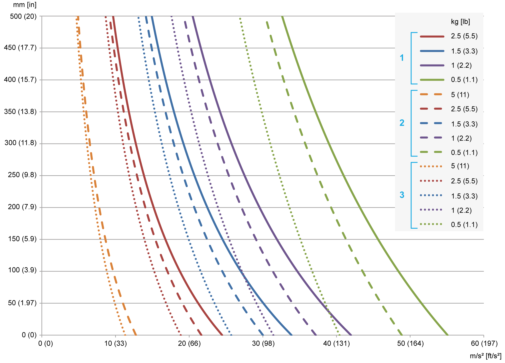
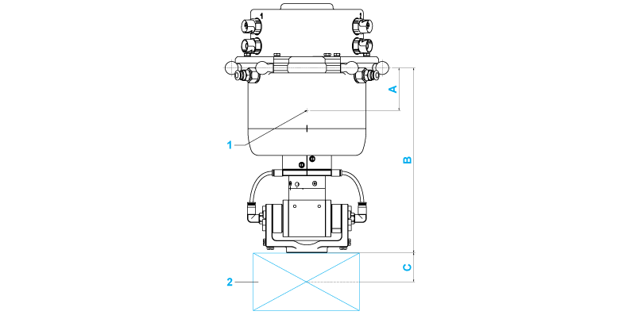

# Technical Data of the Rotational Tilting Modules

## Mechanical and Electrical Data of the Rotational Tilting Modules

| Category | Parameter | Unit | VRKPXYYYY Y00039 | VRKPXYYYY Y00041 | VRKPXYYYY Y00050 |
| --- | --- | --- | --- | --- | --- |
| General data | Maximum load without restrictions | kg (lb) | 0.25 (0.55) | 0.5 (1.1) | 0.5 (1.1) |
| Load with restrictions(1) | kg (lb) | 0.25…2.5  (0.55…5.5) | 0.5…5.0  (1.1…11) | 0.5…5.0  (1.1…11) |
| Allocation of auxiliary axes | – | 4th and 5th | | |
| Maximum torque of the 4th axis(2) | Nm (lbf-in) | 9 (80) | 10 (89) | 10 (89) |
| Maximum torque of the 5th axis(2) | Nm (lbf-in) | 7.5 (66) | 20 (177) | 20 (177) |
| Maximum holding torque of 4th and 5th motor | Nm (lbf-in) | – | – | 5 (44) |
| Position repeatability (ISO 9283) | – | Angle: +/-0.1° | | |
| Electrical data | Mains voltage - 3-phase | Vac | 480(3) | | |
| Motor 4th and 5th axis | – | SH30401P07A2000(4) | | SH30401P07F2000 |
| Maximum current of 4th axis motor(5) | A | (6) | 2.7 | 2.7 |
| Maximum current of 5th axis motor(5) | A | (6) | 1.6 | 1.6 |
| Mechanical data | Protection class | – | IP65 | | |
| Gear ratio i of the 4th axis | – | 440/36 | 704/36 | 704/36 |
| Drive parameter GearOut of the 4th axis motor | – | 440 | 704 | 704 |
| Drive parameter GearIn of the 4th axis motor | – | 36 | 36 | 36 |
| Gear ratio i of the 5th axis motor | – | 10/1 | 64/1 | 64/1 |
| Drive parameter GearOut of the 5th axis motor | – | 10 | 64 | 64 |
| Drive parameter GearIn of the 5th axis motor | – | 1 | 1 | 1 |
| Maximum speed of the 4th axis | 1/min | 800 | 460 | 460 |
| Maximum speed of the 5th axis | 1/min | 900 | 140 | 140 |
| Software parameter TcpPlateSize | mm (in) | 75 (2.95)(7) | | |
| Pneumatic data | Number of pneumatic connections | – | 2 | 0 | 0 |
| Operating pressure | bar (psi) | -0.95…+6  (-13.8…+87) | – | – |
| Working space | Rotation 4th axis | – | Unlimited | | |
| Rotation 5th axis / tilting 5th axis | – | +/-100° | | |
| Weight | – | kg (lb) | 4.8 (10.6) | 5.4 (11.9) | 5.7 (12.6) |
| Material | External casing | – | Aluminum, stainless steel 1.4301, steel nickel-plated, zinc nickel-plated, brass nickel-plated, FPM, EPDM, PE | | |
| (1) Loads above the maximum load are possible with restrictions. If required, contact your local Schneider Electric service representative.  (2) When designing the gripper, be aware of any appearance of mass moments of inertia as well as friction, which could lead to exceeding the maximum torque and consequential damage.  (3) For further information, refer to *Lexium 52 Hardware Guide* or *Lexium 62 Hardware Guide*.  (4) Motor without brake.  (5) Use the drive parameter UserDrivePeakCurrent to adjust the maximum current.  (6) See the limitation of the specific motor.  (7) This value is the distance between the suspension points of the lower arms and the center of the flange plate. | | | | | |

## Interference of the Working Space with Rotational Tilting Modules

By using the Rotational Tilting Modules, the working space of the robot is influenced. This modified working space is the same as for the Double Rotational Module. Therefore, refer to [*Interference of the Working Space with the Double Rotational Module*](D-SE-0090319.html#D-SE-0090319__D-SE-0090319.4) for further information.

## Maximum Tilting Torque

The loading capacity of the Rotational Tilting Modules is limited by the maximum tilting torque at the ball pins level. The following diagram shows the possible vertical distance of the mass at its center of gravity of the payload to the FCP relative to the mass and the required maximum acceleration.

**1** Rotational Tilting Module

**2** Rotational Tilting Module HD

**3** Rotational Tilting Module HD-B

A maximum tilting torque of 20 Nm (177 lbf-in) is to be observed at the ball pins level.

Calculate the tilting torque with the following formula:

Tilting torque [Nm (lbf-in)] = total payload [kg (lb)] x maximum acceleration [m/s² (ft/s²)] x vertical distance [m (in)]

NOTE:

* Total payload [Nm (lbf-in)] = weight of the module + weight of the gripper + weight of the customer end product
* Vertical distance [m (in)] = distance from the ball pins level to the total mass center point = (weight of the module [kg (lb)] x vertical distance from the ball pins to the mass center point of the module (A) [m (in)] + weight of the gripper and the customer end product [kg (lb)] x (vertical distance from the FCP (flange center point) to the mass center point of the gripper and the customer end product (C) [m (in)] + vertical distance from the ball pins to the FCP (B) [m (in)])) / total payload [kg (lb)]

**1** Mass center point of the module

**2** Gripper and customer end product

| Dimension | Description | Unit | Rotational Tilting Module | Rotational Tilting Module HD | Rotational Tilting Module HD-B |
| --- | --- | --- | --- | --- | --- |
| A | Vertical distance from the ball pins to the mass center point of the module | mm  (in) | 52  (2.05) | 52  (2.05) | 62  (2.44) |
| B | Vertical distance from the ball pins to the FCP | mm  (in) | 227  (9) | 257  (10.1) | 283  (11.1) |
| C | Vertical distance from FCP to the mass center point of the gripper and the customer end product | mm  (in) | Depends on the gripper and the customer end product | | |

EIO0000002173.14