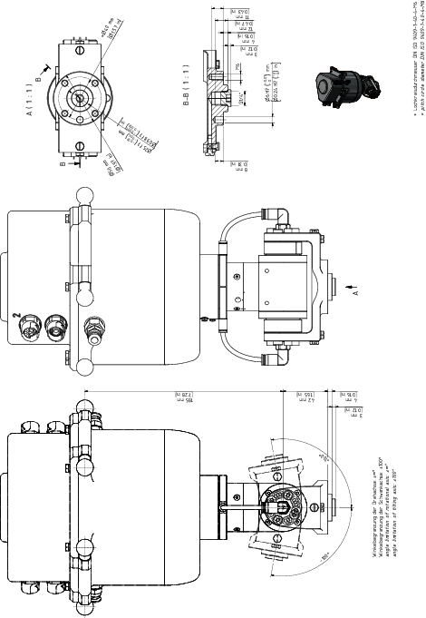
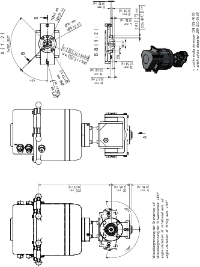
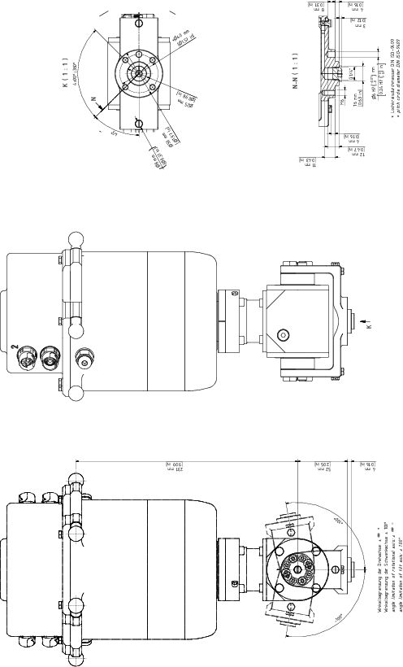

# Mounting the Payload to the Rotational Tilting Modules

## Overview

Here you will find the following information:

* [Mounting the gripper to the Rotational Tilting Module](#D-SE-0097572__D-SE-0097572.6)
* [Flange dimensions for the Rotational Tilting Module](#D-SE-0097572__D-SE-0097572.7)
* [Mounting the gripper to the Rotational Tilting Module HD / HD-B](#D-SE-0097572__D-SE-0097572.10)
* [Flange dimensions for the Rotational Tilting Module HD](#D-SE-0097572__D-SE-0097572.11)
* [Flange dimensions for the Rotational Tilting Module HD-B](#D-SE-0097572__D-SE-0097572.11)
* [Supply of the gripper on the Rotational Tilting Module](#D-SE-0097572__D-SE-0097572.9)

## Mounting the Gripper to the Rotational Tilting Module

| Step | Action |
| --- | --- |
| 1 | Fasten the gripper to the mounting points at the flange (1):   * Pitch circle diameter DIN ISO 9409-1, 40 mm (1.57 in): 4 x M6 (2), tightening torque: 4.5 Nm (40 lbf-in), strength class of the screw: at least A2-70 * Thread for suction pads G1/4”: G1/4” x 12 mm (G1/4” x 0.47 in) (3), tightening torque: depends on your gripper.   For further information, refer to [*Flange Dimensions for the Rotational Tilting Module*](#D-SE-0097572__D-SE-0097572.7). |
| 2 | Calibrate the Rotational Tilting Module if this has not been done before mounting the gripper. For further information, refer to [*Calibrating the Double Rotational Module and the Rotational Tilting Module*](D-SE-0079226.html#D-SE-0079226)  NOTE:  * Observe the permissible weights and distances that result in the [*maximum tilting torque*](D-SE-0097569.html#D-SE-0097569__D-SE-0097569.5). * The maximum torque must not be exceeded. For the respective values, refer to [*Mechanical and Electrical Data of the Rotational Tilting Modules*](D-SE-0097569.html#D-SE-0097569__D-SE-0097569.3). |

## Flange Dimensions for the Rotational Tilting Module

## Mounting the Gripper to the Rotational Tilting Module HD / HD-B

| Step | Action |
| --- | --- |
| 1 | Fasten the gripper to the mounting points at the flange (1):   * Pitch circle diameter DIN ISO 9409-1, 40 mm (1.57 in): 4 x M6 (2), tightening torque: 4.5 Nm (40 lbf-in), strength class of the screw: at least A2-70 * Thread for suction pads G1/4”: G1/4” x 12 mm (G1/4” x 0.47 in) (3), tightening torque: depends on your gripper. Closed with a screw plug as standard.   For further information, refer to [*Flange Dimensions for the Rotational Tilting Module HD*](#D-SE-0097572__D-SE-0097572.10). |
| 2 | Calibrate the Rotational Tilting Module HD if this has not been done before mounting the gripper. For further information, refer to [*Calibrating the Double Rotational Module and the Rotational Tilting Module*](D-SE-0079226.html#D-SE-0079226).  NOTE:  * Observe the permissible weights and distances that result in the [*maximum tilting torque*](D-SE-0097569.html#D-SE-0097569__D-SE-0097569.5). * The maximum torque must not be exceeded. For the respective values, refer to [*Mechanical and Electrical Data of the Rotational Tilting Modules*](D-SE-0097569.html#D-SE-0097569__D-SE-0097569.3). |

## Flange Dimensions for the Rotational Tilting Module HD

## Flange Dimensions for the Rotational Tilting Module HD-B

## Supply of the Gripper on the Rotational Tilting Module

| Step | Action |
| --- | --- |
| 1 | Connect the media line to one of the pneumatic plug-in connections (1.1 or 2.1) of the Double Rotational Module. The plug-in connection has a diameter of 6 mm (0.236 in).  For further information, refer to [*Supply of the Gripper*](D-SE-0059432.html#D-SE-0059432). |
| 2 | When using a standard suction cup:  Remove the plug screw (1.4) and mount the suction cup directly into the thread.  Thread for suction cup: G1/4” x 12 mm (G1/4” x 0.47 in)  NOTE: Connection 1.1 is linked to connection 1.4 |
| 3 | When using any of the other connections:  Remove one of the plug screws of the associated connection (1.2, 1.3, 2.2, or 2.3) and mount your pneumatic connector.  Thread size for the attachment: M5 x 4 mm (M5 x 0.157 in)  NOTE:  * Connection 1.1 is linked to connection 1.2 and 1.3 * Connection 2.1 is linked to connection 2.2 and 2.3 |

EIO0000002173.14