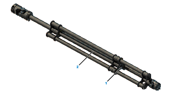

# Replacing the Slide Films

## Overview

The following procedures describe the replacement of the slide films at the telescopic axis as an example. The steps for the Telescopic Axis Double are similar. Note the two lower tubes when handling the Telescopic Axis Double.

## Procedure Overview

Perform the following procedures to replace the slide films:

* Removing the telescopic axis (refer to [*Replacing the Telescopic Axis*](D-SE-0059480.html#D-SE-0059480))
* [Disassembling the telescopic axis](#D-SE-0059482__D-SE-0059482.4)
* [Replacing the slide films](#D-SE-0059482__D-SE-0059482.5)

## Disassembling the Telescopic Axis

NOTE: When disassembling the telescopic axis, do not loosen or remove the bottom bolt (1) on the upper tube (2). This may allow the upper tube to be freely rotated. This causes the position of the gripper to be no longer in congruence with the previous position after the replacement of the slide film. In addition, this may cause a change in the position of the universal joints relative to one another. Both universal joints must be located exactly at the same position as shown in the detail drawing of the [*Telescopic Axis*](D-SE-0060159.html#D-SE-0060159).

| Step | Action |
| --- | --- |
| 1 | Remove both mounting screws (2) at the upper universal joint (1) in order to be able to separate the upper tube (6) and the universal joints. |
| 2 | Remove the upper universal joint. |
| 3 | Remove the clamping on the three lower tubes (8) of the closure bridge (4) and release the self-blocking of the clamping sets by slightly tapping on the three clamping bolts (3). |
| 4 | Remove the closure bridge from the tubes. |
| 5 | Pull off the upper tube and the slide bridge (7) from the three outer tubes. |

| NOTICE | |
| --- | --- |
|  | UNINTENDED GRIPPER POSITION  * Perform a renewed calibration of the rotational axis if the bottom bolt on the upper tube has been loosened or removed. * Following the replacement of the slide films, do not join the upper tube and the lower tubes when these are twisted out of position by 180°.  Failure to follow these instructions can result in equipment damage. |

## Replacing the Slide Films

| Step | Action |
| --- | --- |
| 1 | Remove all four slide films (5) from the bearing points of the bridges and clean the bearing points if necessary. |
| 2 | Insert the new slide films into the bearings. Ensure that the index lugs located on the films engage correctly in the corresponding recesses of the bearing points. |
| 3 | Verify that the slide films are fully inserted into the bearing bores. |
| 4 | Assemble the telescopic axis in reverse order and ensure that the universal joints are orientated correctly in relation to one another. The locating pin in the lower universal joint is in alignment with the larger screw (2) of the upper universal joint or also the larger bore of the upper tube (6).  For further information about the necessary torques, refer to [*Telescopic Axis*](D-SE-0060159.html#D-SE-0060159).  NOTE: When using the Telescopic Axis Double, refer to [*Detail Drawing of the Telescopic Axis Double*](D-SE-0090311.html#D-SE-0090311). |
| 5 | Mount the telescopic axis and calibrate it depending on the necessary angle precision of the application.  For further information, refer to [*Replacing the Telescopic Axis*](D-SE-0059480.html#D-SE-0059480) and [*Calibrating the Robot Mechanics*](D-SE-0059492.html#D-SE-0059492). |

EIO0000002173.14