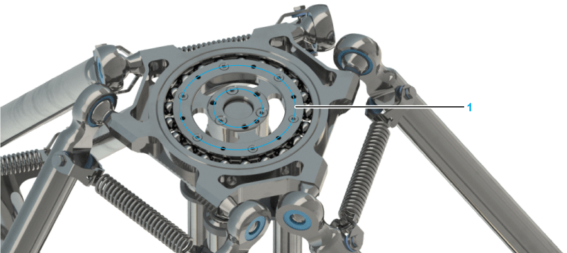

# Replacing the Parallel Plate

## Overview

The following figure shows the correct position of the parallel plate with bottom mounting points (1):

## Replacing the Parallel Plate

| Step | Action |
| --- | --- |
| 1 | Only for robots with a rotational axis (VRKP•••R):  Remove the telescopic axis as described in [*Replacing the Telescopic Axis*](D-SE-0059480.html#D-SE-0059480). |
| 2 | Remove the lower arms as described in [*Replacing the Lower Arms*](D-SE-0059484.html#D-SE-0059484). |
| 3 | Hook in the new parallel plate with the lower arms. Ensure that the mounting side for the gripper is located at the underside, as shown in the figure above.  NOTE: The mounting can be recognized by its threaded holes. |
| 4 | Only for robots with a rotational axis (VRKP•••R):  Mount the telescopic axis as described in [*Replacing the Telescopic Axis*](D-SE-0059480.html#D-SE-0059480).  NOTE: The parallel plate can be rotated by n x 120°. Proceed with particular care in such cases to refit the parallel plate in its original position. |
| 5 | Only for robots with a rotational axis (VRKP•••R):  Move the parallel plate slowly and verify the position of the gripper. |

EIO0000002173.14