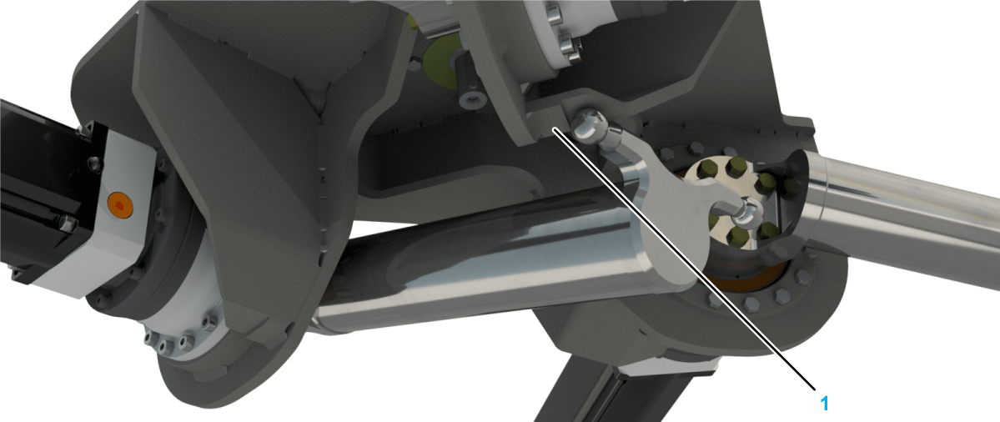
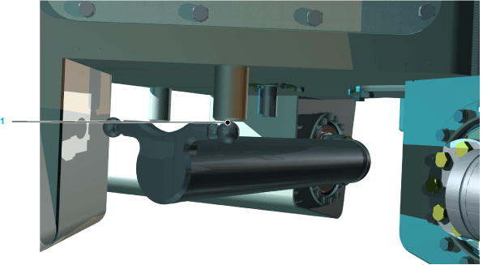
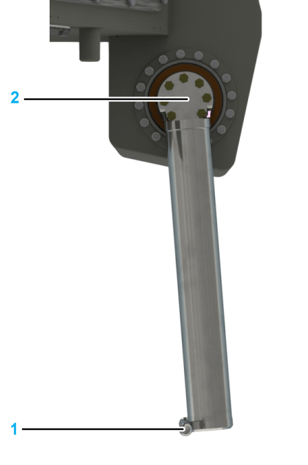

# Calibrating the Main Axes

## Preparing the Robot Mechanics for a Calibration Movement

| Step | Action |
| --- | --- |
| 1 | Remove the rotational axis (if present), the lower arms, and the parallel plate.  For further information, refer to [*Replacing the Telescopic Axis*](D-SE-0059480.html#D-SE-0059480), [*Replacing the Lower Arms*](D-SE-0059484.html#D-SE-0059484), and [*Replacing the Parallel Plate*](D-SE-0059488.html#D-SE-0059488). |
| 2 | Do not move the upper arms beyond their vertical downward position (1) in order to prevent the individual robot arms from colliding with one another during their calibration travel (2). |

## Sequence of the Calibration Process

Calibrate each of the three main axis motors by using the function HomeOnTorque for moving the ball pin of the upper arm to the calibration bolts (1).

The following figure shows the upper arm of the robot VRKP1/VRKP2 at the calibration position:

The following figure shows the upper arm of the robot VRKP0/VRKP4/VRKP5/VRKP6 at the calibration position:

NOTE: Due to the preset offset, the calibration travel ends with the upper arms being in a vertical and downward-oriented position. Here, the ball pin (1) and not the tube of the upper arm are in vertical alignment with the center (2) of the gearbox (see the figure below).

## Verifying the Calibration

| Step | Action |
| --- | --- |
| 1 | Move all three upper arms to the following angle in order to verify the calibration:   * For VRKP0: -119.57° * For VRKP1: -112.72° * For VRKP2: -113.49° * For VRKP4: -119.76° * For VRKP5: -127.85° * For VRKP6: -123.35° |
| 2 | Measure whether the gap between the ball pins (1) of the individual upper arms is larger than 0.6 mm (0.236 in).    If the gap is larger than required or ball pins collide, proceed as follows:   1. Verify that all parameters (motor direction of rotation, gearbox factor) are correctly set in the controller configuration and correct these parameters if necessary. 2. Verify that the following components are not damaged and replace any damaged parts if necessary:     * Upper arms (for example, bent, twisted, dented)    * Drives (for example, damaged gearbox, loose clamping hub between gearbox and motor, damaged motor encoder) 3. Repeat the calibration travel. |
| 3 | Perform one of the following actions:   * Move the upper arms - within the permitted angle position - into a basic position (for example, 0°, see the following figure) * Release the brakes and move the arms into the required position.     **Result:** The robot is now calibrated. |
| 4 | Mount the lower arms, the parallel plate, and the telescopic axis if applicable.  For further information, refer to [*Mounting the Lower Arms*](D-SE-0059445.html#D-SE-0059445), [*Replacing The Parallel Plate*](D-SE-0059488.html#D-SE-0059488), and [*Mounting the Telescopic Axis*](D-SE-0059444.html#D-SE-0059444). |

EIO0000002173.14