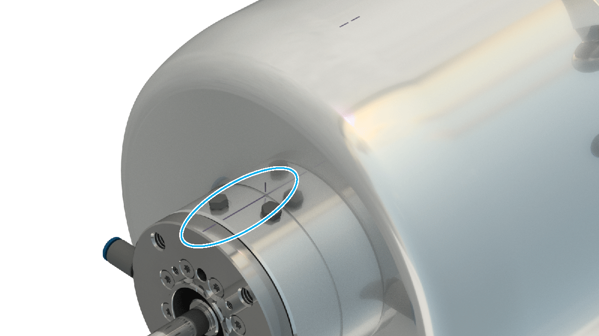
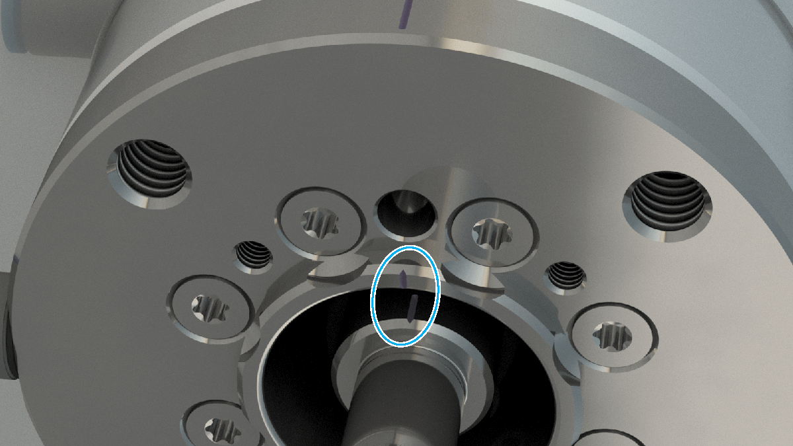
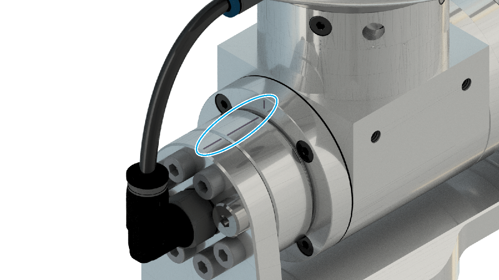

# Calibrating the Double Rotational Module or the Rotational Tilting Module (Optional Equipment)

## Overview

For calibrating the fourth and the fifth axis of the Double Rotational Modules or the Rotational Tilting Modules, use the applied markings. Align the markings to each other as presented in the following figures.

## Calibration Markings at the Fourth Axis

For calibrating the fourth axis of the Double Rotational Modules and the Rotational Tilting Modules, use the markings presented in the following figure.

## Calibration Markings at the Fifth Axis

For calibrating the fifth axis of the Double Rotational Modules, use the markings presented in the following figure.

For calibrating the fifth axis of the Rotational Tilting Modules, use the markings presented in the following figure.

EIO0000002173.14