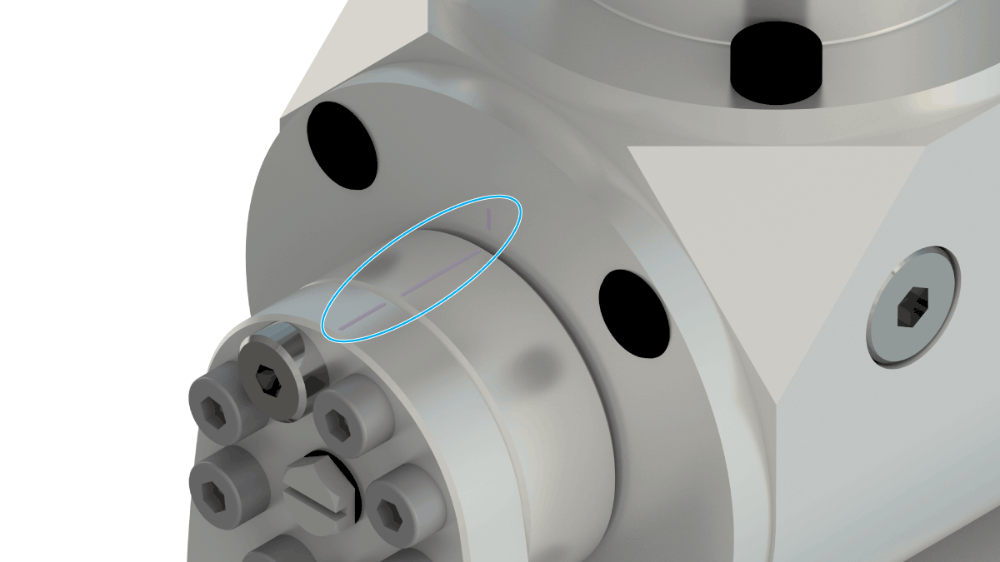

# Calibrating the Tilting Module (Optional Equipment)

## Adjusting the Rotation Angle of the Tilting Axis

| Step | Action |
| --- | --- |
| 1 | Loosen the four nuts (1). |
| 2 | Adjust the required angle by rotating the tilting gearbox.  NOTE: The adjustment angle range is 40°. |
| 3 | Tighten the four nuts.  Tightening torque: 3.5 Nm (31 lbf-in) |

## Calibration Markings at the Tilting Axis

For calibrating the tilting axis, align the applied markings to each other as presented in the following figure.

EIO0000002173.14