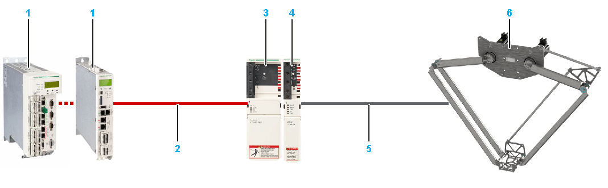
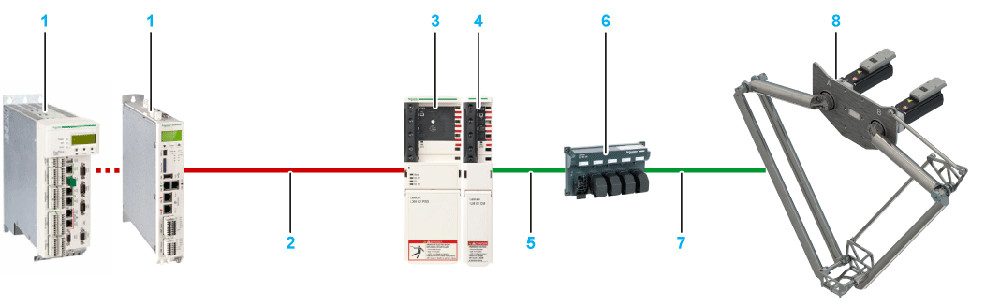
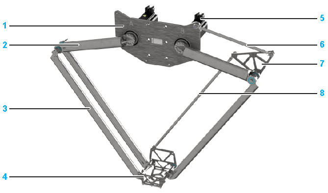

# Product Overview

## System Setup

The following figure presents an example of a system setup for one Lexium T robot with MH3 motors. At a minimum, these are the equipments required to achieve performances described in this guide.

| Number | Device name | Quantity | Device type | Comment |
| --- | --- | --- | --- | --- |
| 1 | Controller | 1 | LMC•00C…LMC•01C | Logic Motion Controller |
| 2 | Sercos cable | 3 | VW3E5001R | Sercos cable; the cable length depends on the distance between controller and cabinet. |
| 3 | Power supply | 1 | LXM62PD84A11000 | Lexium 62 Power Supply(3) |
| 4 | Double drive | 1 | Double drive(2): LXM62DD27•21000 | Lexium 62 Drive Module |
| Single drive | 2 | Single drive(2): LXM62DD27•21000 | Lexium 62 Drive Module(3) |
| 5 | Motor cable for connection of drive and motor | 2 | VW3E1143R••• | PacDrive 3 motor cable; the cable length depends on the distance between cabinet and robot. |
| Feedback cable for connection of drive and motor | 2 | VW3E2094R••• |
| 6 | Lexium T robot | 1 | (1) | |
| (1) The device type depends on the robot reference and its characteristics. For further information, refer to [*Type Code*](D-SE-0073705.html#D-SE-0073705).  (2) The specific variant of the Lexium drive depends on the safety requirements.  (3) Alternatively, use the Lexium LXM52, Stand-Alone Servo Drive. Quantity: 2. Device Type LXM52DD30C. | | | | |

The following figure presents an example of a system setup for one Lexium T robot with ILM motors. At a minimum, these are the equipments required to achieve performances described in this guide.

| Number | Device name | Quantity | Device type | Comment |
| --- | --- | --- | --- | --- |
| 1 | Controller | 1 | LMC•00C…LMC•01C | Logic Motion Controller |
| 2 | Sercos cable | 3 | VW3E5001R | Sercos cable; the cable length depends on the distance between controller and cabinet. |
| 3 | Power supply | 1 | LXM62PD84A11000 | Lexium 62 Power Supply |
| 4 | Connection module | 1 | ILM62CMD20A000 | Lexium 62 Connection Module |
| 5 | Cable for connection of connection module and distribution box | 2 | VW3E1•••R••• | Hybrid cable; the cable length depends on the distance between the cabinet and the robot. Various connector plugs are available. |
| 6 | Distribution box | 1 | ILM62DB4A000 | Lexium 62 Distribution Box |
| 7 | Cable for connection of distribution box and motor | 2 | VW3E1•••R••• | Hybrid cable; the cable length depends on the distance between the cabinet and the robot. Various connector plugs are available. |
| 8 | Lexium T robot | 1 | (1) | |
| (1) The device type depends on the robot reference and its characteristics. For further information, refer to [*Type Code*](D-SE-0073705.html#D-SE-0073705). | | | | |

## Components Overview

|  |  |
| --- | --- |
| **1** Mounting plate | **5** Motor/gearbox |
| **2** Upper arm | **6** Parallel linkage rod short |
| **3** Lower arm | **7** Lever parallel linkage |
| **4** Parallel plate | **8** Parallel linkage rod long |

## Characteristics of the Lexium T Robots

The Lexium T robot provides the following features:

* Stainless steel Delta 2 robot equipped by an automation platform
* Few references covering large performance
* Pre-assembled and ready to connect
* No calibration at customer site
* Compact foot print
* Fast replacement of replacement equipment

EIO0000002280.05