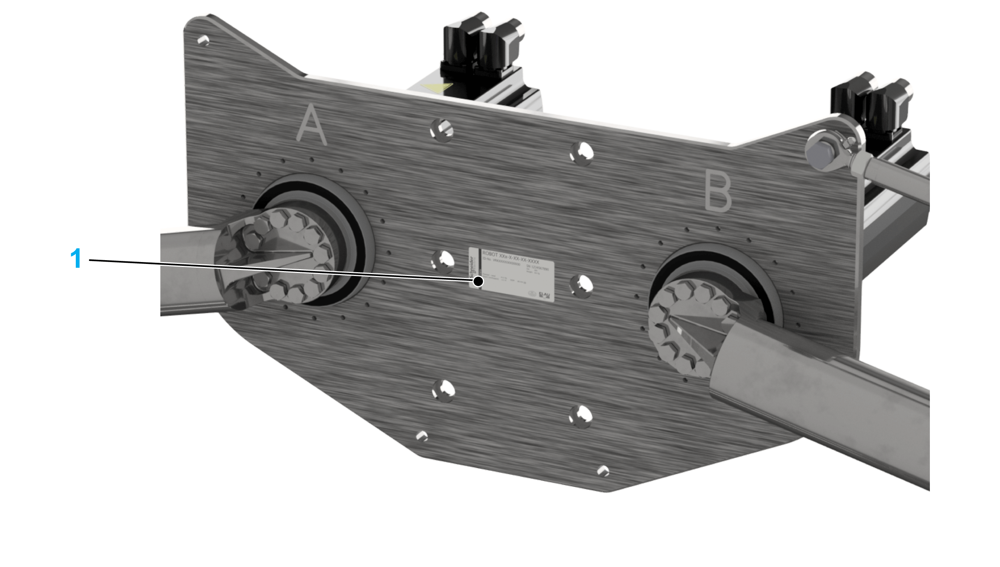
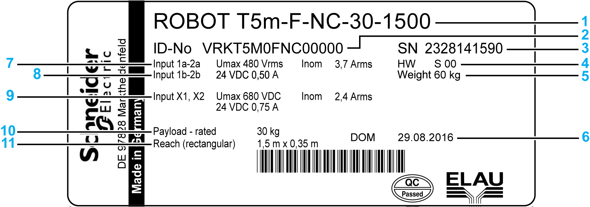

# Type Plate

## Position of the Type Plate

**1** Type plate

## Description of the Type Plate

|  |  |  |  |  |  |  |  |  |  |  |  |  |  |  |  |  |  |  |  |  |  |  |  |
| --- | --- | --- | --- | --- | --- | --- | --- | --- | --- | --- | --- | --- | --- | --- | --- | --- | --- | --- | --- | --- | --- | --- | --- |
| | 1 | Device name | | 2 | Type code\* | | 3 | Serial number | | 4 | Hardware code | | 5 | Weight of the robot | | 6 | Date of manufacture | | | 7 | Voltage and current of the MH3 motor | | 8 | Voltage and current of the MH3 motor brakes | | 9 | Voltage and current of the ILM motors and brakes | | 10 | Nominal load | | 11 | Radius of the working area | |
| \* For detailed information about the meaning of the particular characters, refer to [*Type Code*](D-SE-0073705.html#D-SE-0073705). | |

EIO0000002280.05