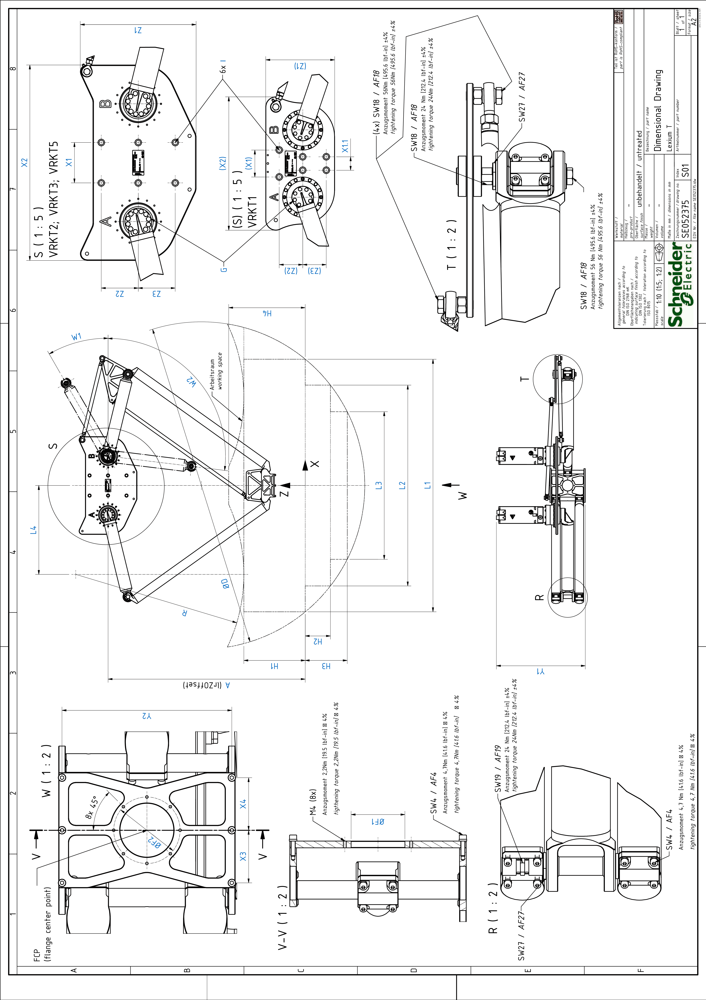

# Dimensional Drawing of the Lexium T Robot

## Dimensional Drawing of the Lexium T VRKT1, VRKT2, VRKT3, VRKT5 Robot

| Dimension | Description | | Unit | Robot type | | | | | | | | | |
| --- | --- | --- | --- | --- | --- | --- | --- | --- | --- | --- | --- | --- | --- |
| VRKT1M0 | VRKT2M0 | VRKT2M1 | VRKT2L0 | VRKT3M0 | VRKT3M1 | VRKT3L0 | VRKT5M0 | VRKT5M1 | VRKT5L0 |
| D | Working area diameter | | mm  (in) | 1100  (43) | 1290  (51) | | | 1500  (59) | | | 1945  (77) | | |
| H1 | Working area height | | mm  (in) | 300  (11.8) | 350  (13.8) | | | 380  (15) | | | 365  (14.4) | | |
| L1 | Auxiliary length 1 | | mm  (in) | 600  (23.6) | 800  (31.5) | | | 1000  (39) | | | 1500  (59) | | |
| H2 | Auxiliary height 2 | | mm  (in) | 50  (1.97) | 90  (3.54) | | | 100  (3.9) | | | 150  (5.9) | | |
| L2 | Auxiliary length 2 | | mm  (in) | 412  (16.2) | 500  (19.7) | | | 719  (28.3) | | | 1193  (47) | | |
| H3 | Auxiliary height 3 | | mm  (in) | - | – | | | 175  (6.9) | | | 250  (9.8) | | |
| L3 | Auxiliary length 3 | | mm  (in) | - | – | | | 317  (12.5) | | | 877  (34.5) | | |
| H4 | Auxiliary height 4 | | mm  (in) | - | – | | | | | | 455.5  (18) | | |
| L4 | Auxiliary length 4 | | mm  (in) | - | – | | | | | | 528  (20.8) | | |
| R | Auxiliary radius | | mm  (in) | - | – | | | | | | 1000  (39) | | |
| A | Z offset | | mm  (in) | 814  (32) | 877  (34.5) | | | 980  (38.6) | | | 1115  (44) | | |
| W1 | Angle maximum upper arm height | | ° | 25 | 30 | | | | | | | | |
| W2 | Angle minimum upper arm height | | ° | 83 | 97 | | | | | | | | |
| Z2 / Z3 | Z distance counterbore mounting plate | | mm  (in) | 70  (2.76) | 110  (4.3) | | | | | | | | |
| X1 | X distance counterbore mounting plate | | mm  (in) | 80  (3.15) | 120  (4.7) | | | | | | | | |
| X1.1 | X distance counterbore mounting plate(1) | | mm  (in) | 40  (1.57) | - | | | | | | | | |
| X3 / X4 | X distance screw parallel plate | | mm  (in) | 62.5  (2.46) | | | | | | | | | |
| Y2 | Y distance screw parallel plate | | mm  (in) | 202  (8) | | | | | | | | | |
| F1 | Flange diameter parallel plate | | mm  (in) | 64 + 0.05 + 0.02  (2.5 + 0.00197 + 0.00079) | | | | | | | | | |
| F2 | Bolt circle diameter | | mm  (in) | 79  (3.1) | | | | | | | | | |
| Z1 | Z mounting space of mounting plate | | mm  (in) | 205  (8.07) | 345  (13.6) | | | | | | | | |
| X2 | X mounting space of mounting plate | | mm  (in) | 396  (15.6) | 581  (23) | | | | | | | | |
| Y1 | Y mounting space robot | | mm  (in) | 507  (20) | 497  (19.6) | 529  (21) | 598  (23.5) | 497  (19.6) | 529  (21) | 598  (23.5) | 497  (19.6) | 529  (21) | 598  (23.5) |
| I | Cylinder screw size | | - | M12 | | | | | | | | | |
| Counterbore size | | mm  (in) | Ø 20 x 8U  (Ø 0.79 x 0.31U) | | | | | | | | | |
| Tightening torque | | Nm  (lbf-in) | 56  (496) | | | | | | | | | |
| G | screw upper arm to gearbox(2) | Wrench size | mm  (in) | 10  (0.39) | 13  (0.51) | | | | | | | | |
| Tightening torque | Nm  (lbf-in) | 14  (123.9) | 22  (194.7) | | | | | | | | |
| Quantity | - | 14 | 22 | | | | | | | | |
| (1) for VRKT1 only  (2) Medium threadlocked with Loctite 243 | | | | | | | | | | | | | |

EIO0000002280.05