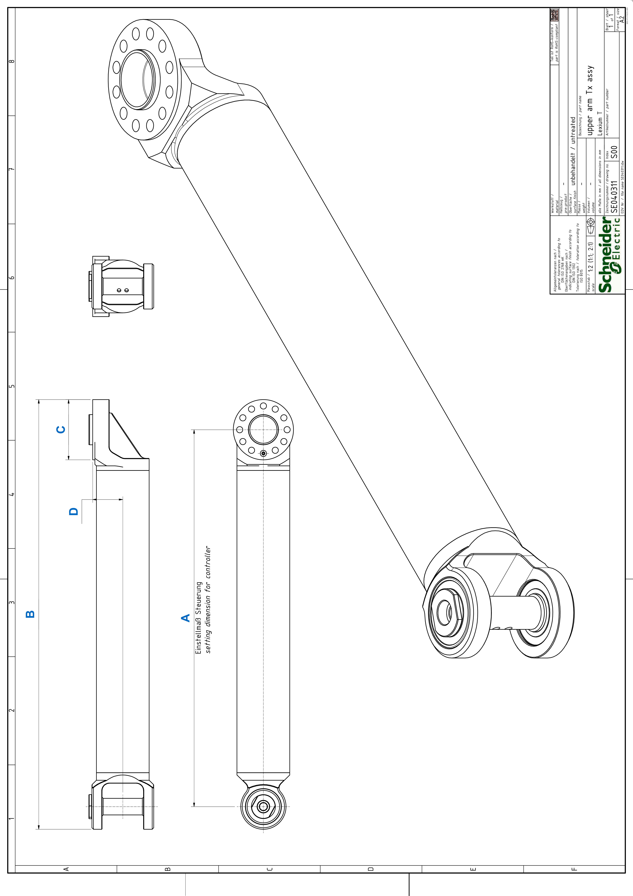

# Detail Drawing of the Upper Arm

## Detail Drawing of the Upper Arm of VRKT1, VRKT2, VRKT3, VRKT5

| Dimension | Description | Unit | Robot type | | | |
| --- | --- | --- | --- | --- | --- | --- |
| VRKT1 | VRKT2 | VRKT3 | VRKT5 |
| A | Adjustment value for controller | mm  (in) | 300  (11.8) | 350  (15.7) | 400  (15.7) | 500  (19.7) |
| B | Total length | mm  (in) | 362.5  (14.3) | 420  (16.5) | 470  (18.5) | 570  (22.4) |
| C | Flange diameter | mm  (in) | 65  (2.56) | 80  (3.15) | | |
| D | Flange center distance | mm  (in) | 37  (1.46) | 40  (1.57) | | |

EIO0000002280.05