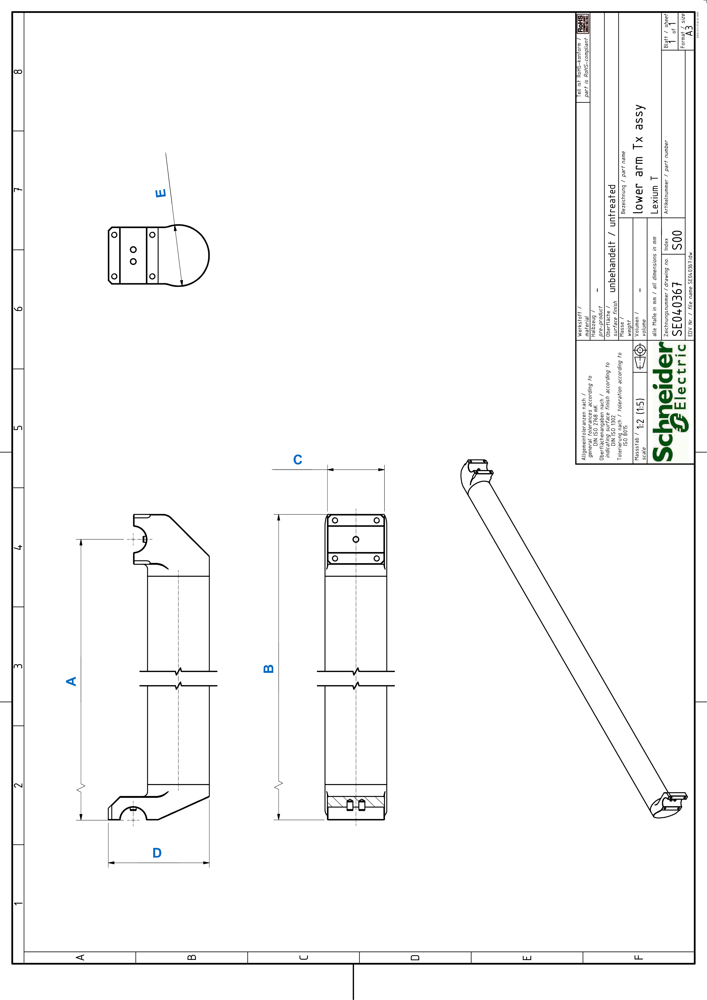

# Detail Drawing of the Lower Arm

## Detail Drawing of the Lower Arm of VRKT1, VRKT2L••NC, VRKT3L••NC, VRKT5L••NC

| Dimension | Description | Unit | Robot type | | | |
| --- | --- | --- | --- | --- | --- | --- |
| VRKT1 | VRKT2 | VRKT3 | VRKT5 |
| A | Adjustment value for controller | mm  (in) | 630  (24.8) | 700  (27.6) | 800  (31.5) | 1000  (39) |
| B | Total length | mm  (in) | 650.8  (25.6) | 720.8  (28.4) | 820.8  (32) | 1020.8  (40) |
| C | Total width | mm  (in) | 48  (1.9) | | | |
| D | Total height | mm  (in) | 63  (2.48) | 85  (3.35) | | |
| E | Tube diameter | mm  (in) | 34  (1.34) | 52  (2.05) | | |

EIO0000002280.05