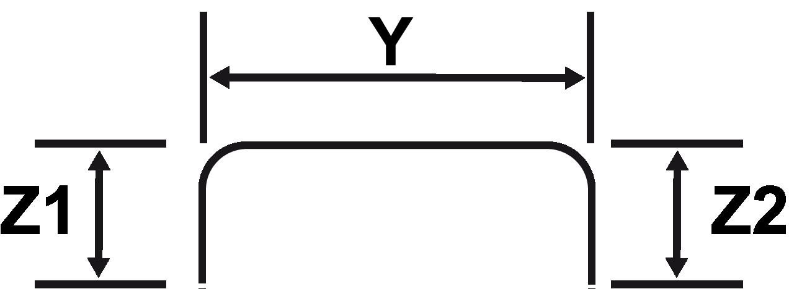
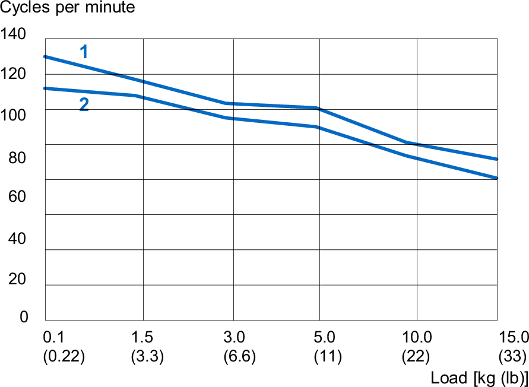
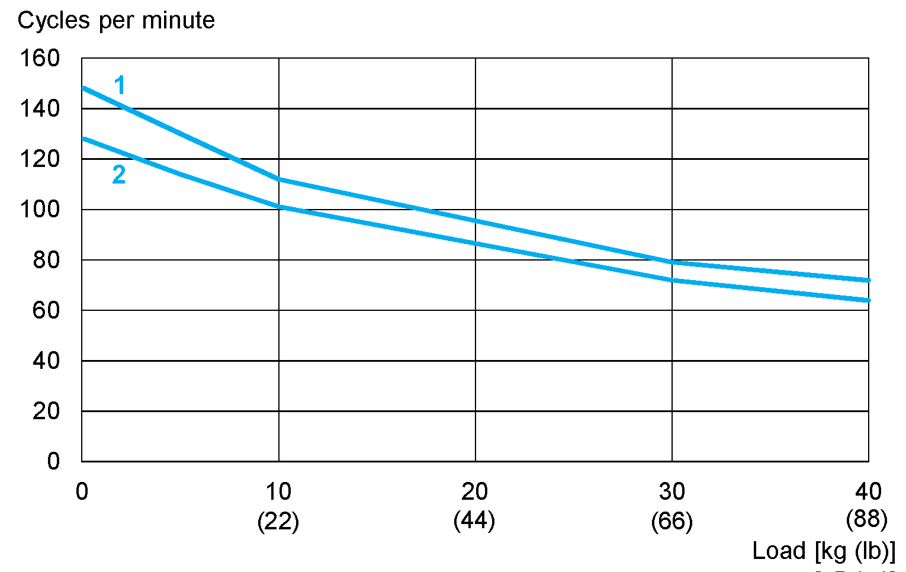
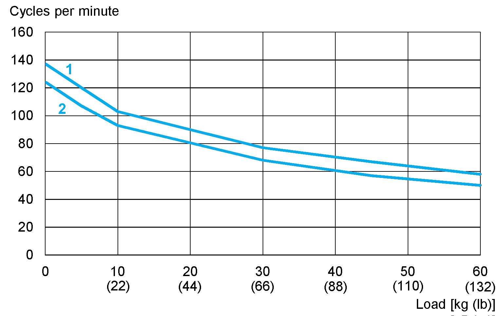
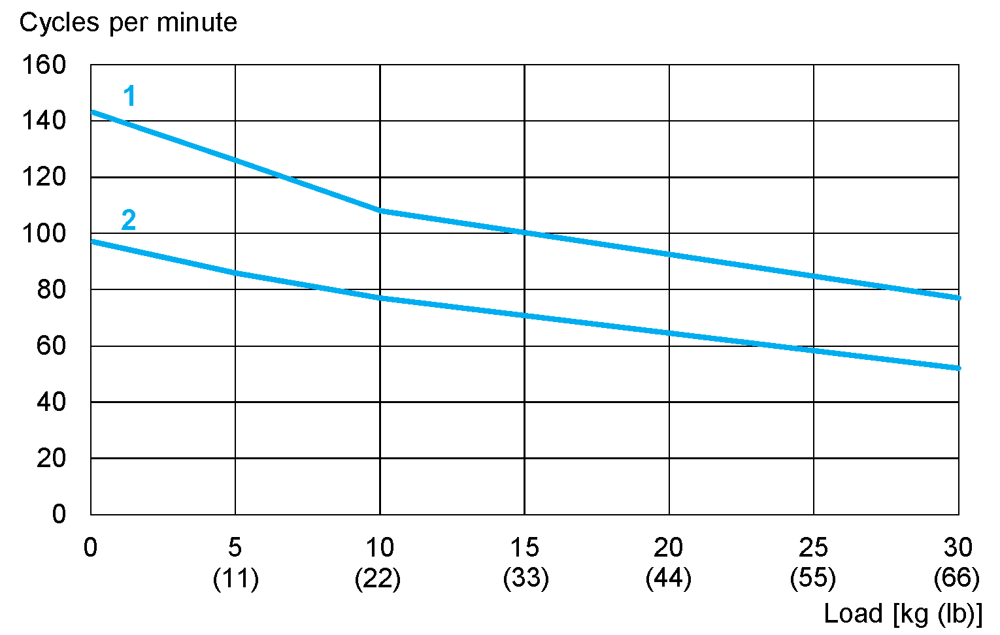
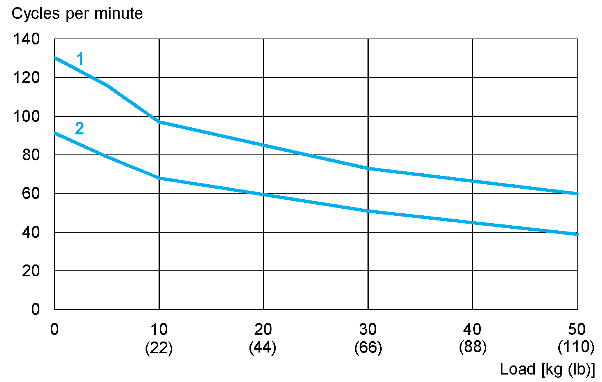
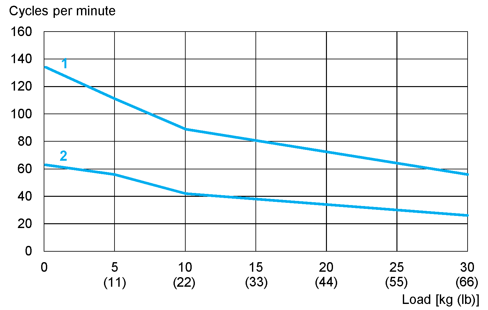
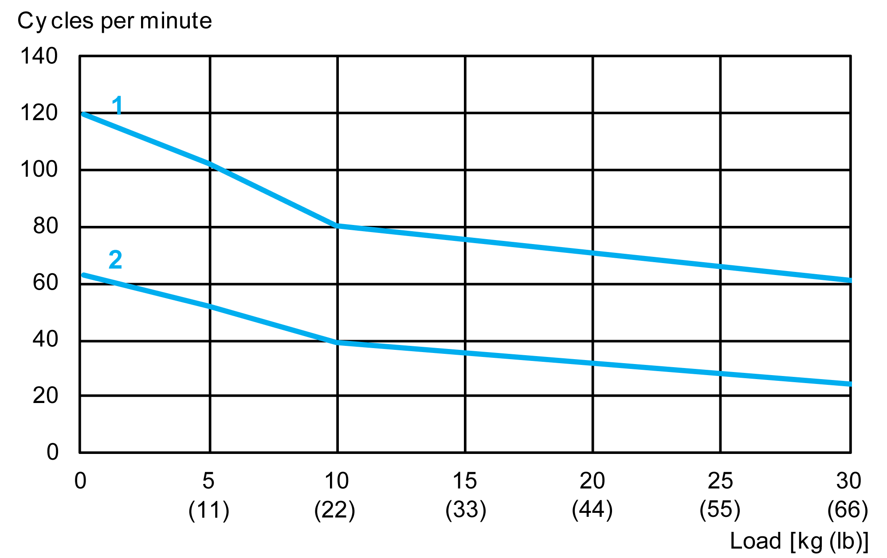

# Typical Cycle Time

## Robot Path (pick-place-pick):

## Cycle Times of Robot VRKT1M0

The following measurements are performed at an ambient temperature of 20 °C (68 °F) with a PacDrive 3 and use the `SchneiderElectricRobotics` library.

| Path Z1 x Y x Z2 in mm (in) | Load(2) in kg (lb) | Cycle time(1) in s | Cycles per minute |
| --- | --- | --- | --- |
| 25 x 305 x 25 (1 x 12 x 1) | 0.1 (0.22) | 0.468 | 128 |
| 1.5 (3.3) | 0.512 | 117 |
| 3.0 (6.6) | 0.568 | 106 |
| 5.0 (11) | 0.580 | 103 |
| 10.0 (22) | 0.692 | 87 |
| 15.0 (33) | 0.764 | 79 |
| 70 x 400 x 70 (2.76 x 15.7 x 2.76) | 0.1 (0.22) | 0.532 | 113 |
| 1.5 (3.3) | 0.548 | 109 |
| 3.0 (6.6) | 0.608 | 99 |
| 5.0 (11) | 0.636 | 94 |
| 10.0 (22) | 0.748 | 80 |
| 15.0 (33) | 0.864 | 69 |
| (1) Cycle times contain the back and forth motion. A position is considered as reached when the robot remains permanently in a window of +/-0.25 mm (0.0098 in) around the target position.  (2) Loads up to 15 kg (33 lb). Heavier payloads upon request. If required, contact your local Schneider Electric service representative | | | |

**1** 25 x 305 x 25 mm (1 x 12 x 1 in)

**2** 70 x 400 x 70 mm (2.76 x 15.7 x 2.76 in)

## Cycle Times of Robot VRKT2M0 / VRKT2L0

The following measurements are performed at an ambient temperature of 20 °C (68 °F) with a PacDrive 3 and use the `SchneiderElectricRobotics` library.

| Path Z1 x Y x Z2 in mm (in) | Load(2) in kg (lb) | Cycle time(1) in s | Cycles per minute |
| --- | --- | --- | --- |
| 25 x 305 x 25 (1 x 12 x 1) | 0.1 (0.22) | 0.405 | 148 |
| 5.0 (11) | 0.462 | 130 |
| 10.0 (22) | 0.536 | 112 |
| 30.0 (66) | 0.759 | 79 |
| 40.0 (88) | 0.833 | 72 |
| 70 x 400 x 70 (2.76 x 15.7 x 2.76) | 0.1 (0.22) | 0.469 | 128 |
| 5.0 (11) | 0.526 | 114 |
| 10.0 (22) | 0.594 | 101 |
| 30.0 (66) | 0.833 | 72 |
| 40.0 (88) | 0.938 | 64 |
| (1) Cycle times contain the back and forth motion. A position is considered as reached when the robot remains permanently in a window of +/-0.25 mm (0.0098 in) around the target position.  (2) Loads up to 40 kg (88 lb). Heavier payloads upon request. If required, contact your local Schneider Electric service representative | | | |

**1** 25 x 305 x 25 mm (1 x 12 x 1 in)

**2** 70 x 400 x 70 mm (2.76 x 15.7 x 2.76 in)

## Cycle Times of Robot VRKT2M1

The following measurements are performed at an ambient temperature of 20 °C (68 °F) with a PacDrive 3 and use the `SchneiderElectricRobotics` library.

| Path Z1 x Y x Z2 in mm (in) | Load(2) in kg (lb) | Cycle time(1) in s | Cycles per minute |
| --- | --- | --- | --- |
| 25 x 305 x 25 (1 x 12 x 1) | 0.1 (0.22) | 0.438 | 137 |
| 5.0 (11) | 0.500 | 120 |
| 10.0 (22) | 0.583 | 103 |
| 30.0 (66) | 0.779 | 77 |
| 45.0 (99) | 0.896 | 67 |
| 60.0 (132) | 1.034 | 58 |
| 70 x 400 x 70 (2.76 x 15.7 x 2.76) | 0.1 (0.22) | 0.484 | 124 |
| 5.0 (11) | 0.560 | 107 |
| 10.0 (22) | 0.680 | 93 |
| 30.0 (66) | 0.880 | 68 |
| 45.0 (99) | 1.060 | 57 |
| 60.0 (132) | 1.200 | 50 |
| (1) Cycle times contain the back and forth motion. A position is considered as reached when the robot remains permanently in a window of +/-0.25 mm (0.0098 in) around the target position.  (2) Loads up to 60 kg (132 lb). Heavier payloads upon request. If required, contact your local Schneider Electric service representative. | | | |

**1** 25 x 305 x 25 mm (1 x 12 x 1 in)

**2** 70 x 400 x 70 mm (2.76 x 15.7 x 2.76 in)

## Cycle Times of Robot VRKT3M0 / VRKT3L0

The following measurements are performed at an ambient temperature of 20 °C (68 °F) with a PacDrive 3 and use the `SchneiderElectricRobotics` library.

| Path Z1 x Y x Z2 in mm (in) | Load(2) in kg (lb) | Cycle time(1) in s | Cycles per minute |
| --- | --- | --- | --- |
| 25 x 305 x 25 (1 x 12 x 1) | 0.1 (0.22) | 0.419 | 143 |
| 5.0 (11) | 0.478 | 126 |
| 10.0 (22) | 0.558 | 108 |
| 30.0 (66) | 0.778 | 77 |
| 70 x 400 x 70 (2.76 x 15.7 x 2.76) | 0.1 (0.22) | 0.479 | 125 |
| 5.0 (11) | 0.538 | 112 |
| 10.0 (22) | 0.619 | 97 |
| 30.0 (66) | 0.858 | 70 |
| 90 x 700 x 90 (3.54 x 27.6 x 3.54) | 0.1 (0.22) | 0.618 | 97 |
| 5.0 (11) | 0.698 | 86 |
| 10.0 (22) | 0.778 | 77 |
| 30.0 (66) | 1.158 | 52 |
| (1) Cycle times contain the back and forth motion. A position is considered as reached when the robot remains permanently in a window of +/-0.25 mm (0.0098 in) around the target position.  (2) Loads up to 35 kg (66 lb). Heavier payloads upon request. If required, contact your local Schneider Electric service representative. | | | |

**1** 25 x 305 x 25 mm (1 x 12 x 1 in)

**2** 90 x 700 x 90 mm (3.54 x 27.6 x 3.54 in)

## Cycle Times of Robot VRKT3M1

The following measurements are performed at an ambient temperature of 20 °C (68 °F) with a PacDrive 3 and use the `SchneiderElectricRobotics` library.

| Path Z1 x Y x Z2 in mm (in) | Load(2) in kg (lb) | Cycle time(1) in s | Cycles per minute |
| --- | --- | --- | --- |
| 25 x 305 x 25 (1 x 12 x 1) | 0.1 (0.22) | 0.460 | 130 |
| 5.0 (11) | 0.519 | 116 |
| 10.0 (22) | 0.619 | 97 |
| 30.0 (66) | 0.818 | 73 |
| 50.0 (110) | 0.998 | 60 |
| 70 x 400 x 70 (2.76 x 15.7 x 2.76) | 0.1 (0.22) | 0.518 | 116 |
| 5.0 (11) | 0.578 | 104 |
| 10.0 (22) | 0.738 | 81 |
| 30.0 (66) | 0.979 | 61 |
| 50.0 (110) | 1.158 | 52 |
| 90 x 700 x 90 (3.54 x 27.6 x 3.54) | 0.1 (0.22) | 0.659 | 91 |
| 5.0 (11) | 0.758 | 79 |
| 10.0 (22) | 0.878 | 68 |
| 30.0 (66) | 1.178 | 51 |
| 50.0 (110) | 1.538 | 39 |
| (1) Cycle times contain the back and forth motion. A position is considered as reached when the robot remains permanently in a window of +/-0.25 mm (0.0098 in) around the target position.  (2) Loads up to 50 kg (110 lb). Heavier payloads upon request. If required, contact your local Schneider Electric service representative. | | | |

**1** 25 x 305 x 25 mm (1 x 12 x 1 in)

**2** 90 x 700 x 90 mm (3.54 x 27.6 x 3.54 in)

## Cycle Times of Robot VRKT5M0 / VRKT5L0

The following measurements are performed at an ambient temperature of 20 °C (68 °F) with a PacDrive 3 and use the `SchneiderElectricRobotics` library.

| Path Z1 x Y x Z2 in mm (in) | Load(2) in kg (lb) | Cycle time(1) in s | Cycles per minute |
| --- | --- | --- | --- |
| 25 x 305 x 25 (1 x 12 x 1) | 0.1 (0.22) | 0.448 | 134 |
| 5.0 (11) | 0.541 | 111 |
| 10.0 (22) | 0.675 | 89 |
| 30.0 (66) | 1.077 | 56 |
| 70 x 400 x 70 (2.76 x 15.7 x 2.76) | 0.1 (0.22) | 0.555 | 108 |
| 5.0 (11) | 0.593 | 101 |
| 10.0 (22) | 0.862 | 70 |
| 30.0 (66) | 1.168 | 51 |
| 90 x 700 x 90 (3.54 x 27.6 x 3.54) | 0.1 (0.22) | 0.658 | 91 |
| 5.0 (11) | 0.798 | 75 |
| 10.0 (22) | 0.991 | 61 |
| 30.0 (66) | 1.828 | 33 |
| 110 x 1300 x 110 (4.3 x 51 x 4.3) | 0.1 (0.22) | 0.950 | 63 |
| 5.0 (11) | 1.076 | 56 |
| 10.0 (22) | 1.418 | 42 |
| 30.0 (66) | 2.275 | 26 |
| (1) Cycle times contain the back and forth motion. A position is considered as reached when the robot remains permanently in a window of +/-0.25 mm (0.0098 in) around the target position.  (2) Loads up to 30 kg (66 lb). Heavier payloads upon request. If required, contact your local Schneider Electric service representative. | | | |

**1** 25 x 305 x 25 mm (1 x 12 x 1 in)

**2** 110 x 1300 x 110 mm (4.3 x 51 x 4.3 in)

## Cycle Times of Robot VRKT5M1

The following measurements are performed at an ambient temperature of 20 °C (68 °F) with a PacDrive 3 and use the `SchneiderElectricRobotics` library.

| Path Z1 x Y x Z2 in mm (in) | Load(2) in kg (lb) | Cycle time(1) in s | Cycles per minute |
| --- | --- | --- | --- |
| 25 x 305 x 25 (1 x 12 x 1) | 0.1 (0.22) | 0.501 | 120 |
| 5.0 (11) | 0.581 | 102 |
| 10.0 (22) | 0.752 | 80 |
| 30.0 (66) | 0.980 | 61 |
| 40.0 (88) | 1.102 | 54 |
| 70 x 400 x 70 (2.76 x 15.7 x 2.76) | 0.1 (0.22) | 0.594 | 101 |
| 5.0 (11) | 0.682 | 88 |
| 10.0 (22) | 0.998 | 60 |
| 30.0 (66) | 1.153 | 52 |
| 40.0 (88) | 1.253 | 48 |
| 90 x 700 x 90 (3.54 x 27.6 x 3.54) | 0.1 (0.22) | 0.751 | 80 |
| 5.0 (11) | 0.893 | 67 |
| 10.0 (22) | 1.092 | 55 |
| 30.0 (66) | 1.575 | 38 |
| 40.0 (88) | 1.875 | 32 |
| 110 x 1300 x 110 (4.3 x 51 x 4.3) | 0.1 (0.22) | 0.952 | 63 |
| 5.0 (11) | 1.157 | 52 |
| 10.0 (22) | 1.535 | 39 |
| 30.0 (66) | 2.504 | 24 |
| 40.0 (88) | 2.859 | 21 |
| (1) Cycle times contain the back and forth motion. A position is considered as reached when the robot remains permanently in a window of +/-0.25 mm (0.0098 in) around the target position.  (2) Loads up to 45 kg (88 lb). Heavier payloads upon request. If required, contact your local Schneider Electric service representative | | | |

**1** 25 x 305 x 25 mm (1 x 12 x 1 in)

**2** 110 x 1300 x 110 mm (4.3 x 51 x 4.3 in)

EIO0000002280.05