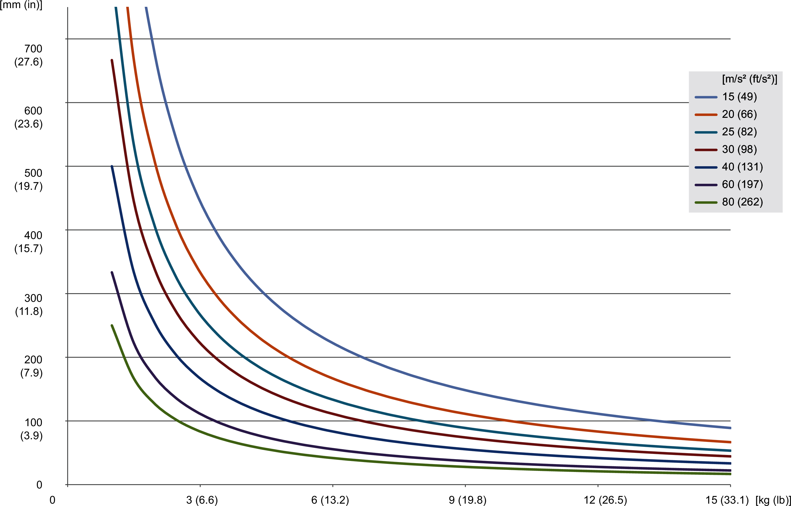
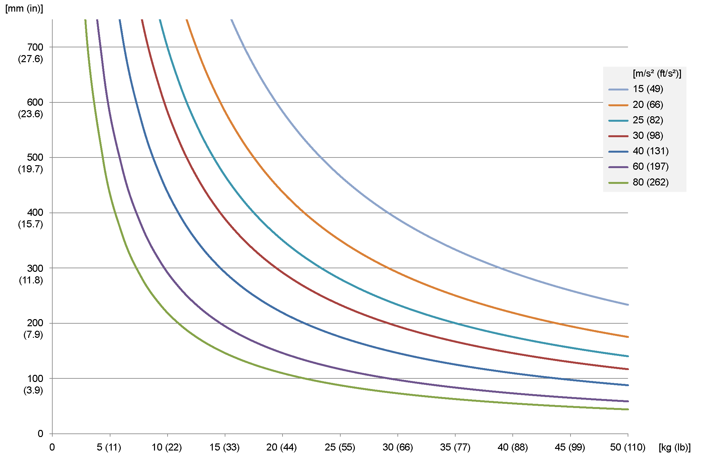

# Load Capacity Diagram

## Overview

The load diagram shows the maximum permissible distance of the mass center of gravity from the Flange Center Point (FCP) for a given acceleration relative to the mass. For detailed information, refer to the respective dimensional drawing in [*Mechanical and Electrical Data*](D-SE-0056649.html#D-SE-0056649).

## Maximum Tilting Torque (Vertical Distance from the FCP)

The loading capacity of the Lexium T robots is limited by the maximum tilting torque at the FCP. The following diagrams show the possible vertical distance of the mass center of gravity of the payload relative to the mass and the required maximum acceleration.

For VRKT1:

A maximum tilting torque of 20 Nm (177 lbf-in) is to be observed at the FCP:

For VRKT2, VRKT3, VRKT5:

A maximum tilting torque of 175 Nm (1549 lbf-in) is to be observed at the FCP:

Calculate the tilting torque with the following formula:

Tilting torque [Nm (lbf-in)] = payload [kg (lb)] x maximum acceleration [m/s2 (ft/s2)] x distance from the FCP [m (in)]

EIO0000002280.05