# Run-On Motions of the Robot for Risk Analysis

## Overview

What is measured is the time from the application of a stop signal to the standstill of the robot. This measurement is carried out for various different loads and velocities (measurement according to ISO 10218-1).

| WARNING | |
| --- | --- |
|  | BREAKDOWN OF THE INTERNAL MOTOR HOLDING BRAKE  * Do not consider the internal motor holding brake to be a functional safety device. * Take into account a possible breakdown of the internal motor holding brake during your safety analysis. * Take into account that the internal motor holding brake of the robot only withstands a limited number of brake operations.  Failure to follow these instructions can result in death, serious injury, or equipment damage. |

If there is a power interruption of the control system, the brakes are applied and the robot mechanics leave the planned trajectory.

| WARNING | |
| --- | --- |
|  | LEAVING THE PLANNED TRAJECTORY OF THE ROBOT MECHANICS  * Use the buffering of the 24 V supply (UPS) in order to enable a controlled stop of the mechanics, in accordance with stop category 1, by making use of the stored residual mechanical and electrical energy. * Use a synchronous stop on the path to avoid collisions with obstacles. * Observe the extension of the run-on path while performing your risk analysis.  Failure to follow these instructions can result in death, serious injury, or equipment damage. |

## Stop Function Categories

The following table presents the stop function categories according to IEC 60204-1 that are related to the product:

| Stop function category | Definition | Corresponds to |
| --- | --- | --- |
| 0 | Stopping by immediate removal of power to the machine actuators (for example, an uncontrolled stop). | An uncontrolled stop (stopping of machine motion by removing electrical power to the machine actuators). |
| 1 | A controlled stop with power available to the machine actuators to achieve the stop and then removal of power when the stop is achieved. | An controlled stop (stopping of machine motion with power to the machine actuators maintained during the stopping process). |

## Run-On Path Robot VRKT1M0

Run-on path of the robot VRKT1M0 for stop category 0:

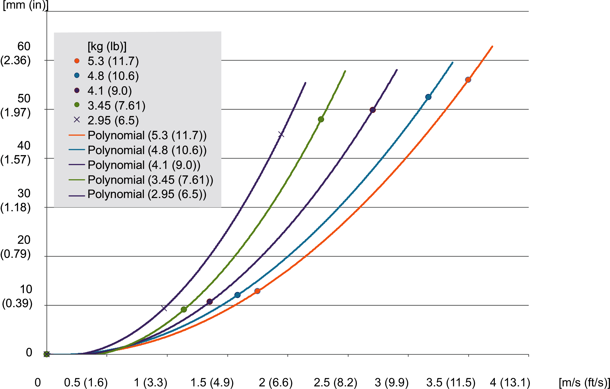

For further information, refer to IEC 60204-1. If necessary, use the holding brake for a stop category 0.

Stopping time of the robot VRKT1M0 for stop category 0:

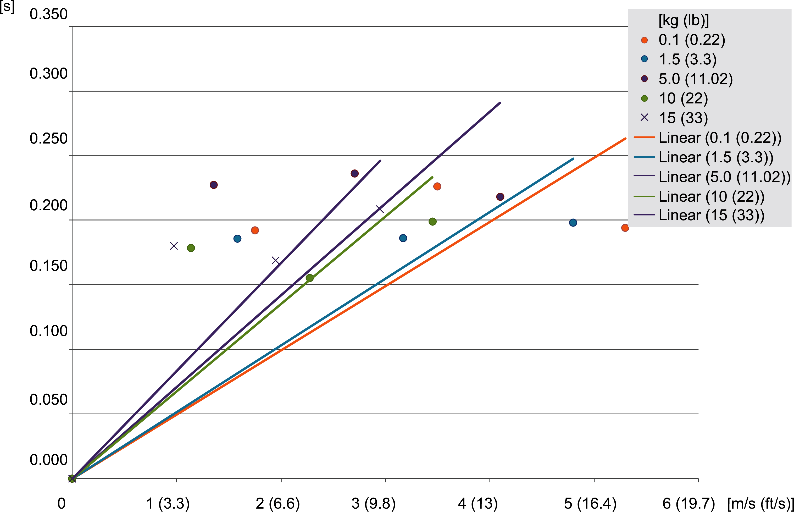

For further information, refer to IEC 60204-1. If necessary, use the holding brake for a stop category 0.

## Run-On Path Robot VRKT2M0 and Robot VRKT2L0

Run-on path of the robot VRKT2M0 and the robot VRKT2L0 for stop category 0:

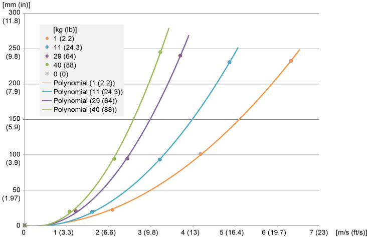

For further information, refer to IEC 60204-1. If necessary, use the holding brake for a stop category 0.

Stopping time of the robot VRKT2M0 and the robot VRKT2L0 for stop category 0:

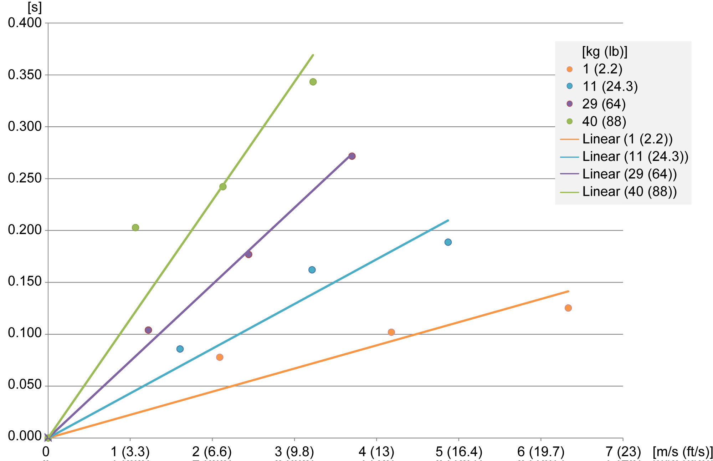

For further information, refer to IEC 60204-1. If necessary, use the holding brake for a stop category 0.

## Run-On Path Robot VRKT2M1

Run-on path of the robot VRKT2M1 for stop category 0:

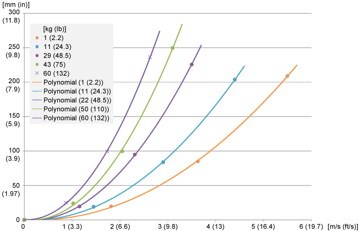

For further information, refer to IEC 60204-1. If necessary, use the holding brake for a stop category 0.

Stopping time of the robot VRKT2M1 for stop category 0:

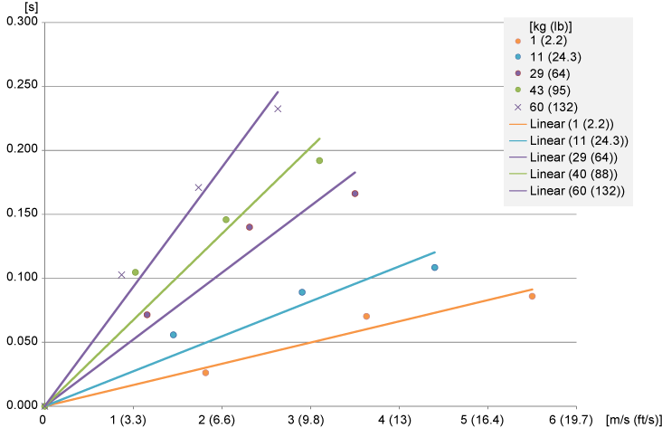

For further information, refer to IEC 60204-1. If necessary, use the holding brake for a stop category 0.

## Run-On Path Robot VRKT3M0 and Robot VRKT3L0

Run-on path of the robot VRKT3M0 and the robot VRKT3L0 for stop category 0:

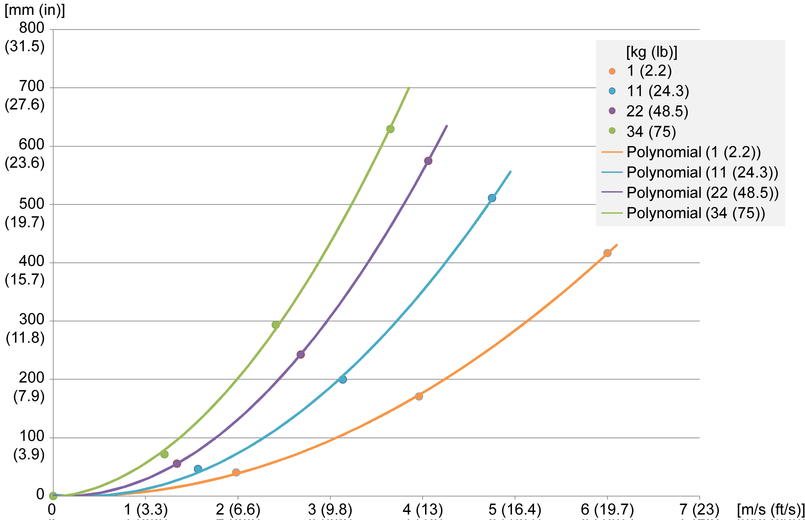

For further information, refer to IEC 60204-1. If necessary, use the holding brake for a stop category 0.

Stopping time of the robot VRKT3M0 and the robot VRKT3L0 for stop category 0:

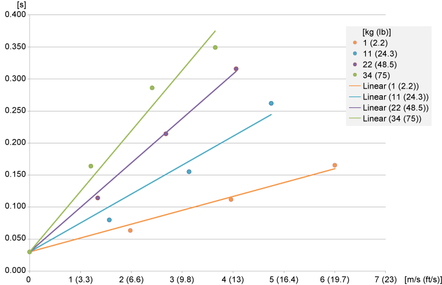

For further information, refer to IEC 60204-1. If necessary, use the holding brake for a stop category 0.

## Run-On Path Robot VRKT3M1

Run-on path of the robot VRKT3M1 for stop category 0:

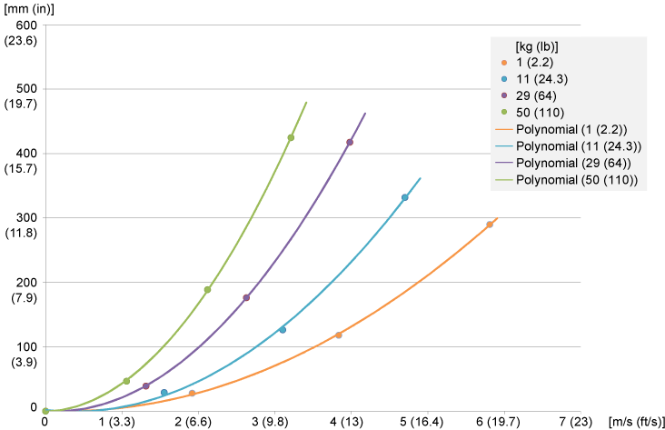

For further information, refer to IEC 60204-1. If necessary, use the holding brake for a stop category 0.

Stopping time of the robot VRKT3M1 for stop category 0:

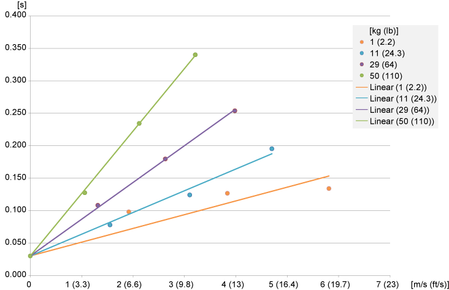

For further information, refer to IEC 60204-1. If necessary, use the holding brake for a stop category 0.

## Run-On Path Robot VRKT5M0 and Robot VRKT5L0

Run-on path of the robot VRKT5M0 and the robot VRKT5L0 for stop category 0:

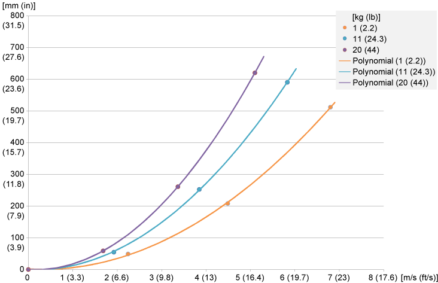

For further information, refer to IEC 60204-1. If necessary, use the holding brake for a stop category 0.

Stopping time of the robot VRKT5M0 and the robot VRKT5L0 for stop category 0:

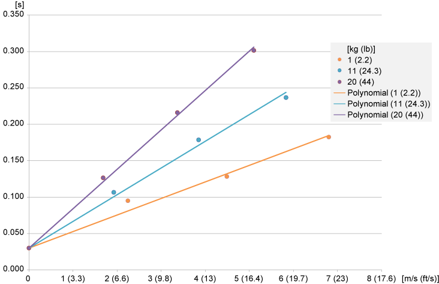

For further information, refer to IEC 60204-1. If necessary, use the holding brake for a stop category 0.

## Run-On Path Robot VRKT5M1

Run-on path of the robot VRKT5M1 for stop category 0:

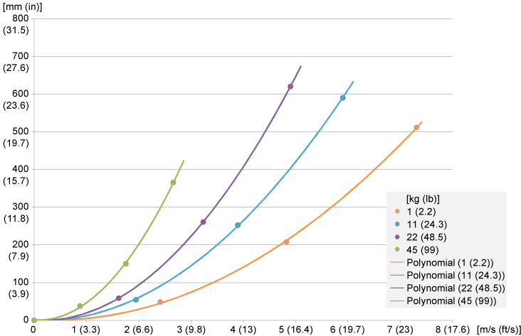

For further information, refer to IEC 60204-1. If necessary, use the holding brake for a stop category 0.

Stopping time of the robot VRKT5M1 for stop category 0:

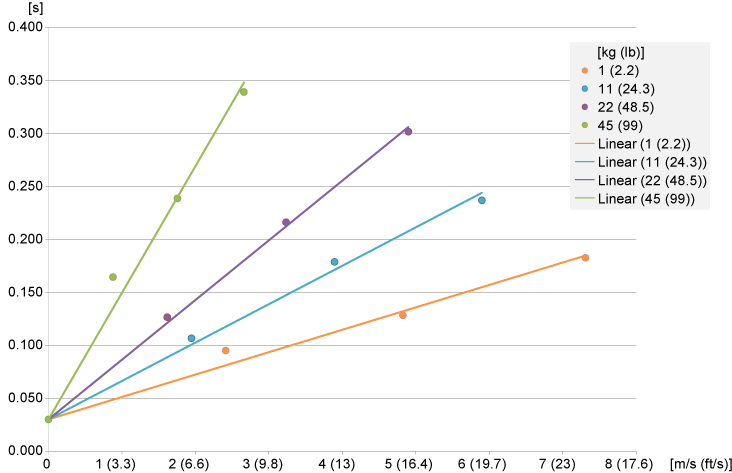

For further information, refer to IEC 60204-1. If necessary, use the holding brake for a stop category 0.

EIO0000002280.05