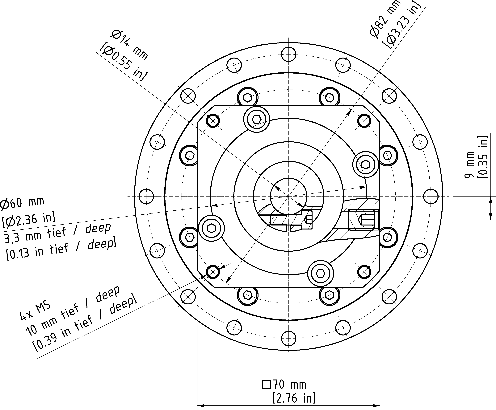
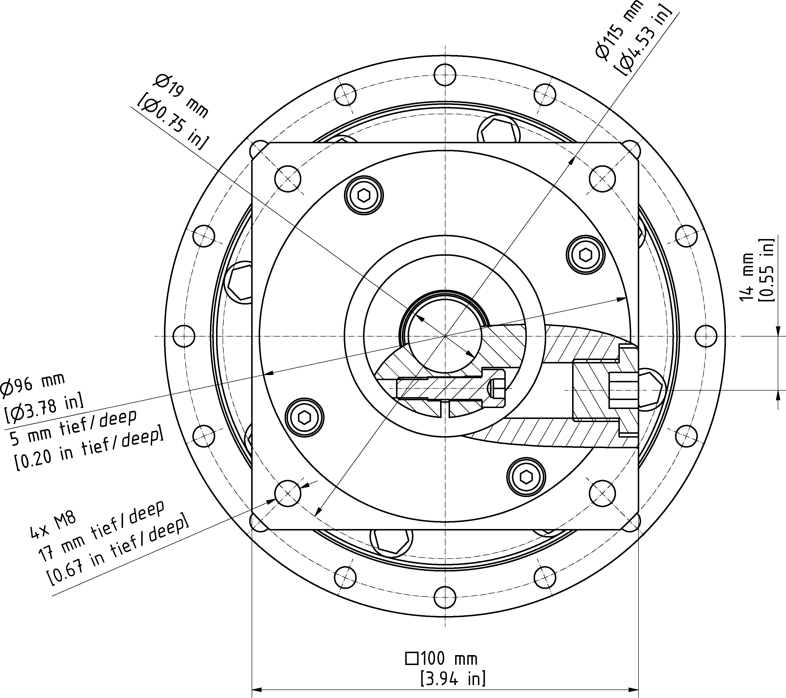

# Technical Data of the Motor and the Gearbox

## Overview

For further information about the motor, record the motor reference on the type plate and refer to the corresponding motor manual.

For further information about the gearbox, record the gearbox reference on the type plate and refer to the corresponding gearbox manual.

## Third-Party Motors

When using a third-party motor, take special care that the maximum permissible drive torque is not exceeded. Otherwise the robot could be rendered inoperable.

| WARNING | |
| --- | --- |
|  | UNINTENDED MOVEMENTS  Observe the maximum permissible drive torque of the corresponding motor and gearbox.  Failure to follow these instructions can result in death, serious injury, or equipment damage. |

The following table presents the maximum permissible torques at the respective axes.

| Parameter | Unit | Robot type | |
| --- | --- | --- | --- |
| VRKT1WM | VRKT2WM  VRKT3WM  VRKT5WM |
| Maximum drive torque on the input side of the gearbox Mmax | Nm (lbf-in) | 2.5 (22.1) | 9 (80) |
| Maximum speed on the input side of the gearbox | 1/min | 8000 | 6000 |

NOTE: When using a third-party motor, the protection class of the robot can deviate from that which is stated in [*Mechanical and Electrical Data*](D-SE-0056649.html#D-SE-0056649). Verify that the protection class corresponds to the environments specified for the robot.

For information about mounting the motor to the gearbox, refer to the corresponding gearbox manual.

The following figure shows the dimensions of the input side of the adapter plate of the gearbox at the main axes.

## VRKT1

## VRKT2, VRKT3, VRKT5

EIO0000002280.05