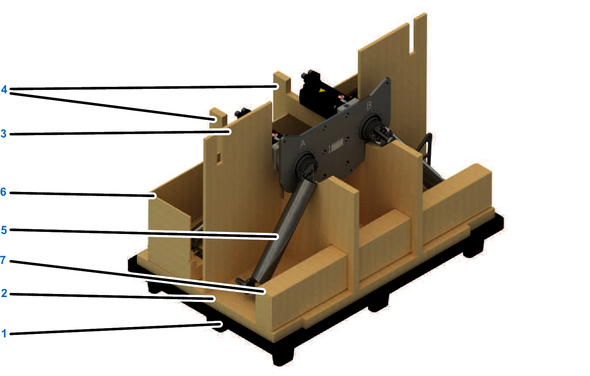

# Unpacking

## Overview

The following figures show the procedure to unpack and prepare the robot as an example.

## Removing the Outer Carton

| Step | Action |
| --- | --- |
| 1 | Remove the lashing straps from the outer carton. |
| 2 | Open the outer carton (1) on the top side and open the corrosion protection bag (not shown in graphic). |
| 3 | Lift up and remove the outer carton (1). |
| 4 | Remove the six carton corners (2) and the supporting carton (3). |

## Presentation of the Robot Packaging

The following figure shows the packaging of robot:

|  |  |
| --- | --- |
| **1** Plastic pallet (120 x 80 cm (47 in x 31.5 in)) | **5** Upper arms in transportation position |
| **2** Base carton | **6** Insert carton robot arm |
| **3** Cross piece carton single | **7** Accessories carton box |
| **4** Cross piece carton double |  |

## Preparing the Robot for Installation

| Step | Action |
| --- | --- |
| 1 | Slide out the insert carton robot arm (4) and the accessories carton box (5) to the left or right and verify it for transport damage. |
| 2 | Verify the robot for transport damage. |
| 3 | Open the accessories box and verify all included parts for transport damage and completeness.  It must contain:   * 1x parallel linkage rod long * 1x parallel linkage rod short * 3x half shell for lower arm fixing * 12x screw for half shell * 12x lock washer for half shell * 1x instruction sheet for Lexium T (NAT24232) |

NOTE: In case of transport damage, contact your Schneider Electric representative.

For information about the disposal of the packaging, refer to [*Disposal*](D-SE-0059497.html#D-SE-0059497).

EIO0000002280.05