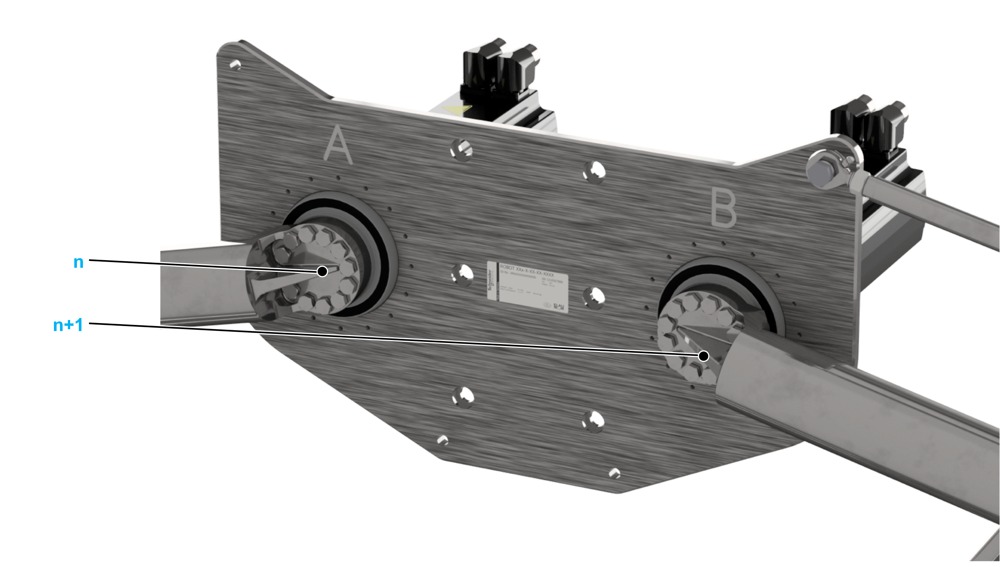

# Allocation of the Sercos Addresses

## Presentation

Allocate the Sercos addresses of the servo amplifiers on the two main axes in ascending order. First allocate A and then allocate B (refer to the engraved letters on the mounting plate).

EIO0000002280.05