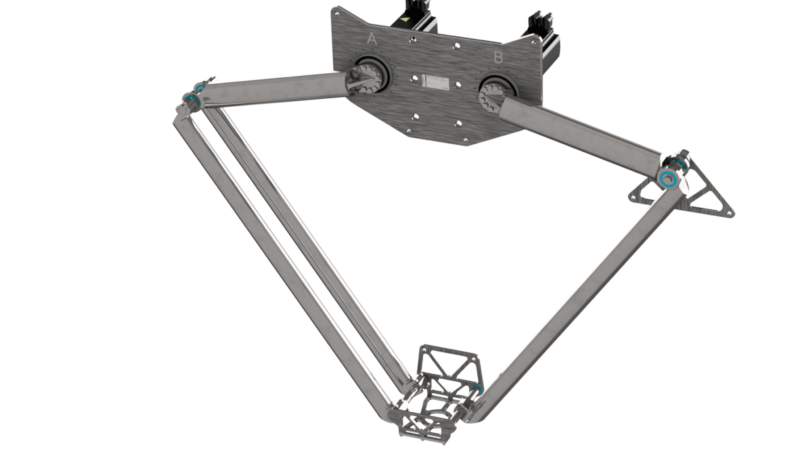

# Mounting the Lower Arms with Parallel Plate

## Overview

In the following procedures, the single lower arm with parallel plate is mounted to the right side and the double lower arm is mounted to the left side of the robot (see the following figure). Alternatively, you can switch the mounting sides of the single lower arm with parallel plate and the double lower arm.

For further information on changing the mounting sides, contact your local Schneider Electric service representative.

## Mounting the Single Lower Arm with Parallel Plate

| Step | Action |
| --- | --- |
| 1 | Verify that the premounted combination of the lower arms and the parallel plate shows no visible signs of transport damage.  NOTE: If there are visible signs of transport damage, replace the parts. |
| 2 | Push the single lower arm (1) with its upper end to the mid of the upper arm (5). |
| 3 | Verify that the two pins (2) of the lower arm are fitting correctly into the upper arm shaft (3). |
| 4 | Attach the half shell (4) to the lower arm and tighten it with four screws (6) and four lock washers (7).  Tightening torque: 4.7 Nm (42 lbf-in) |

## Mounting Double Lower Arms with Parallel Plate

| Step | Action |
| --- | --- |
| 1 | Push both lower arms (1) with their upper ends to the left and right of the upper arm (7). |
| 2 | Verify that the two pins (2) of both lower arms are fitting correctly into the upper arm shaft (3). |
| 3 | Attach the two half shells (4) to the lower arms and tighten each one with four screws (6) and four lock washers (5).  Tightening torque: 4.7 Nm (42 lbf-in) |
| 4 | Verify that the robot configuration corresponds to the following figure.    NOTE: Alternatively, the mounting sides of the single lower arm and the double lower arm can be switched. |

EIO0000002280.05