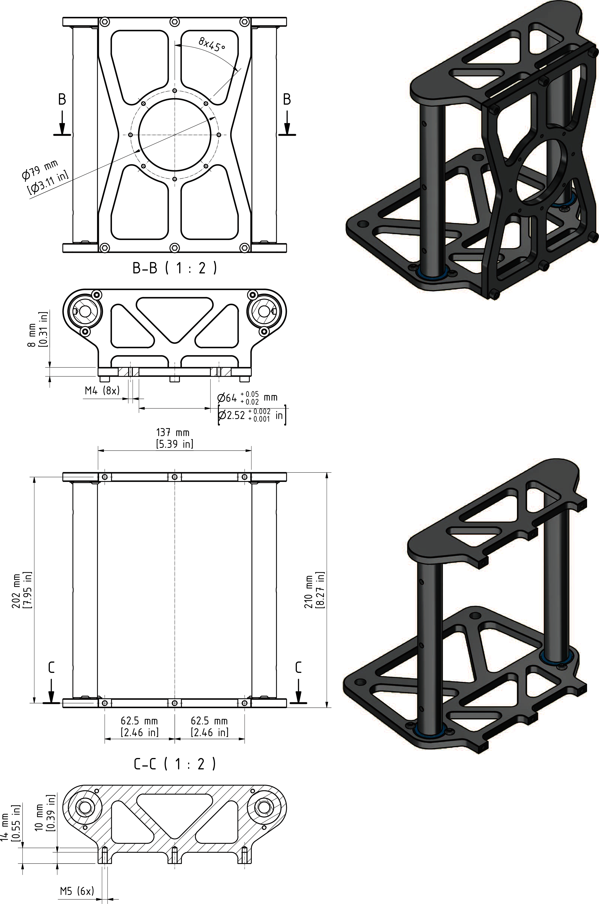

# Mounting the Gripper

## Mounting the Gripper at VRKT1, VRKT2, VRKT3, VRKT5

| Step | Action |
| --- | --- |
| 1 | Fasten the gripper to the mounting points provided for this purpose on the parallel plate (1):   * Pitch circle diameter 79 mm (3.1 in): 8 x M4 (2), tightening torque: 2.2 Nm (19.5 lbf-in); property class of the screws 8.8 or greater or A4-80 or greater.   Use a medium strength threadlocking adhesive, such as Loctite 243, for this purpose.  For further information, refer to [*Flange Dimensions for Lexium T Robots*](#D-SE-0066011__D-SE-0066011.5).    NOTE:  * Observe the permissible weights and distances. For further information, refer to [*Mechanical and Electrical Data*](D-SE-0056649.html#D-SE-0056649). * The maximum tilting torque at the parallel plate is 175 Nm (1549 lbf-in). For further information, refer to [*Load Capacity Diagram*](D-SE-0065883.html#D-SE-0065883). |

## Flange Dimensions for Lexium T Robots

EIO0000002280.05