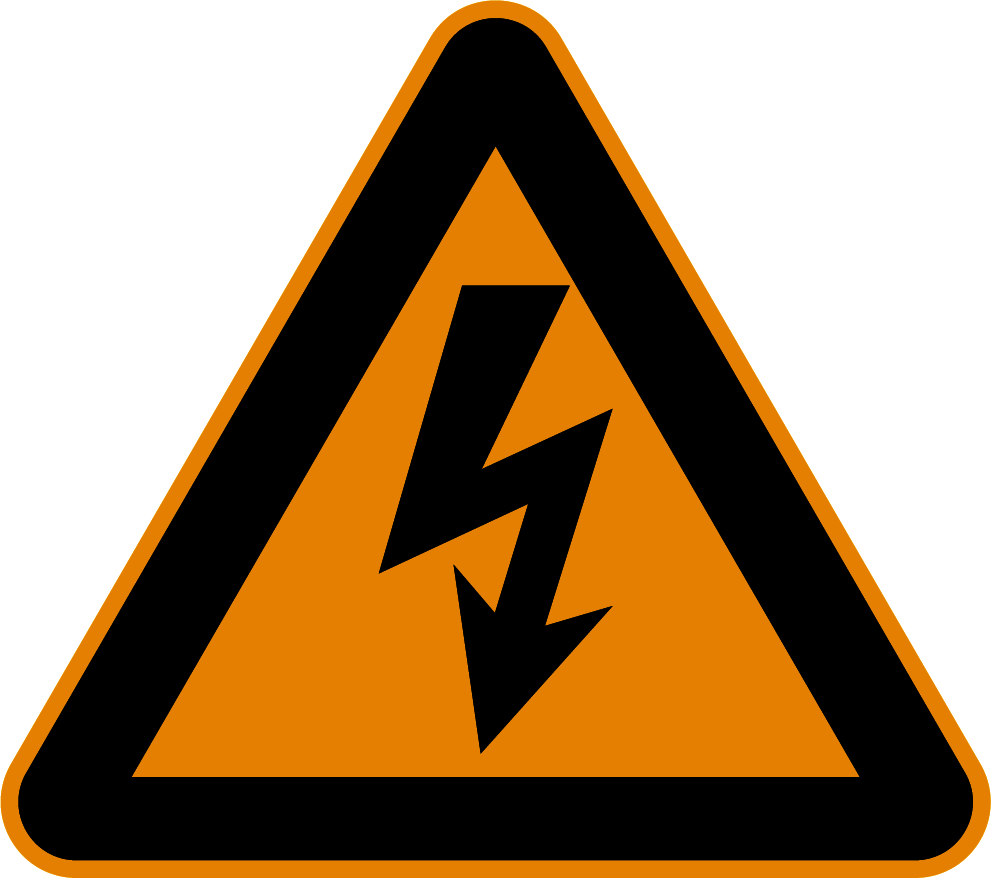
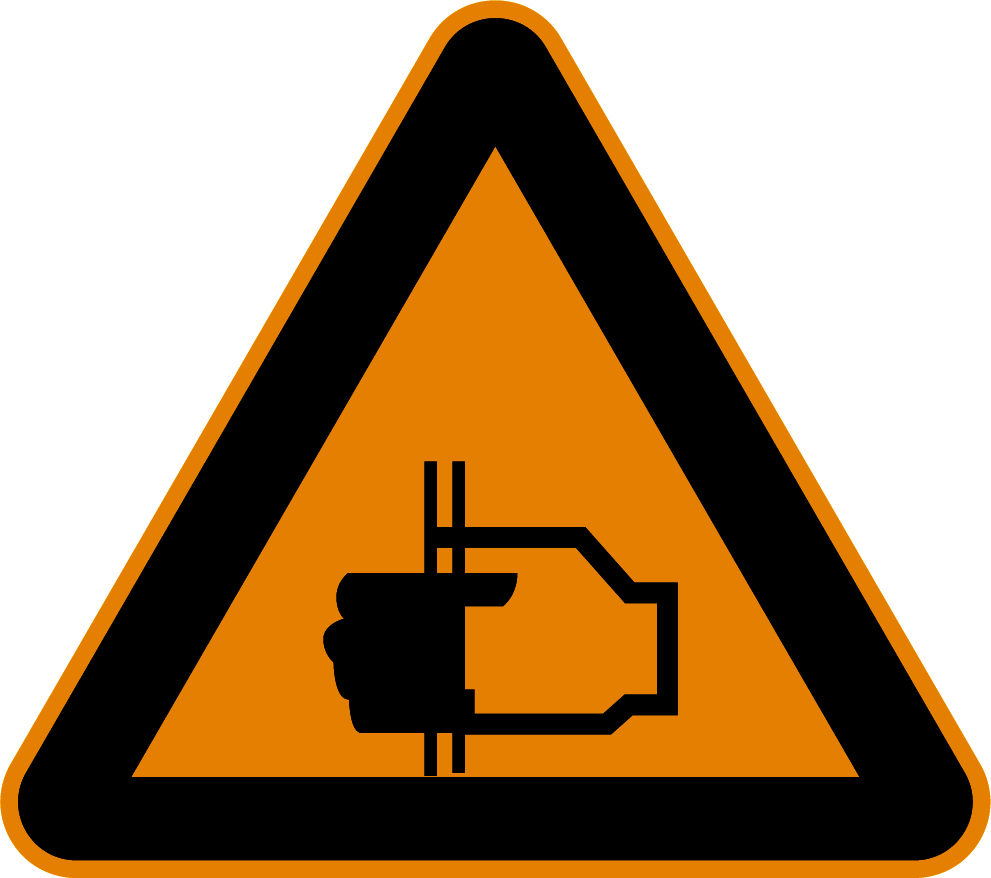
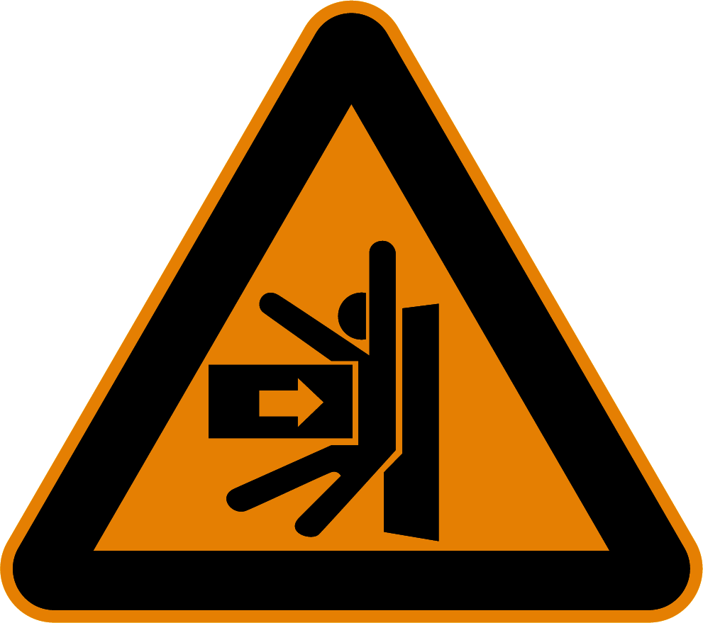
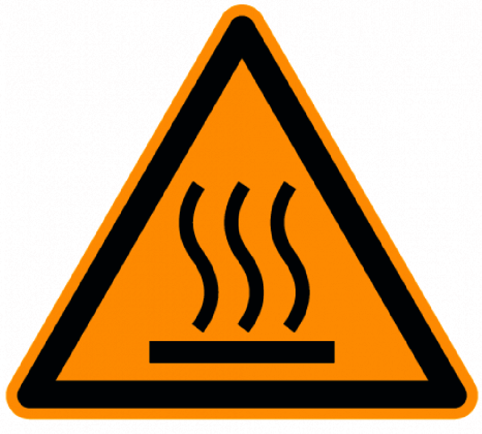
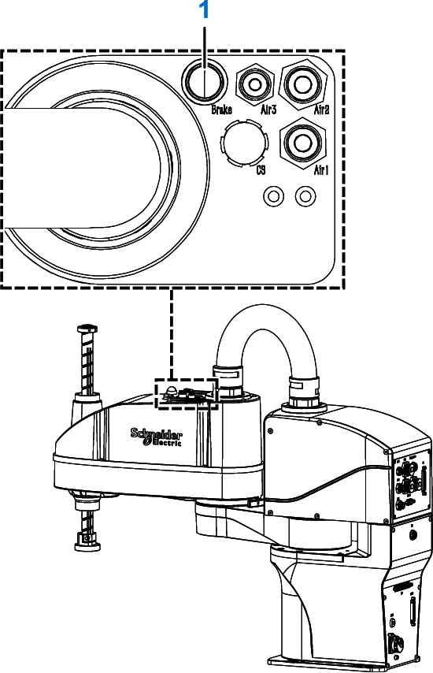
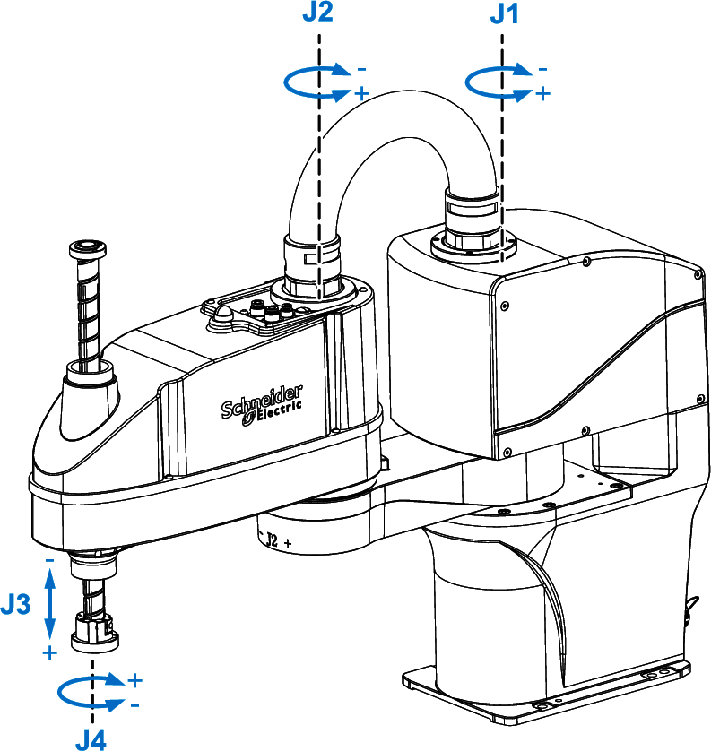

# Residual Risks

## Overview

Risks arising from the robot have been reduced. However a residual risk remains since the robot is moved and operated with electrical voltage and electrical currents.

If activities involve residual risks, a safety message is made at the appropriate points. This includes potential hazards that may arise, their possible consequences, and describes preventive measures to avoid the hazards.

## Electrical Parts

| DANGER | |
| --- | --- |
|  | ELECTRIC SHOCK, EXPLOSION, OR ARC FLASH  * Disconnect all power from all equipment including connected devices prior to removing any covers or doors, or installing or removing any accessories, hardware, cables, or wires except under the specific conditions specified in the appropriate hardware guide for this equipment. * Always use a properly rated voltage sensing device to confirm that the power is off where and when indicated. * Replace and secure all covers, accessories, hardware, cables, and wires and confirm that a proper ground connection exists before applying power to the equipment. * Use only the specified voltage when operating this equipment and any associated products. * After switching off the equipment make sure to maintain a waiting time of at least 5 minutes before disconnecting the power cable for the capacitors to discharge. * Operate electrical components only with a connected protective ground (earth) cable. * Verify the secure connection of the protective ground (earth) cable to the electrical devices so that connection complies with the wiring diagram. * Do not touch the electrical connection points of the components when the equipment is energized. * Provide protection against indirect contact. * Insulate any unused conductors on both ends of the connection cable. * Ensure that the power cables are correctly connected and connectors are locked in place during the operation time of the system.  Failure to follow these instructions will result in death or serious injury. |

NOTE: The following standardized "dangerous voltage" alert symbol is attached to the Lexium SCARA.

## Emergency Stop

The Lexium SCARA is equipped with internal holding brakes on joint 3 and joint 4. The Lexium SCARA is not equipped with other brakes.

The holding brakes automatically engage when a safety stop or emergency stop is performed. For more information on connecting the Lexium SCARA robot to external safety devices, refer to [Electrical Connections](D-SE-0056652.html).

| WARNING | |
| --- | --- |
|  | ENTRAPMENT BY ROBOT MECHANICS  * Provide means for ensuring that the motors can be put into a voltage-free state with any internal holding brake released. * Make available those means to allow one person to manually move the robot within reach of the zone of operation.  Failure to follow these instructions can result in death, serious injury, or equipment damage. |

## Assembly and Handling

| WARNING | |
| --- | --- |
|  | CRUSHING, SHEARING, CUTTING AND HITTING DURING HANDLING  * Observe the general construction and safety regulations for handling and assembly. * Use appropriate mounting and transport equipment and use appropriate tools. * Prevent clamping and crushing by taking appropriate precautions. * Cover edges and angles to protect against cutting damage. * Wear suitable protective clothing (for example, protective goggles, protective boots, protective gloves).  Failure to follow these instructions can result in death, serious injury, or equipment damage. |

NOTE: The following hand pinching alert symbol is attached to the Lexium SCARA.

## Installation

| WARNING | |
| --- | --- |
|  | UNINTENDED EQUIPMENT OPERATION  * Ensure that the Lexium SCARA and the end-effector are properly attached to one another. * Verify that the settings are correct for the Lexium SCARA installation position, the payload mounted on the Tool Center Point (TCP), and the TCP offset according to the instructions in the present document and any supporting documents.  Failure to follow these instructions can result in death, serious injury, or equipment damage. |

## Robot Motion

Parts of the mechanics can move at high speeds. In such cases, the payload weight, additionally installed end-effector, and shifts in the center of gravity of the moving parts contribute to the total energy of the forces generated.

Joint 3 and joint 4 of the Lexium SCARA have an internal holding brake. In case of power loss, the brake engages automatically to help prevent the Lexium SCARA from moving.

NOTE: Moving joints 3 and/or 4 with the holding brake(s) engaged may damage the holding brake. Avoid such movement in non-emergency conditions.

The functional safety standards and directives for the respective country where the equipment is in use define which protective measures are appropriate. Additionally, the system engineer who is responsible for the integration of the robot mechanics must evaluate which measures have to be taken.

NOTE: The configuration of the robot mechanics, the Tool Center Point (TCP) velocity, as well as the additional payload have an effect on the total energy, which can potentially be a source of damage and injury.

| WARNING | |
| --- | --- |
|  | CRUSHING, SHEARING, CUTTING AND IMPACT INJURY  * Define the clearance distance to the working area of operation of the Lexium SCARA to be within the mechanical limits such that the operational staff do not have access to, nor can be enclosed between, the Lexium SCARA working area and the mechanical limits of operation. * All barriers, protective doors, contact mats, light barriers, visual protection system, and other protective equipment must be connected, configured correctly and enabled whenever the robot mechanics are under power. * Consider the Lexium SCARA as active even though the Lexium SCARA has reached a stop position waiting for a run command.  Failure to follow these instructions can result in death, serious injury, or equipment damage. |

| WARNING | |
| --- | --- |
|  | INAPPROPRIATE SAFETY FUNCTIONS  * Ensure that each safety function is verified by parameters and procedure before putting the system in operation for the first time. * Ensure that your intended combination of safety functions is available when using the Lexium SCARA.  Failure to follow these instructions can result in death, serious injury, or equipment damage. |

| NOTICE | |
| --- | --- |
|  | INSUFFICIENT working SPACE  Ensure the Lexium SCARA has sufficient space to operate freely.  Failure to follow these instructions can result in equipment damage. |

NOTE: The following impact hazard and hand pinching alert symbols are attached to Lexium SCARA.

## Heat Dissipation

The Lexium SCARA surface and the housing of the Lexium SCARA are parts of the heat dissipation concept of the system. For this reason, the surfaces must be kept clean and free of any coating or paint.

| NOTICE | |
| --- | --- |
|  | INOPERABLE EQUIPMENT  * Keep the surface and housing clean. * Do not apply coating or painting to the surface and housing nor anything that would affect the heat dissipation properties of the Lexium SCARA.  Failure to follow these instructions can result in equipment damage. |

## Hot Surfaces

The temperature on the housing of the Lexium SCARA may exceed 50 °C (122 °F).

| WARNING | |
| --- | --- |
|  | HOT SURFACES  * Avoid unprotected contact with hot surfaces. * Do not allow flammable or heat-sensitive parts in the immediate vicinity of hot surfaces. * Verify that the heat dissipation is sufficient by performing a test run under maximum load conditions.  Failure to follow these instructions can result in death, serious injury, or equipment damage. |

NOTE: The following hot surface alert symbol is attached to the Lexium SCARA.

## Hazardous Movements

There can be different sources of hazardous movements:

* No or incorrect calibration of the Lexium SCARA
* Wiring or cabling errors
* Errors in the application program
* Component errors
* Error in the measured value and signal transmitter
* Incorrect installation settings (for example, payload parameter, TCP offset, safety-related configuration)
* Combination of the Lexium SCARA with other equipment or integration into a machine or process

NOTE: Provide for personal safety by primary equipment monitoring or measures. Do not rely only on the internal monitoring of the Lexium SCARA system. Adapt the monitoring or other arrangements and measures to the specific conditions of the installation in accordance with a hazard and risk analysis.

| DANGER | |
| --- | --- |
|  | UNAVAILABLE OR INADEQUATE PROTECTION DEVICE(S)  * Prevent entry to the zone of operation with, for example, protective fencing, mesh guards, protective coverings, light barriers or visual protection systems. * Dimension the protective devices properly and do not remove or modify them. * Connect safety-related devices only to the dedicated safety-related inputs and outputs of the system. * Do not make any modifications that can degrade, incapacitate, or in any way invalidate protection devices. * Protect existing workstations and operating terminals against unauthorized operation. * Position emergency stop switches so that they are accessible and within reach of the normal position or station of the operator of the equipment. * Validate the functionality of emergency stop equipment before start-up and during maintenance periods. * Prevent unintentional start-up by disabling the power stages of the equipment system using the emergency stop circuit or using an appropriate lock-out tag-out sequence. * Validate the system and installation before the initial start-up. * Avoid operating high-frequency, remote control, and radio devices close to the system electronics and their feed lines. * Perform, if necessary, a special electromagnetic compatibility (EMC) verification of the system.  Failure to follow these instructions will result in death or serious injury. |

The Lexium SCARA may perform unanticipated movements because of incorrect wiring, incorrect settings, incorrect data, or other errors.

| WARNING | |
| --- | --- |
|  | UNINTENDED EQUIPMENT OPERATION  * Carefully install the wiring in accordance with EMC standards. * Do not operate the Lexium SCARA with undetermined settings and data. * Perform comprehensive commissioning tests that include verification of configuration settings and data that determine position and movement. * Do not operate the Lexium SCARA with a payload greater than the maximum payload.  Failure to follow these instructions can result in death, serious injury, or equipment damage. |

For further information on the payload, refer to [Technical Data](D-SE-0061396.html).

## Noise Protection

The noise level of the mechanics depends on the basic cycle and the payload, as well as on further application-specific accessory parts. Be aware of the fact that noise emissions multiply when several mechanics are in use at the same time. If noise emissions reach a value of more than 70 dBA, wear hearing protection.

| CAUTION | |
| --- | --- |
|  | noise emissions of the robot mechanics  * Wear hearing protection in accordance with the locally applicable regulations. * Ensure that operators are clearly warned of any potentially excessive noise emissions.  Failure to follow these instructions can result in injury or equipment damage. |

NOTE: Attach an alert symbol, such as depicted here, where it can easily be seen in the area where the Lexium SCARA is installed.

## Emissions

Lubricant emissions on the Lexium SCARA may be an indication of a damaged joint.

| NOTICE | |
| --- | --- |
|  | INOPERABLE EQUIPMENT INDICATED BY LUBRICANT EMISSIONS  * Verify the mechanics before, during, and after use. * Shut down the mechanics immediately if lubricant emissions appear on the Lexium SCARA.  Failure to follow these instructions can result in equipment damage. |

## Hanging Loads

The Lexium SCARA is capable of suspending heavy loads.

| WARNING | |
| --- | --- |
|  | Falling Loads  * Do not stand under hanging loads. * Ensure that the Lexium SCARA is properly bolted on the mounting surface. * Ensure that the permissible payload is properly bolted on the Lexium SCARA tool flange.  Failure to follow these instructions can result in death, serious injury, or equipment damage. |

## Attachments or Modifications

Various end effectors can be mounted on the tool flange of the Lexium SCARA. Ensure that the motion of the Lexium SCARA is not restricted by the end effector itself or by pneumatic hoses or wires used to operate the end effector.

If different customer end products are transported by the robot mechanics, then the product pickup must be modified accordingly. For this reason, you can mount different product pickups (end-effector mounting) to the flange. In doing so, ensure that the articulation movement is not restricted and/or that no motion errors can result from the modifications. Attachments and rebuilds must not influence the operation of the protective devices in any way and all emergency stop buttons must be accessible and operational at all times.

| WARNING | |
| --- | --- |
|  | UNINTENDED EQUIPMENT OPERATION  * Do not drill into or modify the equipment. * Do not modify the cable set.  Failure to follow these instructions can result in death, serious injury, or equipment damage. |

## Moving the Robot Without Drive Energy

The robot mechanics are not equipped with an enclosure.

NOTE: Take appropriate safety-related measures concerning the specific use before operating the Lexium SCARA.

| WARNING | |
| --- | --- |
|  | SAGGING OF THE Lexium SCARA  * Ensure that the robot is in the defined safe state before entering the zone of operation. * Ensure that the release of the internal holding brakes poses no subsequent risks in the zone of operation. * Ensure that the emergency stop or the protective stop is enabled.  Failure to follow these instructions can result in death, serious injury, or equipment damage. |

Once the robot is in the defined safe state, the axes J1 and J2 can be moved manually by pushing the robot arms. Axis J3 and J4 are held by a holding brake and do not move freely.

When the robot is powered, press and hold the brake release button to release the brakes. J3 and J4 can then be moved manually. Depending on the load, the axis may move when the brakes are released.

**1** Brake release push-button

When the robot is not powered, axes J3 and J4 can be forced to move without releasing the brakes. Significantly higher forces/torques are required to move the axis in this case.

For detailed information, refer to the technical specification of the [Mechanical and Electrical Data](TPC_Mec_Electr_Data_Cobot-5FA21A22.html).

EIO0000005360.00