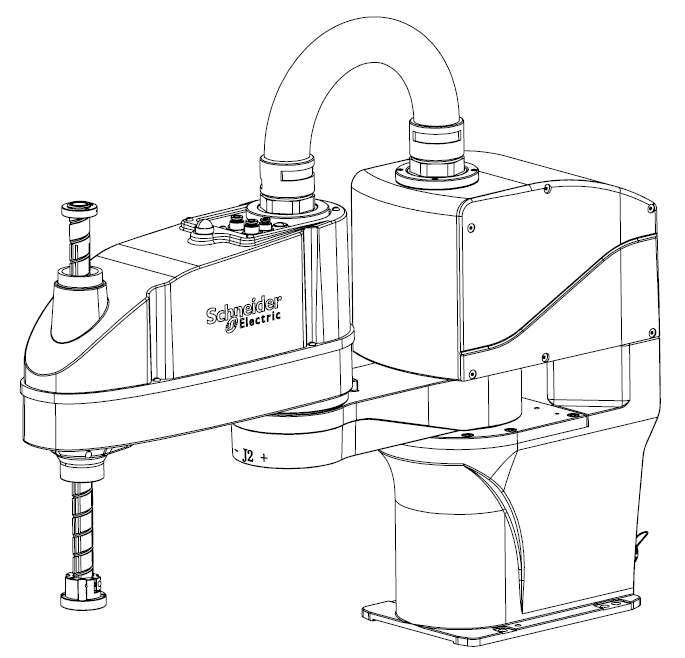
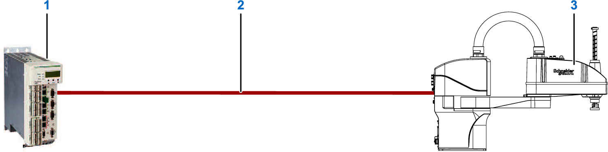
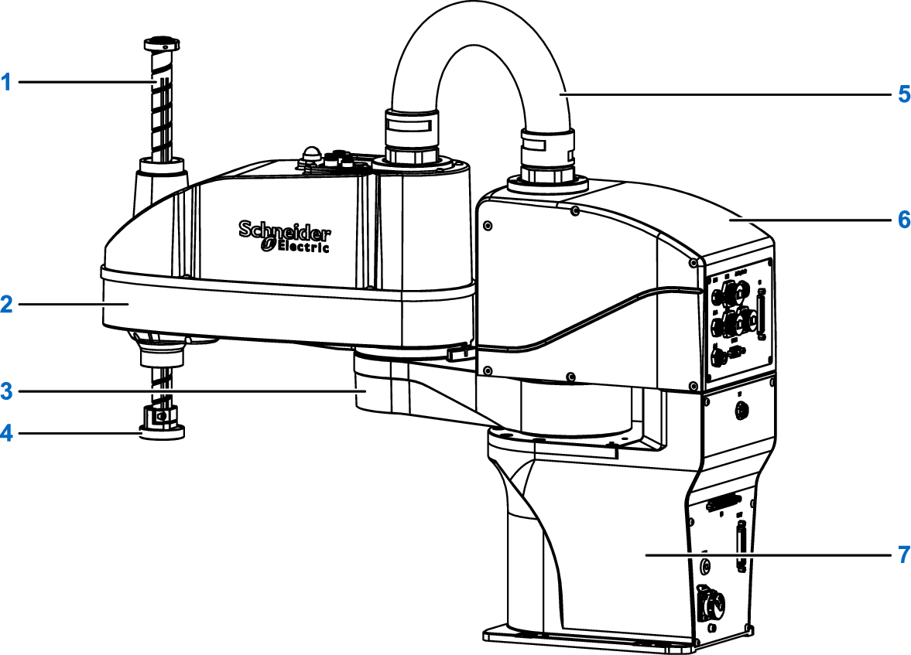

# Product Overview

## Scope of Delivery

A Lexium SCARA package contains the following items:

* Lexium SCARA
* Set of cables for IP20 including:
  + 1x **Cable\_POWER**, 5 m (16.4 ft)
  + 1x **Cable\_Base CS**, 5 m (16.4 ft)
  + 1x **Cable\_Arm CS**, 1.5 m (4.9 ft)
  + 1x **Cable\_SAFETY**, 5 m (16.4 ft)
  + 1x **Cable\_I/O**, 5 m (16.4 ft)
  + 1x MCP jumper plug
  + 18x fully insulated blade connectors, red (for cable arm wiring)
  + 1x set of fastening hardware including:

    - 4x hexagon socket screws M8x25

    - 4x spring washers

    - 4x flat washers
* Instruction sheet
* Declaration of conformity

After unpacking, verify the contents of the carton using the packing list and inspect the equipment for transport damage.

NOTE: In case of transport damages, contact your local Schneider Electric service representative.

## General Description of the Lexium SCARA

The Lexium SCARA is designed as a compact, embeddable system. Typically, this type of robot is used in material handling and parts loading/unloading in electronics, food, and packaging industries.

The Lexium SCARA has the following characteristics:

* Available with a workspace of 500 mm (19.7 in), 600 mm (23.6 in), or 700 mm (27.6 in), and two-stroke lengths of 200 mm (7.9 in) or 300 mm (11.8 in), for adaptation to different user applications.
* The robot is IP20 rated.

## System Setup

The following figure presents an example of a system setup for a Lexium SCARA. At a minimum, the following equipment is required to achieve the performance described in this guide.

| Number | Device name | Quantity(1) | Device type | Comment |
| --- | --- | --- | --- | --- |
| 1 | Controller | 1 | LMC•02C | Logic Motion Controller |
| 2 | Sercos cable | 1 or 2 | VW3E5001R••• | Sercos cable. The cable length depends on the distance between the controller and the Lexium SCARA. |
| 3 | Lexium SCARA | 1 | LXMRSP06••••• (2) | |
| (1) Quantity to be ordered.  (2) The device type depends on the Lexium SCARA reference and its characteristics. For further information, refer to [Commercial Reference](TPC_COBOT_TypeCode-73AF545E.html). | | | | |

## Components Overview

The Lexium SCARA is composed of the following components:

**1** Ball screw

**2** Arm 2

**3** Arm 1

**4** Tool flange

**5** Flexible tube

**6** Control unit

**7** Base

The interface panel, which is located at the back of the Lexium SCARA base, has connectors for power supply, communication ports, and status display LEDs.

Six through-holes are provided for robot mounting, and two dial-pin holes are provided to position the robot accurately.

Three sets of motors/gear reducers and ball screw are installed in arm 2, which provides fast motion and high accuracy positioning capability. Axis J3 and J4 are driven by timing belts.

Since the ball screw spindle is exposed, there is a risk of foreign matter attaching onto the shaft and cause damage.

| NOTICE | |
| --- | --- |
|  | FOREIGN MATTER ON BALL SCREW SPINDLE  Inspect the ball screw spindle periodically and clean when necessary.  Failure to follow these instructions can result in equipment damage. |

For further information on the maintenance schedule, refer to [Maintenance Plan](MaintenancePlan-01BC8EDB.html).

EIO0000005360.00