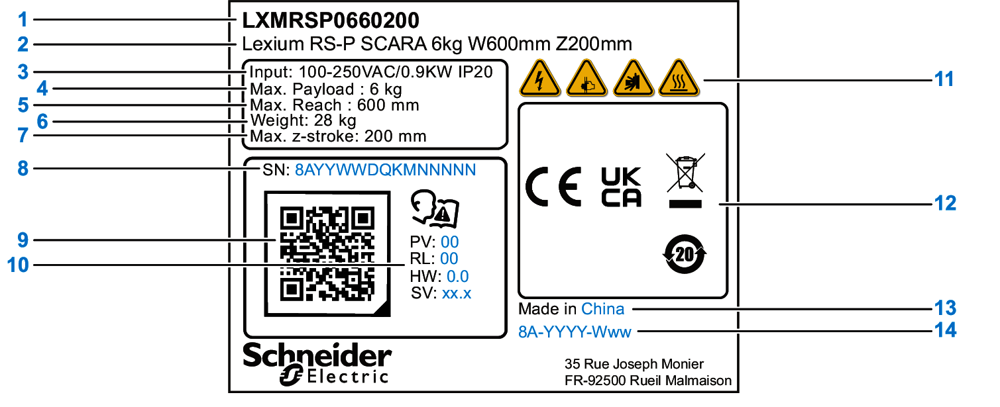

# Type Plate

## Overview

|  |  |  |  |
| --- | --- | --- | --- |
| 1 | Commercial reference\* | 10 | Technical specifications: |
| 2 | Name |  | PV: Product version |
| 3 | Input power and ingress of protection |  | RL: Release version |
| 4 | Maximum payload |  | HW: Hardware version |
| 5 | Radius of the working space |  | SV: Software version |
| 6 | Weight of the robot | 11 | Alert symbols |
| 7 | Maximum Z-stroke | 12 | Certifications |
| 8 | Serial number | 13 | Country of origin |
| 9 | QR code on commercial reference and serial number | 14 | Date of manufacturing, plant code, followed by year and week of manufacture |

\* For detailed information about the meaning of the particular digits, refer to [Commercial Reference](TPC_COBOT_TypeCode-73AF545E.html).

EIO0000005360.00