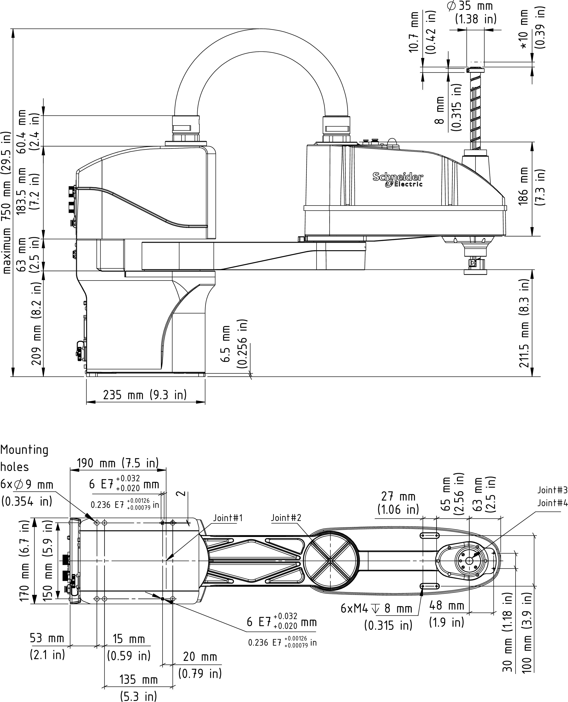
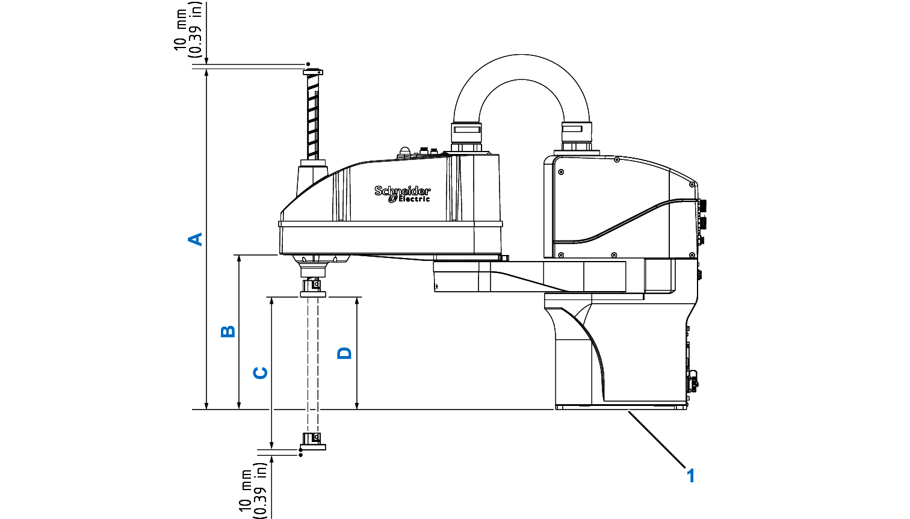
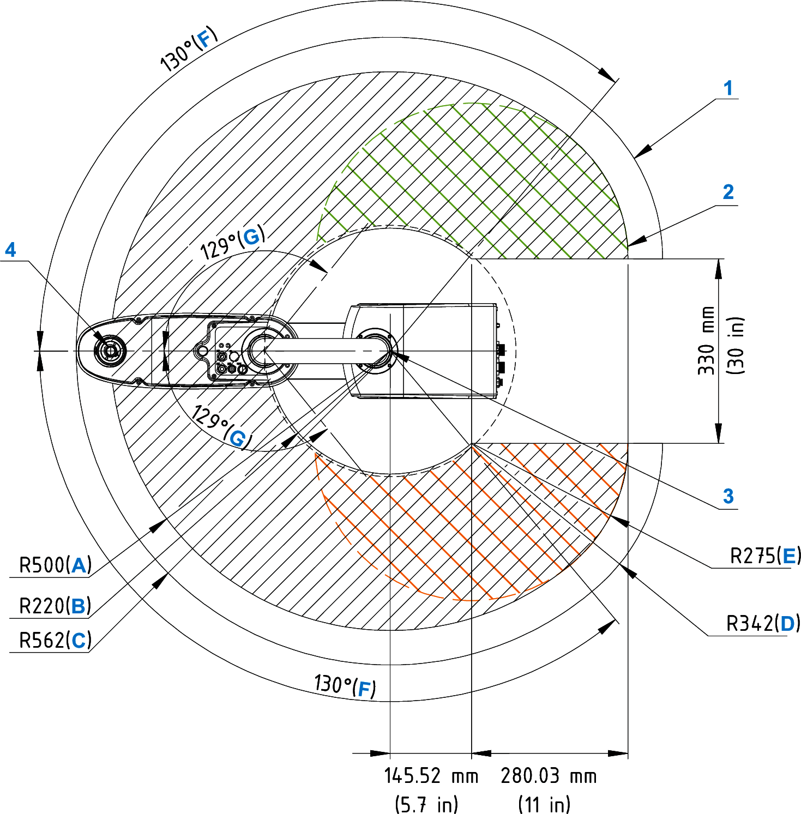
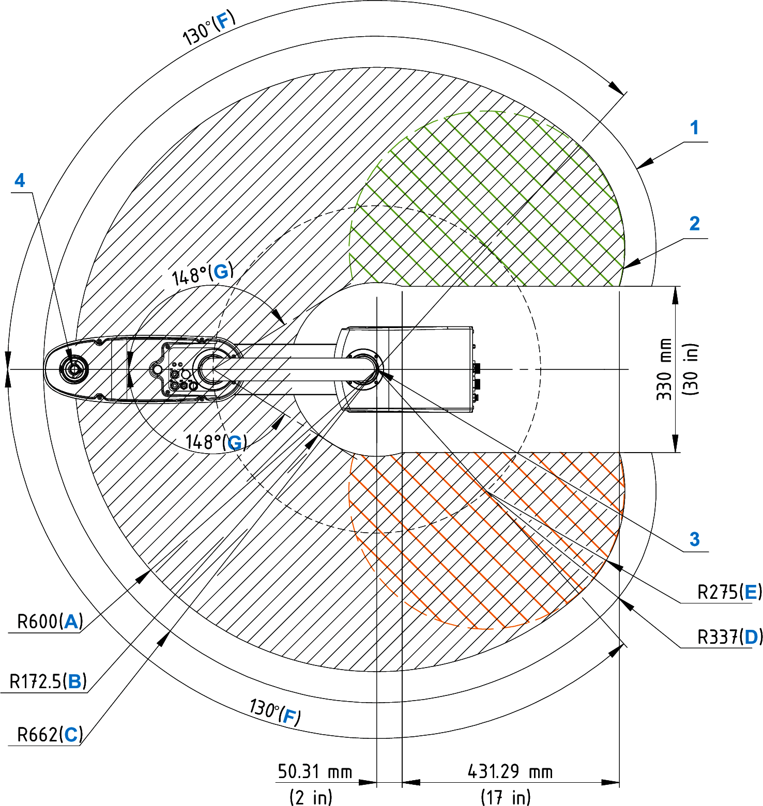
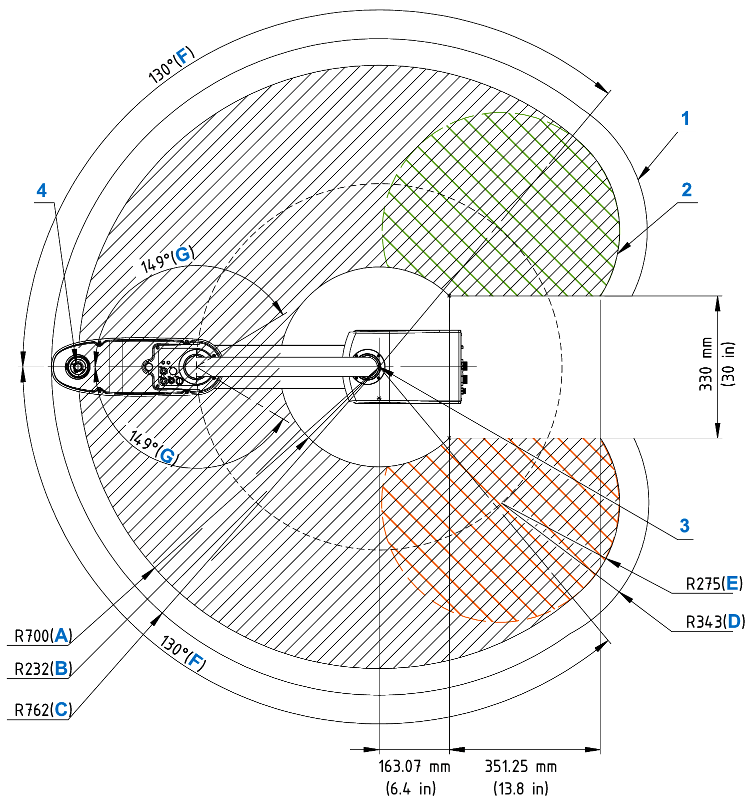

# Dimensional Drawing of LXMRSP06

## Dimensional Drawing

**\*** Screw reaches hard limit position

## Vertical Workspace

**1** Base mounting surface

| Dimension | Unit | LXMRSP0650200 | LXMRSP0650300 | LXMRSP0660200 | LXMRSP0660300 | LXMRSP0670200 | LXMRSP0670300 |
| --- | --- | --- | --- | --- | --- | --- | --- |
| A | mm  (in) | 610  (24) | 710  (28) | 610  (24) | 710  (28) | 610  (24) | 710  (28) |
| B | mm  (in) | 277.7  (11) | | | | 279.7  (11) | |
| C | mm  (in) | 200  (7.9) | 300  (11.8) | 200  (7.9) | 300  (11.8) | 200  (7.9) | 300  (11.8) |
| D | mm  (in) | 201.7  (8) | | | | | |

These dimensions represent:

A – The distance from the top of the ball screw at its highest point to the base mounting surface.

B – The distance from the bottom of arm 2 to the base mounting surface.

C – The nominal working range of the Z axis.

D – The distance from the surface of the tool flange at its highest point to the base mounting surface.

## Horizontal Workspace

Horizontal workspace of Lexium SCARA with workspace of 500 mm (19.7 in):

**1** Maximum area

**2** Motion area

**3** Joint 1 rotation center

**4** Joint 3 rotation center

NOTE: The orange and green circles represent the reduced working area in relation to the arm configuration (left or right).

Horizontal workspace of Lexium SCARA with workspace of 600 mm (23.6 in):

**1** Maximum area

**2** Motion area

**3** Joint 1 rotation center

**4** Joint 3 rotation center

NOTE: The orange and green circles represent the reduced working area in relation to the arm configuration (left or right).

Horizontal workspace of Lexium SCARA with workspace of 700 mm (27.6 in):

**1** Maximum area

**2** Motion area

**3** Joint 1 rotation center

**4** Joint 3 rotation center

NOTE: The orange and green circles represent the reduced working area in relation to the arm configuration (left or right).

| Dimension | Description | Unit | LXMRSP0650200  LXMRSP0650300 | LXMRSP0660200  LXMRSP0660300 | LXMRSP0670200  LXMRSP0670300 |
| --- | --- | --- | --- | --- | --- |
| A | Maximum working radius | mm  (in) | 500  (19.7) | 600  (23.6) | 700  (28) |
| B | Minimum working radius | mm  (in) | 220  (8.7) | 172.5  (6.8) | 232  (9.1) |
| C | Maximum radius occupied by robot | mm  (in) | 562  (22) | 662  (26) | 762  (30) |
| D | Maximum radius occupied by robot, in the extreme end of joint 1 travel | mm  (in) | 342  (13.5) | 337  (13.3) | 343  (13.5) |
| E | Maximum working radius, in the extreme end of joint 1 travel | mm  (in) | 275  (10.8) | 275  (10.8) | 275  (10.8) |
| F | Maximum joint 1 angle travel range | ° | 130 | | |
| G | Maximum joint 2 angle travel range | ° | 129 | 148 | 149 |

EIO0000005360.00