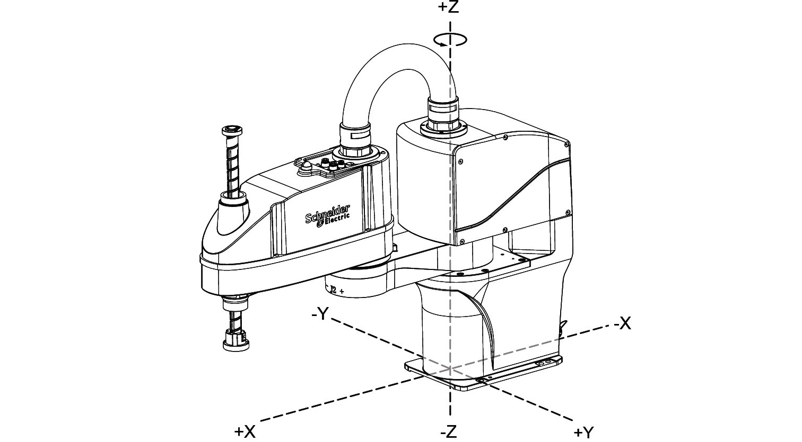

# Coordinate Systems

## Joint Coordinate System

The position of the robot is represented by the rotation angle of each axis.

The + and - signs indicate travel directions of individual axes of the joint coordinate system. These differ from the Cartesian positions of the TCP (Tool Center Point) of the robot.

## Robot Coordinate System

The + and - signs indicate the axes directions of the Cartesian coordinate system. These differ from the travel direction of the individual axes of the robot.

EIO0000005360.00