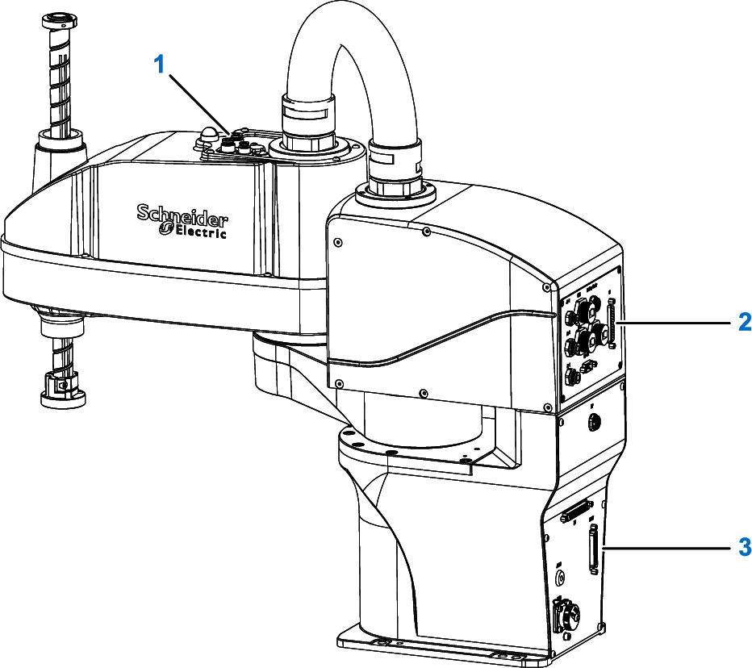
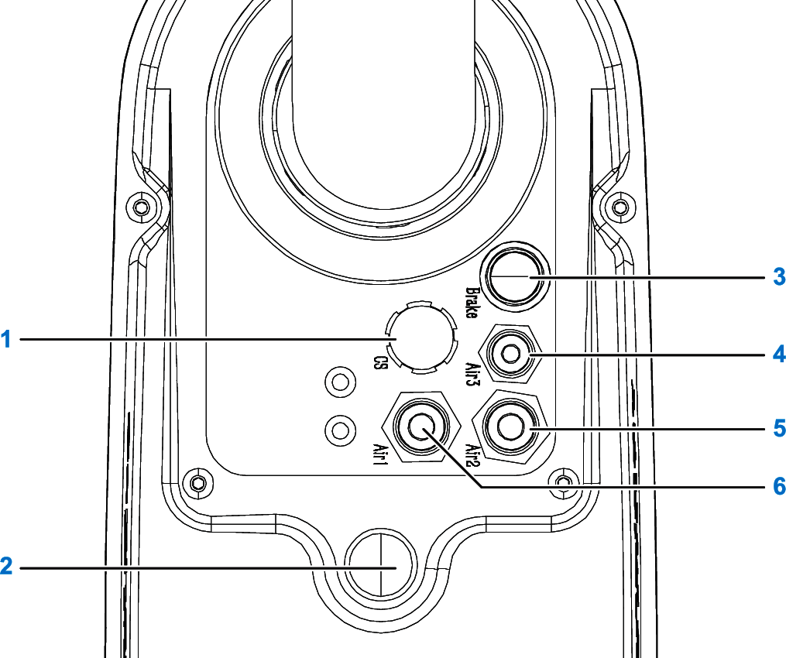
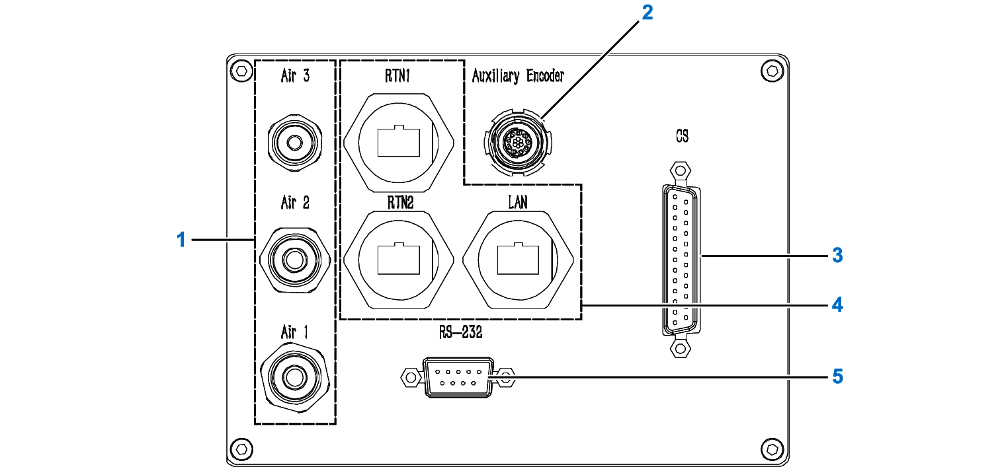
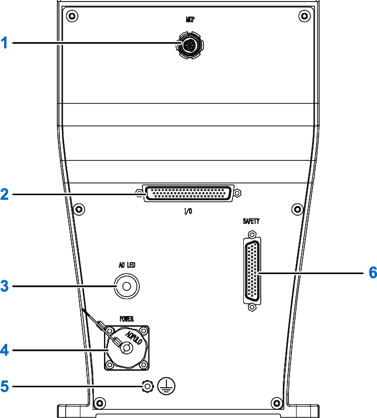

# Interface Panels

## Overview

The following figure presents the location of the three interface panels of the Lexium SCARA.

|  |  |
| --- | --- |
| **1** | Arm 2 interface panel |
| **2** | Control unit interface panel |
| **3** | Base interface panel |

## Arm 2 Interface Panel

The following figure presents the arm 2 interface panel.

|  |  |
| --- | --- |
| **1** | **CS**: Customer Signal interface (Customer Signal) |
| **2** | Robot Status indicator, see [Status Indicators](StatusIndicators-D8802C4F.html) |
| **3** | **Brake**: Brake release button |
| **4** | **Air3**: Air hose 3: Ø 4 mm (0.157 in) |
| **5** | **Air2**: Air hose 2: Ø 6 mm (0.236 in) |
| **6** | **Air1**: Air hose 1: Ø 6 mm (0.236 in) |

## Control Unit Interface Panel

The following figure presents the control unit interface panel.

|  |  |
| --- | --- |
| **1** | **Air1**: Air hose 1: Ø 6 mm (0.236 in)  **Air2**: Air hose 2: Ø 6 mm (0.236 in)  **Air3**: Air hose 3: Ø 4 mm (0.157 in) |
| **2** | **Auxiliary Encoder**: Reserved |
| **3** | **CS**: Customer Signal interface (Customer Signal) |
| **4** | **RTN1**: Sercos port 1  **RTN2**: Sercos port 2  **LAN**: Reserved |
| **5** | **RS-232**: Reserved |

## Base Interface Panel

The following figure presents the base interface panel.

|  |  |
| --- | --- |
| **1** | **MCP**: Reserved: use MCP (Manual Control Pendant) jumper plug |
| **2** | **I/O**: Reserved |
| **3** | **AC LED**: Main power indicator light |
| **4** | **POWER**: AC power supply connector |
| **5** | : Earth ground connection |
| **6** | **SAFETY**: Emergency stop connector |

EIO0000005360.00