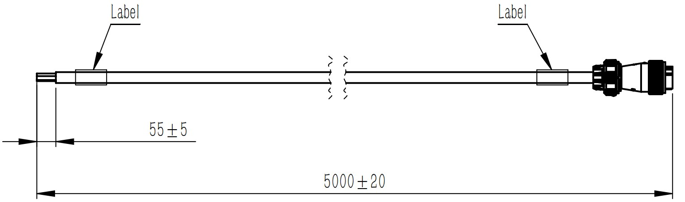
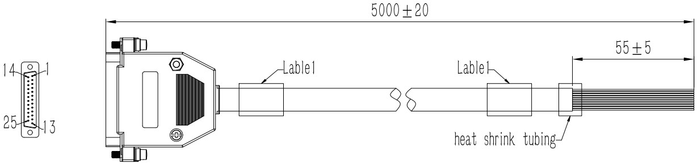
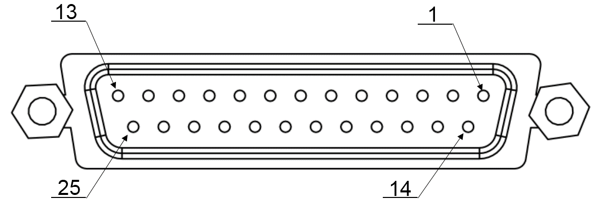
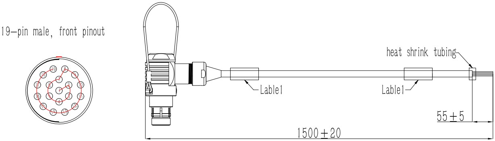
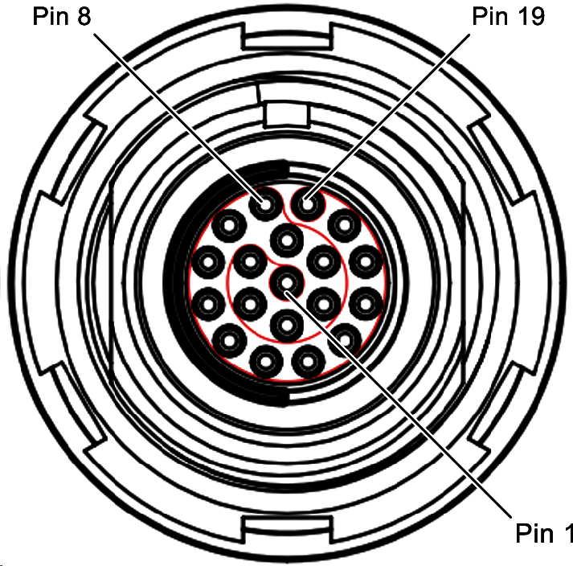
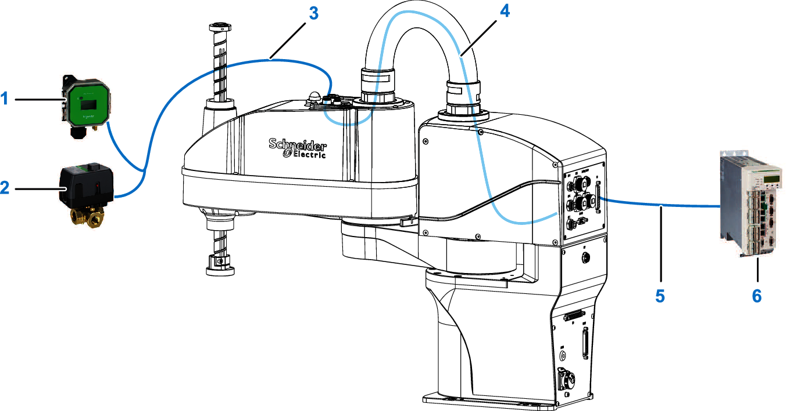
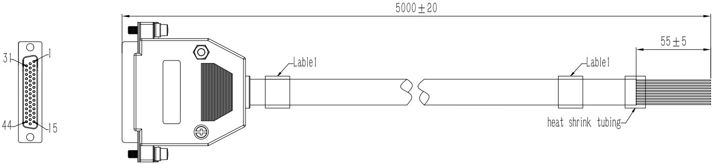
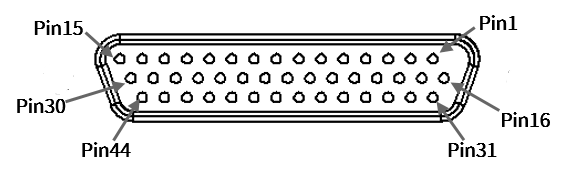
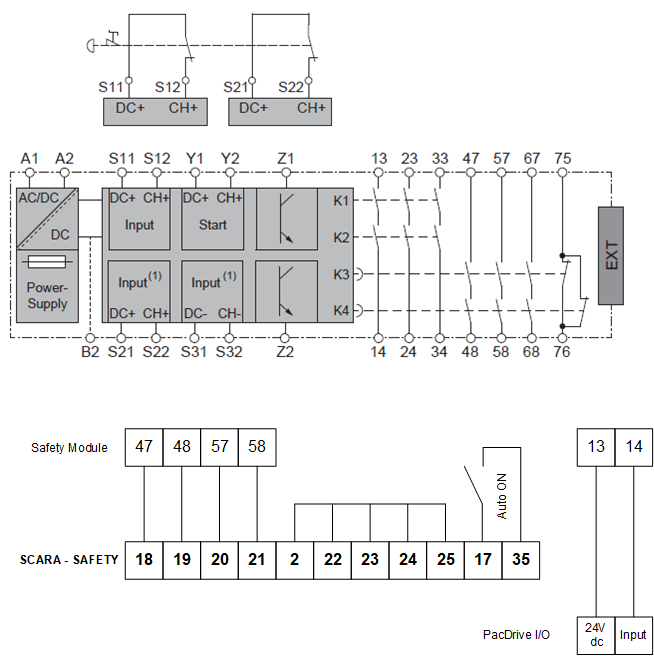

# Connector Definitions

## Overview

This section provides detailed functions and descriptions of pins on the power interface, of the interface of the control unit and of the customer signal interface (**CS**) on the arm 2.

## AC Power Supply Connector (**POWER**)

The **POWER** connector is located at the robot base. The corresponding preconfigured cable is labeled **Cable\_POWER** and presented in the following figure. The cable has an free-end and a connector. The connector is IP67 rated with an input voltage rating of 100...250 V ac. The minimum bending radius of this cable is 54 mm (2.13 in).

| Pin | Label | Wire color | Description | Power Supply Connector |
| --- | --- | --- | --- | --- |
| 1 | L | Brown | Live wire | 4-pin plug-type connector, front pinout |
| 2 | N | Blue | Neutral wire |
| 3 | PE | Yellow/Green | Ground wire |
| 4 | – | – | – |

## MCP Connector (Reserved)

The robot is equipped with a jumper plug that must be installed on the MCP connector. It must be installed prior to the operation of the equipment.

| Pin | Label | Description | Representation |
| --- | --- | --- | --- |
| 01...06 | – | Reserved | 19-pin socket-type connector, front pinout |
| 07 | Jumper 1 | Jumpered to pin 8 |
| 08 | Jumper 1 | Jumpered to pin 7 |
| 09 | – | Reserved |
| 10 | – | Reserved |
| 11 | Jumper 2 | Jumpered to pin 13 |
| 12 | – | Reserved |
| 13 | Jumper 2 | Jumpered to pin 11 |
| 14...19 | – (not used) | |

## Customer Signal (**CS**) Connector on Control Unit

The preconfigured cable used for the **CS** customer signal connector on the control unit is labeled **Cable\_Base CS** and presented in the following figure. The cable has an open end and a connector. The minimum bending radius of this cable is 51 mm (2 in).

25-pin socket-type connector, front pinout

The wires at the open end of the cable are defined as follows:

| Pin | Wire color | Pin | Wire color |
| --- | --- | --- | --- |
| 01 | Black | 11 | Pink |
| 02 | Brown | 12 | White/Black |
| 03 | Red | 13 | White/Brown |
| 04 | Orange | 14 | White/Red |
| 05 | Yellow | 15 | White/Orange |
| 06 | Green | 16 | White/Yellow |
| 07 | Blue | 17 | White/Green |
| 08 | Purple | 18 | White/Blue |
| 09 | Gray | 19...25 | – (not used) |
| 10 | White |

## Customer Signal (**CS**) Connector on Arm 2

The cable used for the **CS** customer signal connector on arm 2 is labeled **Cable\_Arm CS** and presented in the following figure. The connector is IP67 rated. The minimum bending radius of this cable is 51 mm (2 in).

19-pin socket-type connector, front pinout

The wires at the open end of the cable are defined as follows:

| Pin | Wire color | Pin | Wire color |
| --- | --- | --- | --- |
| 01 | Black | 11 | Light blue |
| 02 | White | 12 | Pink |
| 03 | Red | 13 | Light green |
| 04 | Green | 14 | Light yellow |
| 05 | Yellow | 15 | Light brown |
| 06 | Brown | 16 | Light purple |
| 07 | Blue | 17 | Light gray |
| 08 | Orange | 18 | Transparent |
| 09 | Gray | 19 | – (not used) |
| 10 | Purple |

## Application Example of Using CS Connectors and Cables

Two end-of-arm devices are used. One is a pressure sensor and the other is a solenoid valve. The pressure sensor provides a digital signal when triggered, and the solenoid valve is controlled by a digital signal. The I/O states of the signals are monitored/controlled by an application program on a controller. The 24 V dc power supply is supplied to the devices through the customer signal cable.

As presented in the following figures, external wires are used to connect from the devices to the CS connector on the arm 2 (solid blue lines). Internal wiring (solid light blue line) is used to exchange signals between the robot base and the arm 2.

**1** Pressure sensor

**2** Solenoid valve

**3** Customer signal cable

**4** Robot internal cables

**5** CS cable with D-SUB25 connector

**6** PacDrive controller I/O and 24 V dc

Power supply of the devices:

* An external 24 V dc power supply can be used to power a device mounted on arm 2.

  Therefore, two or more wires (for example, wire 1 and 2) of the preconfigured CS cable (with D-Sub25, at robot base) can be used.
* From the preconfigured CS cable (with 19-pin connector, on arm 2), the corresponding wires (for example, wire 1 and 2) must be connected to both devices to provide power.

Digital input and output signals from/to the devices:

* The controller or a connected I/O device provides the digital input and output signals.

  These must be connected to the required wires (for example, wire 3...6) of the preconfigured CS cable (with D-Sub25, at robot base).
* The corresponding wires (for example, wire 3...6) of the preconfigured CS cable (with 19-pin connector, on arm 2), must be connected to both devices to get/set the I/O state.

## Emergency Stop Connector (**SAFETY**)

The emergency stop connector at the robot base is labeled **SAFETY**. The corresponding preconfigured cable is labeled **Cable\_SAFETY** and presented in the figure above. The cable has a D-Sub44 connector and an open end. The minimum bending radius of this cable is 51 mm (2 in).

Pin definition of the emergency stop connector:

The wires at the open end of the cable are defined as follows:

| Pin | Wire color | Function | Description |
| --- | --- | --- | --- |
| 01 | Black | 24 V dc | 24 V dc output |
| 02 | Brown | 24 V dc GND | 24 V dc grounding potential |
| 03 | Red | E-Stop State 1 | Emergency stop output 1 |
| 04 | Orange | E-Stop State 2 | Emergency stop output 2 |
| 05...15 | – | – | Reserved |
| 16 | Yellow | 24 V dc | 24 V dc output |
| 17 | Green | 24 V dc GND | 24 V dc grounding potential |
| 18 | Blue | E-Stop channel 1A | User emergency stop 1 |
| 19 | Purple | E-Stop channel 1B | User emergency stop 1 |
| 20 | Gray | E-Stop channel 2A | User emergency stop 2 |
| 21 | White | E-Stop channel 2B | User emergency stop 2 |
| 22 | Pink | Protective Stop channel 1 | User protective stop 1 |
| 23 | White/Black | Protective Stop channel 2 | User protective stop 2 |
| 24 | White/Brown | Functional safety device 1 | User functional safety device 1 |
| 25 | White/Red | Functional safety device 2 | User functional safety device 2 |
| 26..30 | – | – | Reserved |
| 31 | White/Orange | 24 V dc | 24 V dc output |
| 32 | White/Yellow | 24 V dc GND | 24 V dc grounding potential |
| 33, 34 | – | – | Reserved |
| 35 | White/Purple | Auto\_On(1) | Power enable confirmation |
| 36...44 | – | – | Reserved |
| (1) Before the robot accepts commands from the controller via Sercos, a confirmation is required after the robot has been powered on. For the confirmation pulse, the Auto\_On input is used (pin 17 and pin 35, button or...). The Auto\_On signal must be considered in the safety assessment. | | | |

The D-Sub44 connector must be connected to the **SAFETY** connector at the robot base and the open end of the **Cable\_SAFETY** cable must be connected to the functional safety circuit of the machine.

Wiring example with Safety Module XPSUAT•3A3A•

For further information on wiring, refer to the hardware guide of the safety module.

## Connection Sercos III (**RTN1** and **RTN2**)

| Pin | Signal name | Description | Representation |
| --- | --- | --- | --- |
| 01 | Tx+ | Transmit signal + | 8-pin, front interface |
| 02 | Tx- | Transmit signal - |
| 03 | Rx+ | Receive signal + |
| 04 | - | Reserved |
| 05 | - | Reserved |
| 06 | Rx- | Receive signal - |
| 07 | - | Reserved |
| 08 | - | Reserved |

The following table presents the cable specifications:

|  |  |
| --- | --- |
| **Shield** | Required, both ends grounded |
| **Twisted pair** | Required |
| **PELV** | Required |
| **Cable composition** | 4 x 0.14 mm2 (AWG 24) |
| **Connector type** | RJ45 |

| WARNING | |
| --- | --- |
|  | UNINTENDED EQUIPMENT OPERATION  Do not connect any wiring to reserved, unused connections, or to connections designated as No Connection (N.C.).  Failure to follow these instructions can result in death, serious injury, or equipment damage. |

Use pre-assembled cables to reduce the risk of wiring errors, see [System Setup](ProductOverview-E6FA5C74.html#ProductOverview-E6FA5C74__D-SE-0071545.9).

Verify that the connector locks snap in properly.

EIO0000005360.00