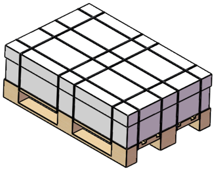

# Transport and Storage

## Overview

Ensure to follow the following instructions while storing or transporting a robot.

| WARNING | |
| --- | --- |
|  | FALLING HEAVY LOAD  * Ensure that the Lexium SCARA is properly secured and stabilized when you transport it or move it. * When lifting a robot with a crane, ensure to stabilize it during movement. A loss of balance may cause the robot to fall, which could result in robot damage or personnel injury.  Failure to follow these instructions can result in death, serious injury, or equipment damage. |

If the robot has been stored or inactive for an extended period of time, ensure that the robot starts at a reduced speed when it is operated. After running for a while without issues, it can be run at full speed again. For more information on warming up the robot, see [Commissioning Procedure](Start-Up-01B4F024.html#Start-Up-01B4F024__D-SE-0062741.7).

If condensation forms when the robot is put in storage, or after transportation, ensure that it is fully cleaned before operation.

## Transport Conditions

The Lexium SCARA must be handled with care. Shocks and impacts may damage the robot. Damage may lead to reduced running accuracy, reduced service life, or to inoperable equipment.

The robot is preassembled before transport.

NOTE: Before unpacking and installing the robot, ensure that the lifting capacity of the lifting devices (forklift truck and crane or hoist) is sufficient to lift the robot.

For detailed information about transport conditions, refer to [Ambient Conditions](D-SE-0070683.html).

## Packaging of the Lexium SCARA

Size and weight of the packaging:

| Parameter | Lexium SCARA |
| --- | --- |
| Packing case L x H x W | 1200 x 409 x 800 mm (47 x 16 x 31.5 in) |
| Gross weight | 52 kg (115 lb) |

## Storage

The Lexium SCARA can be stored inside the packaging or unpacked. In both cases, ensure that it is stored in a sheltered and dry place. Avoid humidity which can have corrosive effects on the robot.

EIO0000005360.00