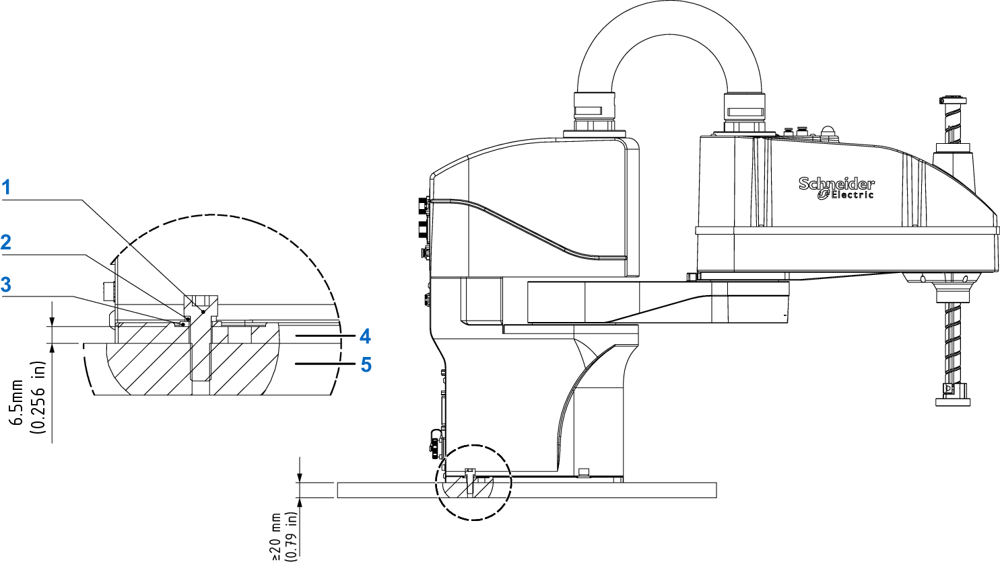

# Mounting the Robot

## Base Mounting

Use bolts, elastic washers, and flat washers for base mounting. The dimensions and installation of the bolts and washers are presented in the following figure.

**1** Hexagon socket screw M8x25 (4 pieces)

**2** Spring washer

**3** Flat washer

**4** Robot base

**5** Bottom plate

For further information on the mounting dimensions, refer to [Dimensional Drawing of LXMRSP06](DimensionalDrawingOfLXMRSP06-03D4687E.html).

## Mounting the Robot

Position the robot via the two dial-pins and secure the robot base by screwing down four bolts through the mounting holes. Use the hexagon bolts, elastic washers, and flat washers.

Torque requirement for base mounting bolt:

* 4 securing screws: M8x25
* Torque requirement: 35 Nm (310 lbf-in)

NOTE: To prevent the hexagon bolts from getting loose during robot operation, tighten them according to torque requirements.

| WARNING | |
| --- | --- |
|  | FALLING LOADS  * Handle the Lexium SCARA by at least two people. * Wear protective equipment when handling the Lexium SCARA.  Failure to follow these instructions can result in death, serious injury, or equipment damage. |

EIO0000005360.00