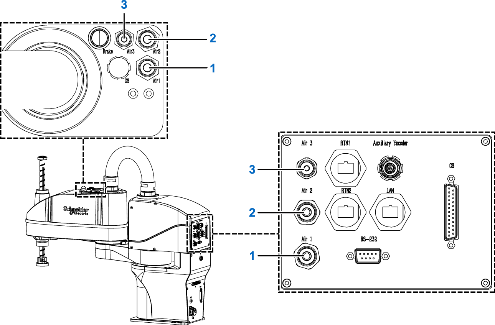

# Pneumatic Installation

## Overview

Three air hoses link the base to the arm 2. If needed, connect **Air 1** both on the base and on the arm 2 to use a pneumatic device. Additionally, you can connect the two **Air 2**, and/or the two **Air 3**.

Maximum pressure: 10 bar (145 psi)

The connections are made using press-on fittings for polyurethane tubing with an internal diameter of:

* 6 mm (0.236 in) for air hose 1 and 2
* 4 mm (0.157 in) for air hose 3

**1** **Air 1**: connection for air hose 1

**2** **Air 2**: connection for air hose 2

**3** **Air 3**: connection for air hose 3

| WARNING | |
| --- | --- |
|  | FALLING HEAVY LOAD  Verify in the application that the gripper is designed to hold the load with the accelerations programmed, as well as in the event of an electrical power outage or an inoperative air supply.  Failure to follow these instructions can result in death, serious injury, or equipment damage. |

EIO0000005360.00