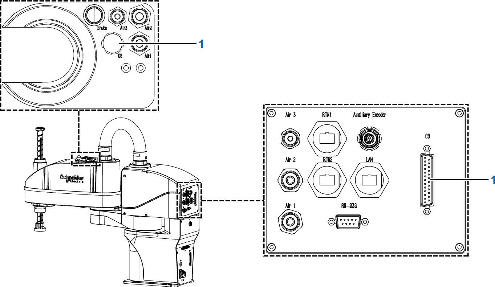

# CS Connection

## Overview

If needed, connect CS both on the base and on the arm 2 to connect an electric device. The maximum voltage and current are repectively 30 V dc and 0.6 A.

**1** CS connection

EIO0000005360.00